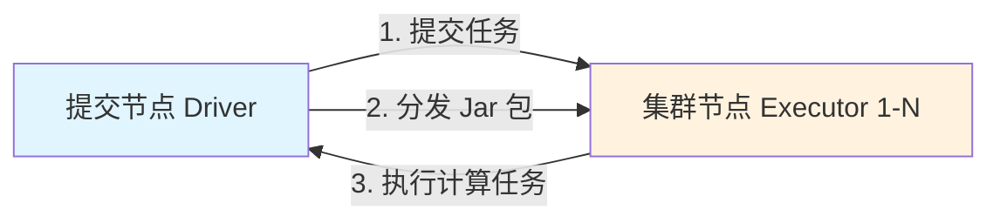
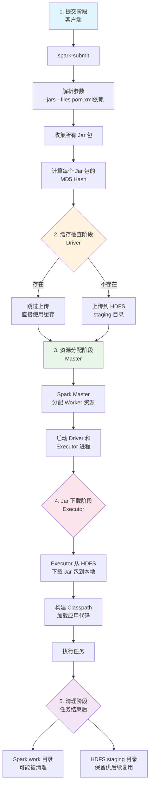

# Spark 任务 Jar 包管理机制说明

:material-file-document-edit: **文档类型**: 工具手册 |
:material-account-clock: **更新时间**: 2026-06-04 |
:material-account: **维护人**: 研发团队 |
:material-tag: **标签**: Spark, Jar包, Standalone, 分布式计算, SparkSubmit

:material-information: **适用场景**: Spark Standalone 模式（`spark://IP:7077`）  
:material-server: **项目环境**: pricemonitor 多模块 Maven 项目  
:material-rocket: **Spark 版本**: 3.0.3

---

## 一、为什么 Spark 要上传 Jar 包？

:material-lightbulb-on: **核心原理**

Spark 是**分布式计算框架**，任务提交后会在多个 Executor 节点上并行执行。每个 Executor 都需要加载应用代码和依赖库才能处理数据。

### 1.1 分布式执行的必然要求



### 1.2 需要上传的内容

| 类型 | 说明 | 示例 |
|------|------|------|
| **应用 Jar** | 项目编译后的主 Jar 包 | `pricemonitor-bigdata-1.0.0.jar` |
| **依赖 Jar** | Maven 依赖的第三方库 | `spark-sql_2.12-3.0.3.jar` |
| **模块 Jar** | 多模块项目的其他模块 | `entpur-backend-1.0.jar` |
| **配置文件** | 需要分发的配置文件 | `application.yml` |

---

## 二、Jar 包上传的完整流程

### 2.1 流程图



### 2.2 关键步骤详解

#### 步骤 1：依赖收集

:material-package: **Spark 会收集以下 Jar 包**

```bash
# Spark 会收集以下 Jar 包
1. --jars 参数指定的 Jar
2. --packages 指定的 Maven 坐标
3. pom.xml 中的 compile + runtime 依赖
4. 项目主 Jar 包
```

#### 步骤 2：Hash 计算

:material-calculator: **Hash 计算逻辑**

```java
// Spark 内部逻辑（简化版）
for (JarFile jar : allJars) {
    String hash = computeMD5(jar);  // 计算 Jar 包的 MD5
    
    if (hdfsCache.exists(hash)) {
        // ✅ 已存在，直接复用
        useCachedJar(hash);
    } else {
        // ❌ 不存在，上传到 HDFS
        uploadToHdfs(jar, hash);
    }
}
```

#### 步骤 3：上传到 HDFS

:material-database-upload: **HDFS staging 目录结构**

```bash
# HDFS staging 目录结构
hdfs:///user/spark/.sparkStaging/application_1234567890001_0001/
├── pricemonitor-bigdata-1.0.0.jar
├── entpur-backend-1.0.jar
├── spark-sql_2.12-3.0.3.jar
└── 其他依赖...
```

#### 步骤 4：Executor 下载

:material-download: **Executor 本地 work 目录**

```bash
# Executor 本地 work 目录
/data/spark-3.0.3-bin-hadoop3.2/work/app-20260601091427-0186/
├── 4/                              # Executor ID
│   ├── pricemonitor-bigdata-1.0.0.jar
│   ├── stderr                      # 标准错误日志
│   └── stdout                      # 标准输出日志
└── 5/
    └── ...
```

---

## 三、Jar 包缓存机制

### 3.1 缓存位置对比

| 缓存位置 | 作用 | 生命周期 | 是否持久化 |
|---------|------|---------|-----------|
| **HDFS staging** | 主要缓存位置 | 长期保留 | :white_check_mark: 是 |
| **Spark work 目录** | Executor 临时工作目录 | 任务结束后可能清理 | :x: 否 |
| **本地 Maven 仓库** | 客户端依赖缓存 | 长期保留 | :white_check_mark: 是 |

### 3.2 复用判断逻辑

:star: **核心原则：基于 Jar 包内容的 Hash 值，与时间无关**

```
判断是否复用 = Jar 包 Hash 值相同 + 缓存未被清理
```

| 场景 | 是否复用 | 原因 |
|------|---------|------|
| 同一天，Jar 内容没变 | :white_check_mark: 复用 | Hash 相同 |
| 不同天，Jar 内容没变 | :white_check_mark: 复用 | Hash 相同 |
| 同一天，Jar 内容变了 | :x: 重新上传 | Hash 不同 |
| 不同天，Jar 内容变了 | :x: 重新上传 | Hash 不同 |

### 3.3 什么情况下会重新上传？

=== "情况 1：Jar 包内容变化（最常见）"
    ```bash
    # 任意以下变化都会导致 Hash 变化
    1. 修改了代码，重新编译
    2. pom.xml 增加或删除了依赖
    3. 依赖库版本升级
    4. 打包插件配置变化
    5. Jar 包内的时间戳文件变化
    ```

=== "情况 2：提交参数变化"
    ```bash
    # 以下参数变化会触发重新上传
    --jars 路径变化
    --packages 列表变化
    spark.jars 配置变化
    ```

=== "情况 3：缓存被清理"
    ```bash
    # HDFS staging 目录被管理员清理
    hdfs dfs -rm -r /user/spark/.sparkStaging/application_xxx
    ```

---

## 四、Spark Work 目录详解

### 4.1 目录结构

```
/data/spark-3.0.3-bin-hadoop3.2/work/
├── app-20260601091427-0186/       # Application ID（包含时间戳）
│   ├── 4/                          # Executor ID
│   │   ├── pricemonitor-bigdata-1.0.0.jar  # Jar 包副本
│   │   ├── stderr                  # 标准错误日志
│   │   └── stdout                  # 标准输出日志
│   └── 5/                          # 另一个 Executor
│       ├── pricemonitor-bigdata-1.0.0.jar
│       ├── stderr
│       └── stdout
├── app-20260526222521-0185/       # 历史 Application
└── app-20260526220516-0184/
```

### 4.2 目录命名规则

```
app-{timestamp}-{sequence}
     │           │
     │           └─ 递增序号（从 0001 开始）
     └─ 提交时间戳（yyyyMMddHHmmss 格式）
```

**示例**：
- `app-20260601091427-0186`：2026年6月1日 09:14:27 提交的第 186 个任务
- `app-20260526222521-0185`：2026年5月26日 22:25:21 提交的第 185 个任务

### 4.3 目录内容说明

| 文件/目录 | 说明 | 是否可删除 |
|----------|------|-----------|
| `app-xxx/` | Application 工作目录 | 任务结束后可删除 |
| `app-xxx/N/` | Executor N 的工作目录 | 任务结束后可删除 |
| `*.jar` | Jar 包副本 | 可删除（会重新下载） |
| `stdout` | 标准输出日志 | 删除后无法查看 |
| `stderr` | 标准错误日志 | 删除后无法查看 |

---

## 五、删除旧 Work 目录的影响

### 5.1 影响分析

| 删除场景 | 影响 | 建议 |
|---------|------|------|
| **任务已结束** | :white_check_mark: 无影响 | 可安全删除 |
| **任务正在运行** | :x: 导致任务失败 | 禁止删除 |
| **Jar 包缓存** | :white_check_mark: 无影响 | 缓存在 HDFS |
| **历史日志** | :warning: 会丢失 | 提前备份 |

### 5.2 为什么删除 work 目录不影响 Jar 缓存？

:material-information: **缓存位置说明**

```
work 目录下的 Jar 包只是副本，真正的缓存在：
├── HDFS staging 目录（主要）
│   └── hdfs:///user/spark/.sparkStaging/application_xxx/*.jar
│
└── Spark Worker 共享目录（次要）
    └── /data/spark-3.0.3-bin-hadoop3.2/worker/
```

:material-check: **删除 work 目录后：**
- 新任务启动时会从 HDFS 重新下载 Jar 包
- 不会影响其他正在运行的任务
- 不会影响未来任务的 Jar 包复用

---

## 六、清理策略与最佳实践

### 6.1 自动清理配置（推荐）

:material-cog: **配置文件路径**: `/data/spark-3.0.3-bin-hadoop3.2/conf/spark-defaults.conf`

```properties
# 开启 Worker 自动清理
spark.worker.cleanup.enabled=true

# 应用数据保留时间（秒），604800 = 7天
spark.worker.cleanup.appDataTtl=604800

# 清理检查间隔（秒），1800 = 30分钟
spark.worker.cleanup.interval=1800
```

!!! warning "注意"
    配置后需重启 Spark Worker 生效。

### 6.2 手动清理脚本

??? example "查看清理脚本"
    ```bash
    #!/bin/bash
    # clean_spark_work.sh

    WORK_DIR="/data/spark-3.0.3-bin-hadoop3.2/work"
    RETENTION_DAYS=7

    echo "===== 开始清理 Spark work 目录 ====="
    echo "清理 $RETENTION_DAYS 天前的旧目录..."

    # 1. 统计待清理目录数量
    OLD_DIRS=$(find $WORK_DIR -maxdepth 1 -name "app-*" -mtime +$RETENTION_DAYS | wc -l)
    echo "发现 $OLD_DIRS 个旧目录"

    # 2. 查看当前磁盘使用
    echo "当前磁盘使用："
    df -h / | tail -1

    # 3. 删除旧目录
    find $WORK_DIR -maxdepth 1 -name "app-*" -mtime +$RETENTION_DAYS -exec rm -rf {} \;

    # 4. 验证清理结果
    echo "清理后磁盘使用："
    df -h / | tail -1

    echo "===== 清理完成 ====="
    ```

### 6.3 定时清理（Crontab）

```bash
# 编辑 crontab
crontab -e

# 添加以下内容（每天凌晨 2 点执行）
0 2 * * * /data/scripts/clean_spark_work.sh >> /var/log/spark_cleanup.log 2>&1
```

### 6.4 清理前检查清单

```bash
# 1. 检查任务是否还在运行
ps aux | grep spark | grep -v grep

# 2. 查看待清理目录数量
find /data/spark-3.0.3-bin-hadoop3.2/work -maxdepth 1 -name "app-*" -mtime +7 | wc -l

# 3. 查看磁盘空间
df -h /data

# 4. 预览待删除目录
find /data/spark-3.0.3-bin-hadoop3.2/work -maxdepth 1 -name "app-*" -mtime +7 -exec ls -ld {} \;

# 5. 确认无误后执行删除
find /data/spark-3.0.3-bin-hadoop3.2/work -maxdepth 1 -name "app-*" -mtime +7 -exec rm -rf {} \;
```

---

## 七、常见问题排查

### 7.1 如何验证 Jar 包是否被复用？

=== "方法 1：查看 HDFS 缓存"
    ```bash
    # 查看 HDFS staging 目录
    hdfs dfs -ls /user/spark/.sparkStaging/

    # 统计 pricemonitor 的 Jar 数量
    hdfs dfs -ls /user/spark/.sparkStaging/application_*/pricemonitor*.jar | wc -l

    # 如果只有 1 个，说明所有任务都在复用
    ```

=== "方法 2：查看 Spark 日志"
    ```bash
    # 查看 Driver 日志
    yarn logs -applicationId application_xxx | grep "Added JAR"

    # 复用时的日志
    INFO  SparkContext: Added JAR hdfs:///user/spark/.sparkStaging/application_yyy/pricemonitor-bigdata-1.0.0.jar

    # 重新上传时的日志
    INFO  SparkContext: Uploading jar file:/local/path/pricemonitor-bigdata-1.0.0.jar to hdfs:///user/spark/.sparkStaging/application_zzz/pricemonitor-bigdata-1.0.0.jar
    ```

### 7.2 如何减少 Jar 包上传大小？

=== "方法 1：使用 `provided` 范围"
    ```xml
    <!-- pom.xml -->
    <dependency>
        <groupId>org.apache.spark</groupId>
        <artifactId>spark-core_2.12</artifactId>
        <version>3.0.3</version>
        <scope>provided</scope>  <!-- 不打包进 Jar -->
    </dependency>
    ```

=== "方法 2：使用 `--packages` 参数"
    ```bash
    # 让 Spark 自动管理依赖
    spark-submit --packages org.apache.spark:spark-sql_2.12:3.0.3 ...
    ```

=== "方法 3：预上传到 HDFS"
    ```bash
    # 提前上传到 HDFS
    hdfs dfs -mkdir -p /user/spark/jars/
    hdfs dfs -put pricemonitor-bigdata-1.0.0.jar /user/spark/jars/

    # 提交时直接引用
    spark-submit --jars hdfs:///user/spark/jars/pricemonitor-bigdata-1.0.0.jar ...
    ```

### 7.3 如何排查 Jar 包冲突？

```bash
# 查看冲突的类
spark-submit --conf spark.driver.userClassPathFirst=true \
             --conf spark.executor.userClassPathFirst=true \
             --class com.example.Main app.jar

# 查看实际加载的 Jar
spark-submit --conf spark.driver.extraJavaOptions="-verbose:class" \
             --class com.example.Main app.jar
```

---

## 八、项目实践建议

### 8.1 项目打包配置

:material-package-variant: **针对 pricemonitor 多模块项目，建议使用 shade 插件打包 fat jar**

??? example "查看 pom.xml 配置"
    ```xml
    <!-- pom.xml -->
    <build>
        <plugins>
            <!-- 使用 shade 插件打包 fat jar -->
            <plugin>
                <groupId>org.apache.maven.plugins</groupId>
                <artifactId>maven-shade-plugin</artifactId>
                <version>3.2.4</version>
                <executions>
                    <execution>
                        <phase>package</phase>
                        <goals>
                            <goal>shade</goal>
                        </goals>
                        <configuration>
                            <!-- 排除 provided 依赖 -->
                            <artifactSet>
                                <excludes>
                                    <exclude>org.apache.spark:*</exclude>
                                    <exclude>org.apache.hadoop:*</exclude>
                                </excludes>
                            </artifactSet>
                            <!-- 排除签名文件 -->
                            <filters>
                                <filter>
                                    <artifact>*:*</artifact>
                                    <excludes>
                                        <exclude>META-INF/*.SF</exclude>
                                        <exclude>META-INF/*.DSA</exclude>
                                        <exclude>META-INF/*.RSA</exclude>
                                    </excludes>
                                </filter>
                            </filters>
                        </configuration>
                    </execution>
                </executions>
            </plugin>
        </plugins>
    </build>
    ```

### 8.2 提交命令示例

:material-rocket: **推荐的提交方式**

```bash
# 推荐的提交方式
spark-submit \
  --master spark://192.168.32.28:7077 \
  --deploy-mode client \
  --class com.pricemonitor.bigdata.Main \
  --conf spark.driver.memory=4g \
  --conf spark.executor.memory=4g \
  --conf spark.executor.cores=2 \
  --conf spark.worker.cleanup.enabled=true \
  --conf spark.worker.cleanup.appDataTtl=604800 \
  /path/to/pricemonitor-bigdata-1.0.0.jar
```

---

## 九、总结

### 9.1 核心要点

| 问题 | 答案 |
|------|------|
| 为什么上传 Jar 包？ | Executor 需要应用代码才能执行任务 |
| 上传到哪里？ | HDFS staging 目录（主要）+ Spark work 目录（临时） |
| 是否重复上传？ | 基于 Hash 判断，相同则复用，不同则重新上传 |
| 删除 work 目录的影响？ | 任务已结束则无影响，不影响 Jar 缓存 |
| 如何优化？ | 配置自动清理 + 使用 provided 范围 |

### 9.2 最佳实践

:material-check-list: **建议清单**

1. :white_check_mark: **配置自动清理**：避免磁盘空间不足
2. :white_check_mark: **使用 provided 范围**：减少上传大小
3. :white_check_mark: **定期检查缓存**：确保复用机制正常工作
4. :white_check_mark: **备份重要日志**：删除 work 目录前备份 stdout/stderr

---

## 十、参考命令速查

:material-console: **常用命令汇总**

```bash
# =====  Jar 包缓存查看  =====
# 查看 HDFS staging 目录
hdfs dfs -ls /user/spark/.sparkStaging/

# 查看 Spark work 目录
ls -la /data/spark-3.0.3-bin-hadoop3.2/work/

# 查看 work 目录占用空间
du -sh /data/spark-3.0.3-bin-hadoop3.2/work/


# =====  清理操作  =====
# 查看 7 天前的旧目录
find /data/spark-3.0.3-bin-hadoop3.2/work -maxdepth 1 -name "app-*" -mtime +7

# 删除 7 天前的旧目录
find /data/spark-3.0.3-bin-hadoop3.2/work -maxdepth 1 -name "app-*" -mtime +7 -exec rm -rf {} \;


# =====  任务状态查看  =====
# 查看 Spark Master UI
http://192.168.32.28:8080

# 查看正在运行的 Spark 进程
ps aux | grep spark | grep -v grep
```

---

**:material-check-all: 文档版本**: v1.0  
**:material-calendar: 更新日期**: 2026-06-01  
**:material-rocket: 适用项目**: pricemonitor-bigdata
