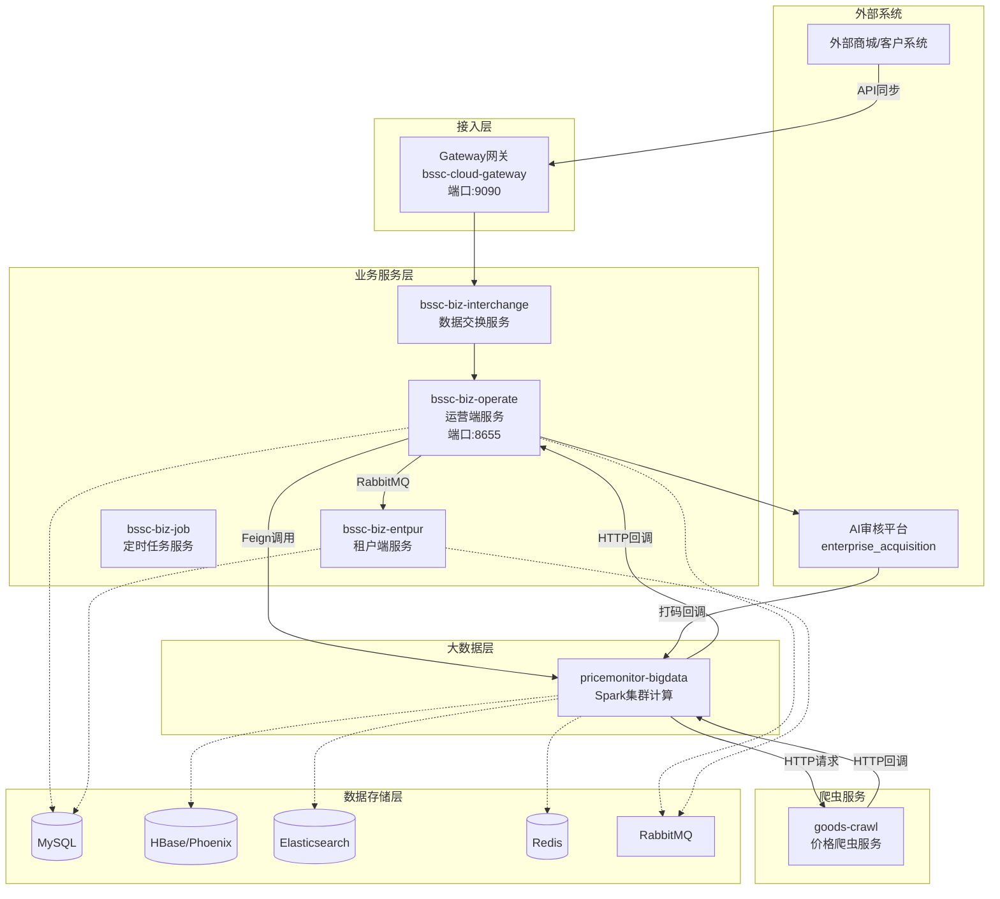
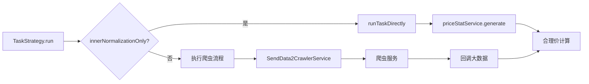
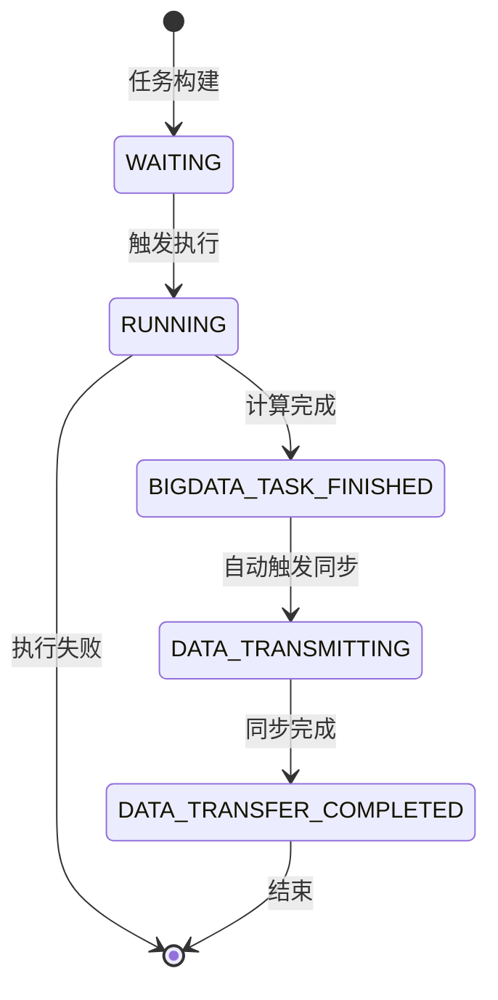

# 价格监测平台 - 项目流程文档

---

## :material-office-building: 一、项目架构概览

### 1.1 系统架构图



---

### 1.2 核心服务说明

| 服务名称 | 模块名 | 端口 | 核心职责 |
|---------|-------|------|---------|
| **Gateway** | bssc-cloud-gateway | 9090 | 统一网关入口，租户信息解析 |
| **数据交换** | bssc-biz-interchange | - | 接收外部系统商品数据同步 |
| **运营端** | bssc-biz-operate | 8655 | 任务调度、打码触发、合理价计算协调 |
| **租户端** | bssc-biz-entpur | - | 商品管理、结果展示、消息接口 |
| **定时任务** | bssc-biz-job | - | XXL-Job执行器，定时触发任务 |
| **大数据** | pricemonitor-bigdata | - | Spark计算合理价、数据存储 |
| **爬虫** | goods-crawl | - | 电商价格爬取、评论采集 |

---

## :material-sitemap-outline: 二、业务主流程

### 2.1 商品数据打码流程

#### 2.1.1 数据来源

| 来源 | 方式 | 接口路径 | 核心方法 |
|-----|------|---------|---------|
| **API同步** | 外部系统主动推送 | `/sync` | `TenantGoodsService.synchronizeGoods()` |
| **手动导入** | 租户端Excel导入 | `/api/goods/import` | `GoodsServiceImpl.importGoods()` |
| **私有化同步** | 定时任务同步 | PrivatizationSyncTask | `PrivatizationSyncTask.sync()` |

**数据流向：**
```
外部系统 → Gateway → bssc-biz-interchange → bssc-biz-operate → t_developer_goods表
```

---

#### 2.1.2 打码任务触发

| 定时器 | 执行器 | 功能 | 适用场景 |
|-------|-------|------|---------|
| **collectAndCodeTaskCreateHandler** | collectAndCodeTaskCreateHandler | 基于批次推送 | 批次打码 |
| **collectAndCodeTaskByTimeHandler** | collectAndCodeTaskByTimeHandler | 基于时间推送 | 通用打码 |
| **tenantCollectAndCodeTaskByTimeHandler** | tenantCollectAndCodeTaskByTimeHandler | 华能专用 | 华能租户 |

**打码流程：**
```
XXL-Job触发 → bssc-biz-operate → Feign通知大数据 → 写入HBase/ES 
    → 推送AI审核平台 → 小博码匹配/同款识别 → 结果回写
```

---

#### 2.1.3 打码结果回传#

| 数据表 | 用途 | 位置 |
|-------|------|------|
| `GOODS_INFO` | 商品宽表（含打码信息） | HBase + ES |
| `ai_task` | AI审核任务记录表 | AI审核平台 |

> **注**：打码结果主要保存在大数据层（HBase/ES），后端通过ES查询获取数据

---

### 2.2 合理价计算流程（核心流程）

#### 阶段一：任务构建（运营端）

```
XXL-Job → XxlJobController.tenantPriceMonitorTaskScheduling()
  → getNeedTriggerTenant() 获取需要触发的租户
  → getTenantTaskWithSource() 流式查询任务配置
  → PriceMonitorTaskConfService.buildNeedMonitoringTask()
    → canBuildMonitorTask() 校验
    → buildDeveloperTask() 插入t_developer_task表
    → insertTaskLog 插入日志
    → TaskService.triggerForEntpurTask() 触发执行
```

**核心校验规则：**
- 检查任务配置状态是否为启用
- 检查是否在维护期（maintenanceStart/maintenanceEnd）
- 检查上次执行时间与配置频率

**关键接口：**
- `GET /api/job/buildPriceMonitorTask` - XXL-Job调用入口

---

#### 阶段二：任务执行与爬虫（大数据端）



**爬虫服务说明：**

| 爬取类型 | 数据源 | 爬取方式 | 功能 |
|---------|-------|---------|------|
| 价格爬取 | 京东/苏宁/天猫等 | API爬虫/浏览器插件 | 实时价格更新 |
| 搜索爬取 | 20+电商平台 | API爬虫 | 同款商品识别 |
| 评论爬取 | 京东/天猫等 | API爬虫 | 好评率/销量采集 |

---

#### 阶段三：合理价计算（Spark计算）

```
PriceStatService.priceStat()
  → crawlFinishCache.get() 检查爬虫完成标记
  → crawlFinish() 验证爬虫状态
  → TASK_IN_PRICE_STAT_MAP 防重复计算
  → GoodsPriceStatGenerateService.generate()
    → ES.scrollQuery() 滚动查询商品数据
      → Spark集群计算合理价
      → 按goodsCode分组聚合
      → ReasonablePriceCalculator 多维度计算
    → Phoenix保存到GOODS_PRICE_STAT表
    → ES同步到goods-price-stat索引
    → silenceCallback() HTTP回调运营端
```

**计算维度：**
- 历史价格趋势
- 市场价格（站内归一、站外同款）
- 供应商价格
- 销量/好评率

---

#### 阶段四：数据同步（运营端→租户端）

```
TaskController.taskOver() 回调
  → TaskService.taskOver() 更新状态为BIGDATA_TASK_FINISHED
  → ForEntpurSyncService.syncGoodsForEntpur()
    → 异步线程池执行
    → ES.scrollQuery() 批量查询GOODS_PRICE_STAT
      → buildGoodsPriceStatItem() 构建同步数据
      → RabbitMQ发送 每10条/批
        → Exchange: pricemonitor.transfer.data
        → Queue: queue.monitor.result
    → checkAndCreate() 检查异常数据
    → MonitorResultConsumer 消费消息
    → GoodsMergeInfoService.saveGoodsMergeInfo()
    → 保存t_goods_merge_his、t_goods_merge_all
    → 生成合理价消息（msgtype=2）
```

**RabbitMQ配置：**
```yaml
Exchange: pricemonitor.transfer.data
Queue: queue.monitor.result
Dead Letter Queue: queue.monitor.result.deadletter
并发度: 20-100
批量大小: 10条/批
最大重试: 3次
```

**关键接口：**
- `POST /api/task/over` - 大数据任务完成回调

---

#### 阶段五：结果保存（租户端）

| 保存顺序 | 数据表 | 说明 |
|---------|-------|------|
| 1 | `t_goods_merge_his` | 历史价格记录（保留所有变化） |
| 2 | `t_goods_merge_all` | 全量最新结果 |
| 3 | `t_developer_msg_detail` | 合理价消息（msgtype=2，SaaS租户） |

---

### 2.3 商品异常上报流程

```
异常上报
  → API同步（外部系统推送）
  → 手动导入（租户端上传）
  → 私有化同步（定时任务拉取）
→ 保存到t_developer_goods_exception表
→ 定时器推送AI审核平台
→ AI平台复审
  → 通过 → 创建合理价计算任务 → 走2.2流程
  → 不通过 → 标记异常，人工处理
```

---

## :material-connection: 三、服务间调用链路

### 3.1 完整调用时序#

```
1. XXL-Job定时触发
   → XxlJobController.buildPriceMonitorTask()
   → 构建t_developer_task任务
   → TaskService.triggerForEntpurTask()

2. 运营端→大数据
   → Feign调用DeveloperTaskApi.runTask()
   → 大数据端TaskStrategy.run()
   → 更新任务状态为RUNNING

3. 爬虫交互（如需要）
   → SendData2CrawlerService发送爬虫请求
   → goods-crawl执行爬虫
   → HTTP回调返回结果

4. 大数据计算
   → PriceStatService.priceStat()
   → Spark计算合理价
   → 保存到HBase/ES

5. 大数据→运营端回调
   → HTTP POST /api/task/over
   → TaskService.taskOver()
   → 更新状态为BIGDATA_TASK_FINISHED
   → ForEntpurSyncService.syncGoodsForEntpur()

6. 运营端→租户端数据同步
   → ES滚动查询GOODS_PRICE_STAT
     → Exchange: pricemonitor.transfer.data
     → Queue: queue.monitor.result

7. 租户端消费
   → MonitorResultConsumer接收消息
   → 保存t_goods_merge_his、t_goods_merge_all
   → 生成合理价消息
   → 更新状态为DATA_TRANSFER_COMPLETED
```

---

### 3.2 接口调用矩阵#

| 调用方向 | 协议 | 接口地址 | 用途 |
|---------|------|---------|------|
| 运营端→大数据 | Feign | `DeveloperTaskApi.runTask()` | 触发任务执行 |
| 大数据→爬虫 | HTTP | `POST /api/crawl/goods` | 发起爬虫 |
| 爬虫→大数据 | HTTP | `POST /callback/goods` | 爬虫回调 |
| 大数据→运营端 | HTTP | `POST /api/task/over` | 任务完成回调 |
| 运营端→租户端 | RabbitMQ | `queue.monitor.result` | 数据同步 |
| 运营端→租户端 | Feign | `OperateApi.transTDMsgDetails()` | 消息同步 |

---

## :material-database: 四、核心数据模型#

### 4.1 任务相关表#

| 表名 | 用途 | 核心字段 | 位置 |
|-----|------|---------|------|
| `t_developer_task` | 监测任务主表（运营端） | id, source_id, task_name, task_type, state, batch_id | MySQL |
| `t_developer_task_logs` | 任务执行日志 | task_id, type, operate_desc, create_time | MySQL |
| `t_tenant_task_conf` | 租户任务配置表 | source_id, tenant_task_id, task_type, frequency, state | MySQL |
| `t_monitor_task` | 租户端监测任务表 | tenant_id, task_name, task_type, task_status, price_algorithm_id | MySQL |

---

### 4.2 商品相关表#

| 表名 | 用途 | 存储位置 | 说明 |
|-----|------|---------|------|
| `t_developer_goods` | 开发者商品表 | MySQL | 存储外部系统同步的商品数据 |
| `GOODS_INFO` | 商品宽表 | HBase + ES | 包含打码信息、价格等全量数据 |
| `GOODS_PRICE_STAT` | 价格统计表 | HBase + ES | 合理价计算结果 |
| `t_goods_merge_all` | 商品全量表（最新） | MySQL | 存储最新监测结果 |
| `t_goods_merge_his` | 商品历史表 | MySQL | 存储历史价格记录 |
| `t_goods_merge_his_expend` | 商品历史扩展表 | MySQL | 存储扩展信息（采购价等） |

---

### 4.3 消息相关表#

| 表名 | 用途 | 核心字段 | 位置 |
|-----|------|---------|------|
| `t_developer_msg_detail` | 消息明细表 | msg_id, developer_id, msg_type, goods_id, status | MySQL |
| `ai_task` | AI审核任务 | - | AI审核平台 |

---

## :material-sync: 五、任务状态流转#

### 5.1 状态定义#

| 状态 | 英文值 | 说明 |
|-----|-------|------|
| 等待中 | `WAITING` | 任务已创建，等待执行 |
| 运行中 | `RUNNING` | 任务正在执行（爬虫/计算中） |
| 大数据完成 | `BIGDATA_TASK_FINISHED` | 合理价计算完成 |
| 数据传输中 | `DATA_TRANSMITTING` | 正在同步到租户端 |
| 数据传输完成 | `DATA_TRANSFER_COMPLETED` | 同步完成 |

---

### 5.2 状态流转图#



---

## :material-cog: 六、配置说明#

### 6.1 核心配置项#

```yaml
# 大数据回调配置
task-callback-url: http://运营端:8655/api/task/over

# 爬虫服务配置
goods-crawl-url: http://爬虫服务/api/crawl/goods
goods-crawl-callback-url: http://大数据端/callback/goods

# 站内归一模式
innerNormalizationOnly: false  # true时跳过爬虫直接计算

# 结果校验开关
price-stat-item-check: false  # 是否开启数据校验
```

---

### 6.2 RabbitMQ配置#

```yaml
exchange: pricemonitor.transfer.data
queue: queue.monitor.result
routing-key: queue.monitor.result
concurrency: 20-100
prefetch: 10
retry: 3  # 最大重试次数
```

---

### 6.3 缓存配置#

| 缓存Key | 用途 | TTL |
|--------|------|-----|
| `crawlFinishCache:*` | 爬虫完成标记 | 30分钟 |
| `TASK_IN_PRICE_STAT_MAP` | 计算防重 | 执行完成后移除 |
| `unCompleteSource:*` | 未完成数据源 | 动态管理 |
| `SOURCE_KEY_PREFIX:*` | 数据源信息 | 1天 |

---

## :material-tools: 七、故障排查指南#

### 7.1 常见问题排查#

| 问题现象 | 排查方向 | 检查点 |
|---------|---------|-------|
| **任务未构建** | 任务配置 | 配置状态、维护期、执行频率 |
| **任务卡在WAITING** | 触发机制 | triggerForEntpurTask是否执行 |
| **爬虫未完成** | 爬虫服务 | crawlFinishCache、爬虫状态、回调URL |
| **合理价未计算** | 大数据计算 | TASK_IN_PRICE_STAT_MAP残留、爬虫数据 |
| **数据未同步** | MQ链路 | 队列堆积、消费者异常、死信队列 |
| **消息未生成** | 租户类型 | tenantType、消息生成开关 |
| **任务卡在RUNNING** | 执行超时 | 爬虫响应、Spark资源、线程池状态 |
| **ES查询超时** | 搜索性能 | 集群状态、索引分片、查询条件 |

---

### 7.2 关键日志位置#

| 服务 | 关键日志 | 说明 |
|-----|---------|------|
| 运营端 | `PriceMonitorTaskConfServiceImpl` | 任务构建日志 |
| 运营端 | `TaskServiceImpl.taskOver` | 任务状态变更 |
| 大数据 | `PriceStatService.priceStat` | 合理价计算 |
| 大数据 | `ForEntpurSyncServiceImpl.sync` | 数据同步 |
| 租户端 | `MonitorResultConsumer` | MQ消费 |

---

### 7.3 性能优化建议#

1. **批量处理**：ES查询500条/批，MQ发送10条/批
2. **异步执行**：数据同步使用线程池，不阻塞主流程
3. **并发控制**：TASK_IN_PRICE_STAT_MAP防止重复计算
4. **缓存优化**：Redis缓存数据源、开发者信息
5. **容错机制**：MQ消费失败最多重试3次
6. **幂等性**：确保重复回调不会导致重复计算

---

## :material-book-open: 八、术语解释#

| 术语 | 解释 |
|-----|------|
| **打码** | AI审核平台对商品进行编码标识，包括小博码匹配、同款识别 |
| **合理价** | 基于历史价格、市场价格、供应商价格等多维度计算的价格区间 |
| **站内归一** | 将同一平台内的相似商品进行标准化处理 |
| **站外同款** | 识别不同电商平台之间的同款商品 |
| **SaaS租户** | 使用平台统一云服务的租户 |
| **私有化租户** | 独立部署在客户本地环境的租户 |
| **小博码** | AI平台生成的商品唯一标识码 |
| **XXL-Job** | 分布式任务调度平台 |
| **Feign** | Spring Cloud声明式HTTP客户端 |

---

## :material-file-document: 附录#

### A. 项目目录结构#

```
pricemonitor/
├── entpur-backend/          # 后端微服务
│   ├── bssc-cloud-gateway/  # 网关
│   ├── bssc-biz-operate/    # 运营端
│   ├── bssc-biz-entpur/     # 租户端
│   ├── bssc-biz-interchange/# 数据交换
│   ├── bssc-biz-job/        # 定时任务
│   └── ...
├── pricemonitor-bigdata/    # 大数据服务（Spark）
├── goods-crawl/             # 爬虫服务
└── enterprise_acquisition/  # AI审核平台
```

---

### B. 环境信息#

| 环境 | 地址 | 备注 |
|-----|------|------|
| 开发环境 | 172.18.164.67 | 每日零点构建 |
| 测试环境 | 172.18.164.65 | - |
| 准生产 | 172.18.164.69 | - |
| 生产环境 | e.gcycloud.cn | - |
