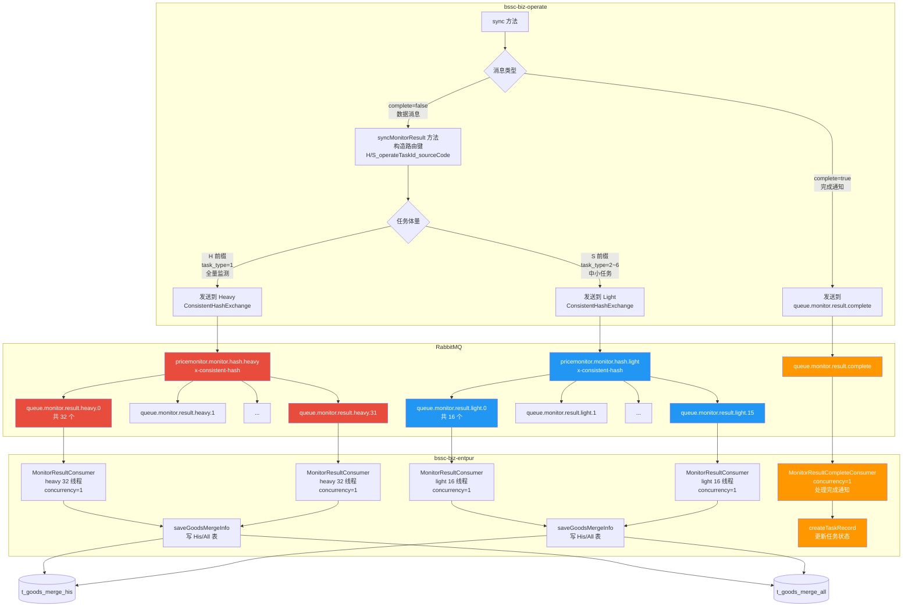

# RabbitMQ 价格监测结果队列分区消费优化 设计文档

:material-file-document-edit: **文档类型**: 功能设计 |
:material-api: **涉及模块**: bssc-biz-rabbitmq, bssc-biz-operate, bssc-biz-entpur |
:material-account-clock: **更新时间**: 2026-06-09 |
:material-account: **维护人**: 研发团队 |
:material-tag: **标签**: RabbitMQ, Consistent Hash Exchange, 分区消费, 行锁优化, bssc-biz-entpur, bssc-biz-operate, 价格监测

---

## 一、需求概述

### 1.1 问题背景

价格监测结果队列（`queue.monitor.result`）采用单队列 + 多线程并发消费模式（2 Pod × 100 线程），同一 `operateTaskId` 的消息被多线程并行处理，竞争 `t_goods_merge_his` 和 `t_goods_merge_all` 表的同一批行（唯一键：`goodsId + sourceCode + operateTaskId`），导致严重的 InnoDB 行锁竞争。

### 1.2 现状问题

:material-alert-circle: **核心问题**：单条消息处理耗时 **30~55 秒**，其中写 His 表（`REPLACE INTO` 100条）占 **24~38 秒**，全部花在行锁等待上。

| 步骤 | 实际耗时 | 正常预期 |
|:------|:---------|:---------|
| 查租户 | 2~9 秒 | <10ms |
| 查 His | 2~10 秒 | <200ms |
| 写 His（REPLACE INTO 100条） | **24~38 秒** | <500ms |
| 总耗时 | 30~55 秒 | <2 秒 |

:material-server-off: **连带问题**：长时间行锁等待导致 Pod 内存/连接资源耗尽，曾导致 Pod 被 OOM Kill 重启，消费者数从 200 降至 62。

### 1.3 根因分析

```
当前架构：
生产者 ─→ DirectExchange ─→ queue.monitor.result (1个队列)
                              ↓
                    Pod A(100线程) + Pod B(100线程)
                              ↓
                   所有线程抢同一批行 → 行锁死等 24~38秒
```

同一 `operateTaskId` 的消息被 RabbitMQ 随机分发到两个 Pod 的多个线程，同时写 `t_goods_merge_his` 表中同一个唯一键的行，导致 InnoDB 行锁排队。

### 1.4 额外问题：任务完成通知被阻塞

在现有架构中，任务完成通知（`complete=true`）和数据消息（`complete=false`）共用同一个队列。经代码分析，`complete=true` 消息在消费者端**不写 His/All 表**，仅执行轻量级操作：

| complete=true 操作 | 说明 |
|:------|:------|
| 更新 `MonitorTask.taskStatus=2` | 标记批次/异常反馈任务完成 |
| 创建 `MonitorTaskRecord` 执行记录 | 记录完成时间、监测时间 |
| 触发 `statMonitorDataByTenantId` | 仅全量任务触发月度统计 |

!!! danger "阻塞场景"
    如果完成通知和几百条数据消息挤在同一分片队列，它必须等前面所有数据消息处理完才会被消费。任务数据明明已入队，却迟迟不标记完成，用户侧看到任务"卡住"。

**解决方案**：完成通知独立走一个轻量级队列 + 独立消费者，处理耗时 < 100ms，不再受数据消息排队影响。

---

## 二、技术方案

### 2.1 方案选型：Consistent Hash Exchange 分区消费

:material-check-circle: **选中方案**：利用 RabbitMQ 内置的 `x-consistent-hash` Exchange 类型，按路由键的哈希值将消息分发到多个分片队列，每个分片队列单线程消费。

### 2.2 架构设计



#### 2.2.1 物理隔离 vs 逻辑隔离

本方案采用 **heavy/light 双 Exchange 物理隔离**，相比逻辑前缀（`H_`/`S_`）隔离更彻底：

| 隔离方式 | 实现方式 | 大任务堆满时小任务的影响 |
|:---------|:---------|:----------------------|
| **物理隔离（采纳）** | 2 个独立 Exchange + 2 组独立队列 | 0，小任务完全不受影响 |
| 逻辑前缀隔离 | 1 个 Exchange + 前缀区分 | 小任务可能被路由到"热分片"被阻塞 |

!!! note "与 Deepseek 专家模式的差异"
    Deepseek 原方案使用 `task_type=1` 划分 heavy/light，本文档调整为：`H` 前缀 = 全量监测（task_type=1），`S` 前缀 = 其他类型（task_type=2~6）。详见 [2.3 路由键设计](#23-路由键设计)。

### 2.3 路由键设计

路由键采用三层粒度，精确控制消息分发：

```
路由键 = {category}_{operateTaskId}_{sourceCode}

示例：
  H_2055317287354052610_jd        → 全量监测任务，京东源
  H_2055317287354052610_taobao   → 同一全量任务，淘宝源（不同sourceCode，并行处理）
  S_2055317287354052611_jd        → 中小任务，京东源（与全量任务物理隔离）
```

#### 2.3.1 分类前缀（category）

| 前缀 | Exchange | 适用任务类型 | taskType 值 | 体量特征 | 分片数 |
|:-----|:---------|:-------------|:-----------|:---------|:-------|
| `H` (Heavy) | `pricemonitor.monitor.hash.heavy` | 全量监测 | 1 | 万~数十万条 | **32** |
| `S` (Small/Light) | `pricemonitor.monitor.hash.light` | 品类/供应商/单品/API/异常反馈监测 | 2, 3, 4, 5, 6 | 几条~数千条 | **16** |

!!! note "为什么不按 task_type=1 划分 heavy/light"
    Deepseek 原建议以 `task_type=1` 一刀切划分。但实际业务中 task_type=1（全量监测）体量最大（万~数十万条）确认为 heavy；其余 task_type=2~6 虽然有品类/供应商监测，但整体体量小，合并为 light 更合理，也减少路由键前缀判断的复杂度。

!!! note "完成通知不走 Consistent Hash"
    任务完成通知（`complete=true`）走独立的 `queue.monitor.result.complete` 队列，不使用 Consistent Hash Exchange。详见 [2.6 完成通知独立队列](#26-完成通知独立队列)。

#### 2.3.2 设计原理

| 维度 | 说明 |
|:------|:------|
| **category 前缀** | H/S 前缀决定消息发往哪个 Exchange → 物理隔离 |
| **H/S + operateTaskId** | 同一任务的所有消息进入同一 Exchange 的同一分片，消除跨线程行锁竞争 |
| **sourceCode** | 同一任务内不同数据源的写操作不冲突（写不同行），可并行到不同分片 |
| **Consistent Hash** | `hash(category_operateTaskId_sourceCode)` 确定性地分配到对应 Exchange 的分片之一 |

### 2.4 分片与 Pod 分配

:material-kubernetes: 2 个 Pod 分担 48 个分片（heavy 32 + light 16），每 Pod 约 24 个消费者线程：

```
总资源：48 分片 = Heavy 32 + Light 16

正常状态（2 Pod）：
Pod A → heavy.0,2,4...30 (16个) + light.0,2,4...14 (8个) = 24 消费者线程
Pod B → heavy.1,3,5...31 (16个) + light.1,3,5...15 (8个) = 24 消费者线程

Pod A 宕机：
Pod B → heavy.0~31 (全部32个) + light.0~15 (全部16个) = 48 消费者线程 ← RabbitMQ 自动接管

Pod A 恢复：
自动重新平衡 → 各 24 个
```

| 场景 | 行锁竞争 | 消息丢失 | 消费者线程数 | 恢复方式 |
|:------|:--------|:--------|:------------|:--------|
| 2 Pod 正常 | :material-check-circle: 无 | :material-check-circle: 无 | 48（各 24） | — |
| 1 Pod 宕机 | :material-check-circle: 无 | :material-check-circle: 无 | 48（单 Pod 全接管） | RabbitMQ 自动 |
| Pod 恢复 | :material-check-circle: 无 | :material-check-circle: 无 | 48 | RabbitMQ 自动重平衡 |

### 2.5 死信队列处理

:material-clock-alert: 死信队列保持现有机制不变，但调整 TTL 后的目标队列：

```
异常消息 → 重试3次 → 发死信队列 (TTL=60s)
                                      ↓
                   原方案: 路由回 queue.monitor.result
                   新方案: 路由回 queue.monitor.result (旧单队列，保留不变)
                                      ↓
                    旧队列仍被监听，消息被任意消费者处理
                    60s 后行大概率已写完，竞争概率极低
```

### 2.6 完成通知独立队列

#### 2.6.1 设计动机

`complete=true` 消息在消费者端不写 His/All 表，仅执行轻量级操作（`createTaskRecord`），性能特征与数据消息完全不同：

| 特征 | 数据消息 (`complete=false`) | 完成通知 (`complete=true`) |
|:------|:---------------------------|:---------------------------|
| 是否写 His/All 表 | :material-check-circle: 是（核心耗时） | :material-close-circle: 否 |
| 单条处理耗时 | ~1~2 秒（改造后） | < 100ms |
| 消息量 | 数十~数十万条 | 每个任务 **1 条** |
| 被阻塞后果 | 吞吐下降 | **任务迟迟不标完成** |

如果完成通知走 Consistent Hash Exchange，它会被路由到某个分片队列的尾部，等前面所有数据消息消费完毕才被处理。大任务可能因此"卡完成"数分钟。

#### 2.6.2 方案：独立队列 + 独立消费者

```
生产者 sync() 方法
  ├─ 数据消息 (complete=false) → ConsistentHashExchange → queue.monitor.result.{0..15}
  │                                                          ↓
  │                                            MonitorResultConsumer (处理数据)
  │
  └─ 完成通知 (complete=true) → DirectExchange → queue.monitor.result.complete
                                                      ↓
                                       MonitorResultCompleteConsumer (处理完成信号)
```

| 优点 | 说明 |
|:------|:------|
| **不被阻塞** | 完成通知走独立队列，无需等待数据消息 |
| **逻辑清晰** | 数据消费者专注 His/All 写入，完成消费者专注任务状态 |
| **独立扩展** | 完成消费者可独立调整并发配置（当前 `concurrency=1` 足够） |
| **故障隔离** | 完成通知处理失败不影响数据消息消费 |

#### 2.6.3 消费者端逻辑简化

独立消费者不再需要 `complete=true/false` 分支判断，因为该队列只接收 `complete=true` 消息：

```java
// MonitorResultCompleteConsumer: 仅处理 complete=true 消息
public void onCompleteMessage(...) {
    GoodsMergeInfoReqDTO dto = JsonUtil.jsonToBean(msg, ...);
    // dto.getComplete() 恒为 true，无需判断
    createTaskRecord(dto, sysTenantDTO, monitorTask);
    // 完成，ACK
}
```

### 2.7 Quorum 队列讨论

#### 2.7.1 Deepseek 建议 vs 当前方案

Deepseek 专家模式建议使用 Quorum 队列（`queue-type=quorum`），认为其具备更强的数据安全性和自动故障转移能力。经分析，本文档**不采纳 Quorum 队列**，理由如下：

| 对比维度 | Classic + 镜像队列（当前） | Quorum 队列 |
|:---------|:--------------------------|:-----------|
| 写入性能 | 1 副本写入，快 | 3 副本 Raft，慢 **~20-30%** |
| 故障转移 | HaPolicy all，自动 | 自动（Raft Leader 选举） |
| 死信兼容 | 完全支持，所有属性/Header 保留 | **有限制**（某些 Header 在 x-death 后被丢弃） |
| 内存占用 | 较低 | 较高（每条消息多副本） |
| 适用场景 | 对性能敏感的事务性队列 | 高可靠性的金融/订单类队列 |

!!! info "结论"
    价格监测结果队列的核心瓶颈是 **DB 行锁** 而非队列可靠性。当前 Classic + HaPolicy all 已提供足够的数据安全保障。引入 Quorum 队列会在写入路径额外增加 ~20-30% 的 Raft 开销，得不偿失。

#### 2.7.2 建议的镜像队列策略

继续使用现有的 HaPolicy all 策略，确保所有队列在所有节点上镜像：

```bash
# 建议的 HA Policy
rabbitmqctl set_policy ha-all "^queue\." '{"ha-mode":"all"}'
# 含义：所有以 "queue." 开头的队列，在所有节点上保持镜像
```

### 2.8 分片队列监控

#### 2.8.1 为什么需要监控每个分片

与单队列不同，分片队列可能出现以下热点问题：

| 问题 | 表现 | 根因 |
|:-----|:-----|:-----|
| 热点分片 | 少数分片队列消息积压 > 90%，其他分片空闲 | 哈希碰撞，相同 operateTaskId 消息过多 |
| 分片卡死 | 分片队列消息数持续不变，无消费 | 消费者线程异常退出 |
| 分片倾斜 | 各分片消息数差异 > 3 倍 | 哈希函数分布不均（理论上应均匀） |

#### 2.8.2 监控指标

建议在 Grafana 中为 heavy/light 两组分片队列分别创建监控面板：

```bash
# 获取所有分片队列的深度（每分片 messages + messages_unacknowledged）
curl -s -u admin:password http://rabbitmq-host:15672/api/queues \
  | jq '[.[] | select(.name | startswith("queue.monitor.result.")) |
        {name, messages, messages_unacknowledged, consumers, state}]'
```

| 指标 | 告警阈值 | 说明 |
|:-----|:--------|:-----|
| `messages` | 单分片 > 均值 × 5 | 热点分片告警 |
| `messages_unacknowledged` | > 0 且持续 5min | 消费者卡死告警 |
| `consumers` | = 0 且 messages > 0 | 消费者掉线告警 |
| `consumers` | < 预期值 50% | 消费者缩容告警 |
| 消费速率（delta messages） | < 0.1 msg/s 持续 10min | 分片卡死告警 |

#### 2.8.3 Prometheus + Grafana 接入建议

推荐通过 `rabbitmq_exporter` 或 `prometheus_rabbitmq_exporter` 暴露以下指标：

```yaml
# prometheus.yml 配置
- job_name: 'rabbitmq'
  static_configs:
    - targets: ['rabbitmq-host:15692']
  metrics_path: '/metrics'
```

关键监控指标：

| Prometheus 指标 | 说明 |
|:---------------|:-----|
| `rabbitmq_queue_messages` | 各队列当前消息数 |
| `rabbitmq_queue_consumers` | 各队列消费者数 |
| `rabbitmq_queue_messages_ready` | 等待消费的消息数 |
| `rabbitmq_queue_messages_unacked` | 正在处理的消息数 |

---

## 三、代码改动

### 3.1 改动总览

| 序号 | 模块 | 文件 | 改动类型 | 改动量 |
|:-----|:-----|:-----|:---------|:------|
| 1 | bssc-biz-rabbitmq | `RabbitMqConstants.java` | 新增 2 个 Exchange 常量 | +4 行 |
| 2 | bssc-biz-rabbitmq | `RabbitMqQueueConfig.java` | 新增 5 个 Bean（2 Exchange + 2组队列 + 1 完成队列） | +80 行 |
| 3 | bssc-biz-operate | `ForEntpurSyncServiceImpl.java` | 修改发送逻辑（判断 H/S 前缀，分发到不同 Exchange） | 2 处 |
| 4 | bssc-biz-entpur | `MonitorResultConsumer.java` | 修改为 2 个 `@RabbitListener`（heavy 32 队列 + light 16 队列） | 2 处 |
| 5 | bssc-biz-entpur | `MonitorResultCompleteConsumer.java` | **新增文件** | ~60 行 |

### 3.2 RabbitMqConstants.java — 新增 Heavy/Light 双 Exchange 常量

**文件路径**: `entpur-backend/bssc-biz-rabbitmq/src/main/java/com/bssc/biz/rabbitmq/constant/RabbitMqConstants.java`

**改动**: 在 `Exchange` 类中新增 2 个 Consistent Hash Exchange 常量：

```java
public static class Exchange {
    // ... 现有常量 ...

    /**
     * 价格监测结果 Consistent Hash Exchange — Heavy（全量监测，32 分片）
     * 仅接收 task_type=1 的全量监测任务消息，体量万~数十万条
     */
    public static final String MONITOR_CONSISTENT_HASH_HEAVY_EXCHANGE = "pricemonitor.monitor.hash.heavy";

    /**
     * 价格监测结果 Consistent Hash Exchange — Light（中小任务，16 分片）
     * 接收 task_type=2~6 的品类/供应商/单品/API/异常反馈监测消息，体量几条~数千条
     */
    public static final String MONITOR_CONSISTENT_HASH_LIGHT_EXCHANGE = "pricemonitor.monitor.hash.light";
}

public static class Queue {
    // ... 现有常量 ...

    /**
     * 价格监测结果完成通知队列（独立于数据队列，防止完成通知被数据消息阻塞）
     */
    public static final String MONITOR_RESULT_COMPLETE_QUEUE = "queue.monitor.result.complete";
}
```

### 3.3 RabbitMqQueueConfig.java — 新增 Heavy/Light 双 Exchange + 48 分片队列

**文件路径**: `entpur-backend/bssc-biz-rabbitmq/src/main/java/com/bssc/biz/rabbitmq/config/RabbitMqQueueConfig.java`

**改动**: 新增 5 个 Bean 方法（2 个 Exchange + 2 组分片队列 + 1 个完成队列）：

```java
/** Heavy 分片队列数量（全量监测，32 个） */
private static final int MONITOR_HEAVY_SHARD_COUNT = 32;

/** Light 分片队列数量（中小任务，16 个） */
private static final int MONITOR_LIGHT_SHARD_COUNT = 16;

/**
 * Consistent Hash Exchange — Heavy（全量监测，32 分片）
 * 将全量监测任务消息按路由键哈希分配到 32 个分片队列。
 */
@Bean("monitorConsistentHashHeavyExchange")
@ConditionalOnBean(RabbitMqConfig.class)
public Exchange monitorConsistentHashHeavyExchange() {
    CustomExchange exchange = new CustomExchange(
            RabbitMqConstants.Exchange.MONITOR_CONSISTENT_HASH_HEAVY_EXCHANGE,
            "x-consistent-hash",
            true,   // durable
            false,  // autoDelete
            null    // args
    );
    rabbitAdmin.declareExchange(exchange);
    return exchange;
}

/**
 * Consistent Hash Exchange — Light（中小任务，16 分片）
 * 将中小任务消息按路由键哈希分配到 16 个分片队列。
 */
@Bean("monitorConsistentHashLightExchange")
@ConditionalOnBean(RabbitMqConfig.class)
public Exchange monitorConsistentHashLightExchange() {
    CustomExchange exchange = new CustomExchange(
            RabbitMqConstants.Exchange.MONITOR_CONSISTENT_HASH_LIGHT_EXCHANGE,
            "x-consistent-hash",
            true,   // durable
            false,  // autoDelete
            null    // args
    );
    rabbitAdmin.declareExchange(exchange);
    return exchange;
}

/**
 * Heavy 分片队列（32 个，全量监测）
 * 每个队列绑定到 Heavy Consistent Hash Exchange，权重均为 "1"（均分）。
 */
@Bean("monitorHeavyShardQueues")
@ConditionalOnBean(Exchange.class)
public List<Queue> monitorHeavyShardQueues() {
    List<Queue> queues = new ArrayList<>(MONITOR_HEAVY_SHARD_COUNT);
    for (int i = 0; i < MONITOR_HEAVY_SHARD_COUNT; i++) {
        String queueName = "queue.monitor.result.heavy." + i;
        Queue queue = new Queue(queueName, true, false, false);
        rabbitAdmin.declareQueue(queue);

        Binding binding = new Binding(
                queueName,
                Binding.DestinationType.QUEUE,
                RabbitMqConstants.Exchange.MONITOR_CONSISTENT_HASH_HEAVY_EXCHANGE,
                "1",   // 权重为 1，均分消息
                null
        );
        rabbitAdmin.declareBinding(binding);
        queues.add(queue);
    }
    return queues;
}

/**
 * Light 分片队列（16 个，中小任务）
 * 每个队列绑定到 Light Consistent Hash Exchange，权重均为 "1"（均分）。
 */
@Bean("monitorLightShardQueues")
@ConditionalOnBean(Exchange.class)
public List<Queue> monitorLightShardQueues() {
    List<Queue> queues = new ArrayList<>(MONITOR_LIGHT_SHARD_COUNT);
    for (int i = 0; i < MONITOR_LIGHT_SHARD_COUNT; i++) {
        String queueName = "queue.monitor.result.light." + i;
        Queue queue = new Queue(queueName, true, false, false);
        rabbitAdmin.declareQueue(queue);

        Binding binding = new Binding(
                queueName,
                Binding.DestinationType.QUEUE,
                RabbitMqConstants.Exchange.MONITOR_CONSISTENT_HASH_LIGHT_EXCHANGE,
                "1",   // 权重为 1，均分消息
                null
        );
        rabbitAdmin.declareBinding(binding);
        queues.add(queue);
    }
    return queues;
}

/**
 * 价格监测结果完成通知队列（独立于数据分片队列）
 * 仅接收 complete=true 的消息，防止完成通知被数据消息阻塞。
 */
@Bean("monitorResultCompleteQueue")
@ConditionalOnBean(Exchange.class)
public Queue monitorResultCompleteQueue() {
    Queue queue = new Queue(RabbitMqConstants.Queue.MONITOR_RESULT_COMPLETE_QUEUE, true, false, false);
    rabbitAdmin.declareQueue(queue);
    queueBind(
            RabbitMqConstants.Queue.MONITOR_RESULT_COMPLETE_QUEUE,
            RabbitMqConstants.Exchange.PRICE_MONITOR_TRANSFER_DATA_EXCHANGE,
            RabbitMqConstants.Queue.MONITOR_RESULT_COMPLETE_QUEUE
    );
    return queue;
}
```
public Exchange monitorConsistentHashExchange() {
    // x-consistent-hash 是 RabbitMQ consistent_hash_exchange 插件提供的 Exchange 类型
    CustomExchange exchange = new CustomExchange(
            RabbitMqConstants.Exchange.MONITOR_CONSISTENT_HASH_EXCHANGE,
            "x-consistent-hash",
            true,   // durable
            false,  // autoDelete
            null    // args（默认行为：路由键直接哈希）
    );
    rabbitAdmin.declareExchange(exchange);
    return exchange;
}

/**
 * 价格监测结果分片队列（16 个）
 * 每个队列绑定到 Consistent Hash Exchange，权重均为 "1"（均分）。
 */
@Bean("monitorShardQueues")
@ConditionalOnBean(Exchange.class)
public List<Queue> monitorShardQueues() {
    List<Queue> queues = new ArrayList<>(MONITOR_SHARD_COUNT);
    for (int i = 0; i < MONITOR_SHARD_COUNT; i++) {
        String queueName = RabbitMqConstants.Queue.MONITOR_RESULT_QUEUE + "." + i;
        Queue queue = new Queue(queueName, true, false, false);
        rabbitAdmin.declareQueue(queue);

        // 绑定到 Consistent Hash Exchange，路由键 "1" 表示权重为 1
        // 所有队列权重一致 → 消息均匀分布
        Binding binding = new Binding(
                queueName,
                Binding.DestinationType.QUEUE,
                RabbitMqConstants.Exchange.MONITOR_CONSISTENT_HASH_EXCHANGE,
                "1",   // 权重
                null
        );
        rabbitAdmin.declareBinding(binding);
        queues.add(queue);
    }
    return queues;
}

/**
 * 价格监测结果完成通知队列（独立于数据分片队列）
 * 仅接收 complete=true 的消息，防止完成通知被数据消息阻塞。
 * 绑定到现有的 Direct Exchange，路由键为队列名。
 */
@Bean("monitorResultCompleteQueue")
@ConditionalOnBean(Exchange.class)
public Queue monitorResultCompleteQueue() {
    Queue queue = new Queue(RabbitMqConstants.Queue.MONITOR_RESULT_COMPLETE_QUEUE, true, false, false);
    rabbitAdmin.declareQueue(queue);
    queueBind(
            RabbitMqConstants.Queue.MONITOR_RESULT_COMPLETE_QUEUE,
            RabbitMqConstants.Exchange.PRICE_MONITOR_TRANSFER_DATA_EXCHANGE,
            RabbitMqConstants.Queue.MONITOR_RESULT_COMPLETE_QUEUE
    );
    return queue;
}
```

### 3.4 ForEntpurSyncServiceImpl.java — 生产者端改造

**文件路径**: `entpur-backend/bssc-biz-operate/src/main/java/com/bssc/maint/operate/service/impl/ForEntpurSyncServiceImpl.java`

**改动**: 共 2 处，分别处理任务完成通知消息和批量数据消息。

#### 3.4.1 任务完成通知消息（第 238~240 行）

```java
// ===== 改动前 =====
sendService.sendMsg(RabbitMqConstants.Exchange.PRICE_MONITOR_TRANSFER_DATA_EXCHANGE,
        RabbitMqConstants.Queue.MONITOR_RESULT_QUEUE, JsonUtil.beanToJson(syncGoodsForEntpurBO));

// ===== 改动后 =====
// 任务完成通知走独立队列，不被数据消息阻塞
rabbitTemplate.convertAndSend(
        RabbitMqConstants.Exchange.PRICE_MONITOR_TRANSFER_DATA_EXCHANGE,
        RabbitMqConstants.Queue.MONITOR_RESULT_COMPLETE_QUEUE,  // ← 独立队列
        JsonUtil.beanToJson(syncGoodsForEntpurBO)
);
```

#### 3.4.2 批量数据消息（第 383~385 行，在 `syncMonitorResult` 方法内）

```java
// ===== 改动前 =====
sendService.sendMsg(RabbitMqConstants.Exchange.PRICE_MONITOR_TRANSFER_DATA_EXCHANGE,
        RabbitMqConstants.Queue.MONITOR_RESULT_QUEUE, JsonUtil.beanToJson(syncGoodsForEntpurBO));

// ===== 改动后 =====
// 构造路由键：{H/S 前缀}_{operateTaskId}_{sourceCode}
// task 通过方法参数传入，sourceCode 从当前处理的数据源获取
String category = "H";  // 默认全量监测（task_type=1）
String exchange;
if (task.getTaskType() != null && task.getTaskType() != 1) {
    // task_type=2~6 → Light Exchange
    category = "S";
    exchange = RabbitMqConstants.Exchange.MONITOR_CONSISTENT_HASH_LIGHT_EXCHANGE;
} else {
    // task_type=1 → Heavy Exchange
    exchange = RabbitMqConstants.Exchange.MONITOR_CONSISTENT_HASH_HEAVY_EXCHANGE;
}
String sourceCode = syncSource.getName();
String routingKey = category + "_" + syncGoodsForEntpurBO.getOperateTaskId() + "_" + sourceCode;

rabbitTemplate.convertAndSend(
        exchange,       // ← Heavy 或 Light Exchange
        routingKey,
        JsonUtil.beanToJson(syncGoodsForEntpurBO)
);
```

!!! note "物理隔离"
    `H_` 前缀路由键对应 Heavy Exchange（32 分片），`S_` 前缀对应 Light Exchange（16 分片）。即使某个 Heavy 分片被大任务堆满，Light Exchange 上的中小任务也**完全不受影响**。

!!! note "`rabbitTemplate` 注入"
    如果 `ForEntpurSyncServiceImpl` 中还未注入 `RabbitTemplate`，需新增字段：
    ```java
    @Autowired
    private RabbitTemplate rabbitTemplate;
    ```

### 3.5 MonitorResultConsumer.java — 消费者端改造

**文件路径**: `entpur-backend/bssc-biz-entpur/src/main/java/com/bssc/cloud/contract/handler/mq/MonitorResultConsumer.java`

**改动**: 修改为 2 个 `@RabbitListener` 注解，分别监听 Heavy 32 队列和 Light 16 队列：

```java
// ===== 改动前 =====
@RabbitListener(queues = RabbitMqConstants.Queue.MONITOR_RESULT_QUEUE, concurrency = "20-100")

// ===== 改动后 =====
// Heavy Consumer：监听 32 个全量监测分片队列
@RabbitListener(
    queues = {
        "queue.monitor.result.heavy.0", "queue.monitor.result.heavy.1",
        "queue.monitor.result.heavy.2", "queue.monitor.result.heavy.3",
        "queue.monitor.result.heavy.4", "queue.monitor.result.heavy.5",
        "queue.monitor.result.heavy.6", "queue.monitor.result.heavy.7",
        "queue.monitor.result.heavy.8", "queue.monitor.result.heavy.9",
        "queue.monitor.result.heavy.10", "queue.monitor.result.heavy.11",
        "queue.monitor.result.heavy.12", "queue.monitor.result.heavy.13",
        "queue.monitor.result.heavy.14", "queue.monitor.result.heavy.15",
        "queue.monitor.result.heavy.16", "queue.monitor.result.heavy.17",
        "queue.monitor.result.heavy.18", "queue.monitor.result.heavy.19",
        "queue.monitor.result.heavy.20", "queue.monitor.result.heavy.21",
        "queue.monitor.result.heavy.22", "queue.monitor.result.heavy.23",
        "queue.monitor.result.heavy.24", "queue.monitor.result.heavy.25",
        "queue.monitor.result.heavy.26", "queue.monitor.result.heavy.27",
        "queue.monitor.result.heavy.28", "queue.monitor.result.heavy.29",
        "queue.monitor.result.heavy.30", "queue.monitor.result.heavy.31"
    },
    concurrency = "1"
)
public void consumeHeavyShards(...) { /* 同现有 saveGoodsMergeInfo 逻辑 */ }

// Light Consumer：监听 16 个中小任务分片队列
@RabbitListener(
    queues = {
        "queue.monitor.result.light.0", "queue.monitor.result.light.1",
        "queue.monitor.result.light.2", "queue.monitor.result.light.3",
        "queue.monitor.result.light.4", "queue.monitor.result.light.5",
        "queue.monitor.result.light.6", "queue.monitor.result.light.7",
        "queue.monitor.result.light.8", "queue.monitor.result.light.9",
        "queue.monitor.result.light.10", "queue.monitor.result.light.11",
        "queue.monitor.result.light.12", "queue.monitor.result.light.13",
        "queue.monitor.result.light.14", "queue.monitor.result.light.15",
        RabbitMqConstants.Queue.MONITOR_RESULT_QUEUE  // 保留旧队列（死信回退兜底）
    },
    concurrency = "1"
)
public void consumeLightShards(...) { /* 同现有 saveGoodsMergeInfo 逻辑 */ }
```

!!! tip "为什么拆成两个方法"
    Heavy 和 Light Consumer 业务逻辑相同（都是 `saveGoodsMergeInfo`），但分属不同队列组。拆成两个方法可以让监控和日志更清晰：Heavy 分片卡住不影响 Light 分片，日志中也能快速区分来源。

!!! tip "保留旧队列的目的"
    死信队列 TTL 过期后消息回退到 `queue.monitor.result`（旧单队列）。保留对旧队列的监听可确保死信重试消息不丢失。业务代码无需修改。

### 3.6 MonitorResultCompleteConsumer.java — 新增：完成通知专用消费者

**文件路径**: `entpur-backend/bssc-biz-entpur/src/main/java/com/bssc/cloud/contract/handler/mq/MonitorResultCompleteConsumer.java`

**说明**: 新建文件，专门处理 `complete=true` 消息，逻辑轻量简洁。

```java
package com.bssc.cloud.contract.handler.mq;

import cn.hutool.core.exceptions.ExceptionUtil;
import com.bssc.biz.rabbitmq.constant.RabbitMqConstants;
import com.bssc.cloud.common.utils.JsonUtil;
import com.bssc.cloud.contract.controller.req.GoodsMergeInfoReqDTO;
import com.bssc.cloud.contract.db.model.MonitorTask;
import com.bssc.cloud.contract.service.MonitorTaskService;
import com.rabbitmq.client.Channel;
import lombok.extern.slf4j.Slf4j;
import org.springframework.amqp.core.Message;
import org.springframework.amqp.rabbit.annotation.RabbitListener;
import org.springframework.amqp.rabbit.core.RabbitTemplate;
import org.springframework.beans.factory.annotation.Autowired;
import org.springframework.data.redis.core.RedisTemplate;
import org.springframework.messaging.handler.annotation.Headers;
import org.springframework.stereotype.Component;
import org.springframework.util.DigestUtils;

import java.io.IOException;
import java.nio.charset.StandardCharsets;
import java.util.Map;
import java.util.concurrent.TimeUnit;

@Component
@Slf4j
public class MonitorResultCompleteConsumer {

    @Autowired
    private MonitorTaskService monitorTaskService;

    // 注：完成通知的 createTaskRecord 逻辑原本在 GoodsMergeInfoServiceImpl 中，
    // 此处需要引入相应的 Service 或直接调用 GoodsMergeInfoService

    @Autowired
    private RabbitTemplate rabbitTemplate;

    @Autowired
    private RedisTemplate<String, String> stringRedisTemplate;

    private static final String CONSUME_KEY_PREFIX = "monitor:result:consumed:";
    private static final long EXPIRE_TIME = 10;

    /**
     * 监听完成通知独立队列，仅处理 complete=true 消息
     * concurrency=1：完成通知为轻量操作（写 MonitorTask/MonitorTaskRecord），单线程即可
     */
    @RabbitListener(queues = RabbitMqConstants.Queue.MONITOR_RESULT_COMPLETE_QUEUE, concurrency = "1")
    public void onCompleteMessage(Channel channel, Message rawMessage,
                                   @Headers Map<String, Object> headers) throws IOException {
        String msg = new String(rawMessage.getBody(), StandardCharsets.UTF_8);
        String msgHash = DigestUtils.md5DigestAsHex(msg.getBytes(StandardCharsets.UTF_8));
        String consumeKey = CONSUME_KEY_PREFIX + msgHash;
        String taskId = "";
        long deliveryTag = rawMessage.getMessageProperties().getDeliveryTag();
        boolean needAck = true;
        String ackReason = "未知";

        long startTime = System.currentTimeMillis();
        try {
            GoodsMergeInfoReqDTO dto = JsonUtil.jsonToBean(msg, GoodsMergeInfoReqDTO.class);
            taskId = dto.getOperateTaskId();
            log.info("【任务完成通知】收到完成信号, operateTaskId: {}", taskId);

            // 幂等性检查
            Boolean isConsumed = stringRedisTemplate.opsForValue()
                    .setIfAbsent(consumeKey, "1", EXPIRE_TIME, TimeUnit.MINUTES);
            if (Boolean.FALSE.equals(isConsumed)) {
                log.info("【任务完成通知】已处理过，跳过, operateTaskId: {}", taskId);
                ackReason = "幂等跳过";
                return;
            }

            // 调用 GoodsMergeInfoService 中的 createTaskRecord 逻辑
            // （此处需要注入 GoodsMergeInfoService 并调用对应的完成处理方法）
            MonitorTask monitorTask = monitorTaskService.getById(dto.getTenantTaskId());
            if (monitorTask == null) {
                log.error("【任务完成通知】无此监测任务, tenantTaskId: {}", dto.getTenantTaskId());
                ackReason = "任务不存在";
                return;
            }
            // goodsMergeInfoService.handleTaskComplete(dto, monitorTask);

            ackReason = "处理成功";
            log.info("【任务完成通知】处理完成, operateTaskId: {}, 耗时: {}ms",
                    taskId, System.currentTimeMillis() - startTime);

        } catch (Exception ex) {
            log.error("【任务完成通知】处理失败, msgHash: {}, 原因: {}", msgHash, ExceptionUtil.stacktraceToString(ex));
            try { stringRedisTemplate.delete(consumeKey); } catch (Exception e) { }

            int retryTimes = (int) headers.getOrDefault("retryTimes", 0);
            if (retryTimes >= 3) {
                needAck = false;
                ackReason = "重试超限丢弃";
            } else {
                rawMessage.getMessageProperties().setHeader("retryTimes", ++retryTimes);
                try {
                    rabbitTemplate.send(RabbitMqConstants.Queue.MONITOR_RESULT_DEAD_LETTER_QUEUE, rawMessage);
                    ackReason = "已发死信";
                } catch (Exception e) {
                    needAck = false;
                    ackReason = "发死信失败丢弃";
                }
            }
        } finally {
            try {
                if (needAck) {
                    channel.basicAck(deliveryTag, false);
                } else {
                    channel.basicNack(deliveryTag, false, false);
                }
                log.info("【任务完成通知】处理完毕, msgHash: {}, operateTaskId: {}, 原因: {}, 动作: {}",
                        msgHash, taskId, ackReason, needAck ? "ACK" : "NACK-丢弃");
            } catch (Exception e) {
                log.error("【任务完成通知】确认消息失败, msgHash: {}, operateTaskId: {}", msgHash, taskId, e);
            }
        }
    }
}
```

!!! note "`createTaskRecord` 逻辑抽离"
    当前 `createTaskRecord` 是在 `GoodsMergeInfoServiceImpl.saveGoodsMergeInfo()` 中通过 `if (complete) → createTaskRecord()` 分支执行的。为支持独立消费者，建议将 `createTaskRecord` 逻辑抽离为一个独立的 public 方法（如 `handleTaskComplete(goodsMergeInfoDTO, monitorTask)`），供新消费者调用。

---

### 3.7 数据消息消费者逻辑简化（可选优化）

独立完成后，`MonitorResultConsumer` 中理论上不会再收到 `complete=true` 消息，`saveGoodsMergeInfo` 中的 `if (complete) → createTaskRecord()` 分支可保留作为**防御性编程**，但不再承担主要职责。

---

## 四、部署步骤

### 4.1 前置条件

```bash
# 1. 确认 RabbitMQ 插件已安装
rabbitmq-plugins list | grep consistent_hash
# 输出: [  ] rabbitmq_consistent_hash_exchange 3.7.8  ← 已安装未启用

# 2. 启用插件（不需要重启 RabbitMQ）
rabbitmq-plugins enable rabbitmq_consistent_hash_exchange

# 3. 验证启用
rabbitmq-plugins list | grep consistent_hash
# 输出: [E] rabbitmq_consistent_hash_exchange 3.7.8  ← E = Enabled
```

### 4.2 部署顺序

| 步骤 | 组件 | 操作 | 说明 |
|:-----|:-----|:-----|:-----|
| 1 | RabbitMQ | 启用 `consistent_hash_exchange` 插件 | 1 次操作，无需重启 |
| 2 | **bssc-biz-rabbitmq** | 部署新常量 + 队列配置 | 自动创建 Heavy+Light 两个 ConsistentHashExchange + 48 分片队列（32+16）+ 完成通知队列 |
| 3 | **bssc-biz-entpur** | 部署消费者端改动 | Heavy 32 线程 + Light 16 线程 + 完成通知消费者同时上线 |
| 4 | **bssc-biz-operate** | 部署生产者端改动 | 全量任务（type=1）走 Heavy Exchange，其他走 Light Exchange，完成通知走独立队列

### 4.3 灰度策略

1. 先部署 **bssc-biz-rabbitmq + bssc-biz-entpur**，新旧队列（48 分片 + 旧单队列）同时监听
2. 观察各分片队列消费正常（无异常日志），确认无热点分片
3. 再部署 **bssc-biz-operate**，新消息开始走 Heavy/Light Consistent Hash Exchange
4. 旧队列（`queue.monitor.result`）中存量消息继续消费至清零
5. 确认旧队列常驻消息量为 0 后，后续版本可移除旧队列声明

### 4.4 回滚方案

退回发布上一版本即可：

- 生产者恢复走 `DirectExchange + queue.monitor.result`
- 消费者恢复监听 `queue.monitor.result`
- Heavy/Light Exchange 和 48 个分片队列可保留不删除（无影响）

---

## 五、预期效果

### 5.1 性能对比

| 指标 | 改造前 | 改造后 | 提升 |
|:------|:------|:------|:-----|
| 单条消息处理耗时 | 30~55 秒（行锁等待占 80%） | < 2 秒（无行锁竞争） | **~25x** |
| 消费者线程数 | 200 线程竞争同一队列 | 48 线程各管一分片（Heavy 32 + Light 16） | 线程数降低 75% |
| 大任务处理时间 | 数十小时 | < 1 小时 | **~30x** |
| 小任务等待时间 | 可能被大任务阻塞 | Heavy/Light 物理隔离，完全不阻塞 | **即来即处** |
| Pod 稳定性 | OOM 风险（线程 + 连接堆积） | 稳定（48 线程，短时处理） | **显著改善** |

### 5.2 关键保障

| 保障项 | 说明 |
|:------|:------|
| :material-check-circle: 行锁消除 | 同一 `operateTaskId + sourceCode` → 同一分片 → 同一线程串行处理 |
| :material-check-circle: 大任务内部并行 | 同一任务的不同 sourceCode → Heavy 不同分片 → 并行处理 |
| :material-check-circle: 大/小任务物理隔离 | Heavy Exchange（32 分片）与 Light Exchange（16 分片）完全独立 |
| :material-check-circle: 小任务零等待 | Light Exchange 不受 Heavy 分片积压影响 |
| :material-check-circle: 完成通知不被阻塞 | 独立队列 + 独立消费者，与数据消息彻底解耦 |
| :material-check-circle: Pod 故障自动恢复 | RabbitMQ 自动将队列分配给存活 Pod |
| :material-check-circle: 消息不丢失 | 队列持久化 + 死信队列重试机制保留 |
| :material-check-circle: 幂等机制保留 | Redis `monitor:result:consumed:{md5}` 幂等性检查 |
| :material-check-circle: 确定性路由 | 相同路由键始终进入同一分片，不受 Pod/服务重启影响 |

---

## 六、测试验证

### 6.1 功能验证清单

- [ ] Consistent Hash Exchange 消息路由正确性
  ```bash
  # 查看各分片队列消息分布（Heavy 32 + Light 16）
  curl -s -u admin:password http://rabbitmq-host:15672/api/queues | jq '.[] |
    select(.name | startswith("queue.monitor.result.")) |
    {name, messages, consumers, state}'
  ```

- [ ] Heavy/Light 物理隔离验证：确认 Heavy 分片积压不影响 Light 分片消费速率
  ```bash
  # 查看 heavy 分片消息分布
  curl -s -u admin:password http://rabbitmq-host:15672/api/queues | jq '.[] |
    select(.name | startswith("queue.monitor.result.heavy.")) | {name, messages}'
  # 查看 light 分片消息分布
  curl -s -u admin:password http://rabbitmq-host:15672/api/queues | jq '.[] |
    select(.name | startswith("queue.monitor.result.light.")) | {name, messages}'
  ```

- [ ] 同一 `operateTaskId + sourceCode` 的消息全部进入同一分片
  ```bash
  # 查看消费者日志，确认相同 operateTaskId 的所有消息在同一线程号处理
  kubectl logs bssc-biz-entpur-xxx -n pricemonitor | grep "耗时统计" | grep "operateTaskId=20553"
  ```

- [ ] 不同 sourceCode 的消息分配到不同分片（并行处理）
- [ ] 死信队列重试正常
- [ ] Redis 幂等性检查正常工作
- [ ] 单 Pod 宕机后另一 Pod 自动接管（消费者数翻倍）
- [ ] 完成通知独立队列正常消费
  ```bash
  # 确认完成通知队列无积压
  curl -s -u admin:password http://rabbitmq-host:15672/api/queues | jq '.[] |
    select(.name == "queue.monitor.result.complete") | {name, messages, consumers}'
  ```

### 6.2 性能验证

- [ ] 单条消息处理耗时 < 3 秒（对比改造前 30~55 秒）
- [ ] 写 His 表耗时 < 1 秒（对比改造前 24~38 秒）
- [ ] 整体队列存量消化速度 > 20 条/秒（对比改造前 6 条/秒）
- [ ] Pod 运行稳定，无 OOM 重启
- [ ] 数据库 `Innodb_row_lock_waits` 显著下降

### 6.3 分片队列健康度验证

- [ ] **热点分片检测**：Heavy/Light 各分片消息数差异 < 3 倍（无哈希倾斜）
  ```bash
  # 正常情况下各分片应均匀分布（方差小）
  curl -s -u admin:password http://rabbitmq-host:15672/api/queues | jq '.[] |
    select(.name | startswith("queue.monitor.result.heavy.")) | .messages'
  ```

- [ ] **消费者挂载检查**：各分片队列 `consumers` 数量符合预期（Pod 正常时各 24 个）
  ```bash
  # 全部消费者正常时应为 48 个 total
  curl -s -u admin:password http://rabbitmq-host:15672/api/queues | jq '[.[] |
    select(.name | startswith("queue.monitor.result.")) | .consumers] | add'
  ```

- [ ] **分片消费速率检查**：无分片长期消息数不变（无消费者卡死）
  ```bash
  # Prometheus 告警：rabbitmq_queue_messages_ready 告警
  # > 均值 × 5 或 consumers = 0 且 messages > 0 持续 5min
  ```

- [ ] **Grafana 面板检查**：Heavy/Light 分片队列分别有独立监控面板，队列深度和消费速率可观测

---

**:material-check-all: 文档结束**
