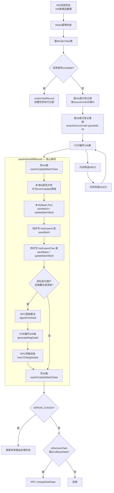

# saveGoodsMergeInfo 性能优化方案

:material-file-document-edit: **文档类型**: 功能设计 |
:material-api: **涉及模块**: bssc-biz-entpur / GoodsMergeInfoServiceImpl | 
:material-account-clock: **更新时间**: 2026-06-09 |
:material-account: **维护人**: 研发团队 |
:material-tag: **标签**: 价格监测, 性能优化, RabbitMQ, MySQL, INSERT ON DUPLICATE KEY UPDATE

---

## 一、问题现象

消息消费链路 `saveGoodsMergeInfo` 单次处理耗时 **40~48秒**，消费速率极低，导致队列积压约 21 万条消息。

### 典型耗时日志（100条数据/次）

```
operateTaskId=2062927446314139649, 
查租户=85ms,  查His=1537ms,  查All=2369ms, 
dataCount=100, 生成DO=1ms(all=100/his=100), 
写His=27145ms(100条),   ← 瓶颈#1：27秒
算法=83ms,  生成消息=46ms(100条), 
传输消息=2331ms,         ← 瓶颈#3：2.3秒（RPC）
写All=8624ms(100条),    ← 瓶颈#2：8.6秒
总=42222ms
```

### 耗时分布

| 环节 | 耗时 | 占比 | 根因 |
|:---|---:|:---:|:---|
| **写His** | 27秒 | **61%** | MyBatis-Plus `saveBatch`/`updateBatchById` + 额外写 Expend 表 + 行锁竞争 |
| **写All** | 8.6秒 | **19%** | MyBatis-Plus `saveBatch`/`updateBatchById` + 行锁竞争 |
| **传输消息** | 2.3秒 | **5%** | 同步 RPC 调用 `transTDMsgDetails` |
| 查All | 2.4秒 | **5%** | All 表数据量大，IN 查询回表多 |
| 其他 | 3.5秒 | **8%** | 查His、查租户、算法等 |

---

## 二、链路流程



---

## 三、根因分析

### 根因1：His/All 写入未使用 Mapper 中已定义的 INSERT ... ON DUPLICATE KEY UPDATE

Mapper XML 中已定义了高效的批量 upsert SQL（一条 SQL 包含 100 行），但 **ServiceImpl 并未调用它**：

??? example "His Mapper XML — 批量 upsert SQL 已存在"
    ```sql
    <!-- GoodsMergeHisMapper.xml:660-690 — 现状是 REPLACE INTO -->
    <update id="saveOrUpdateBatchData">
        replace into t_goods_merge_his (id, goods_code, ...) values
        <foreach collection="goodsMergeHisList" item="item" separator=",">
            (#{item.id}, #{item.goodsCode}, ...)
        </foreach>
    </update>

    <!-- GoodsMergeAllMapper.xml:482-504 — 现状是 REPLACE INTO -->
    <update id="saveOrUpdateBatchData">
        replace into t_goods_merge_all (...) values
        <foreach collection="goodsMergeAllList" item="item" separator=",">
            (...)
        </foreach>
    </update>
    ```

??? example "His ServiceImpl — 实际调用的是 MyBatis-Plus 原生方法"
    ```java
    // GoodsMergeHisServiceImpl.saveOrUpdateBatchData:232-245
    @Override
    public void saveOrUpdateBatchData(List<GoodsMergeHisDO> goodsMergeHisList) {
        goodsMergeHisList.stream()
            .collect(Collectors.partitioningBy(item -> StrUtil.isEmpty(item.getId())))
            .forEach((item, list) -> {
                if (CollectionUtil.isNotEmpty(list)) {
                    if (item) {
                        this.saveBatch(list, list.size());  // ← 非批量upsert，逐条INSERT
                        saveOrUpdateHisExpend(list, true);
                    } else {
                        this.updateBatchById(list, list.size());  // ← 逐条UPDATE
                        saveOrUpdateHisExpend(list, false);
                    }
                }
            });
    }
    ```

**后果**：当 id 不为空（已存在记录）时，走的是**逐条 UPDATE**，产生大量 SQL 执行和事务开销。

---

### 根因2：His 写入时额外同步写 2 张 Expend 表

`saveOrUpdateHisExpend` 方法对每批 100 条 His 记录，还会同步写 Expend 和 ExpendTwo 两张副本表：

```java
// GoodsMergeHisServiceImpl:247-271
private void saveOrUpdateHisExpend(List<GoodsMergeHisDO> list, boolean isInsert){
    // copy 100条 → Expend + ExpendTwo
    if (isInsert) {
        goodsMergeHisExpendService.saveBatch(goodsMergeHisExpendDOS);     // 额外100条INSERT
        goodsMergeHisExpendTwoService.saveBatch(goodsMergeHisExpendTwoDOS); // 额外100条INSERT
    } else {
        goodsMergeHisExpendService.updateBatchById(goodsMergeHisExpendDOS);
        goodsMergeHisExpendTwoService.updateBatchById(goodsMergeHisExpendDOS);
    }
}
```

**行锁竞争范围扩大 3 倍**：His + Expend + ExpendTwo 三张表竞争同一批行的锁。

---

### 根因3：多线程对同一批行的行锁竞争

多个消费者线程（concurrency=20~100）同时处理**同一个 `operateTaskId`** 的消息，MySQL InnoDB 对同一批 `(goods_id, source_code, operate_task_id)` 行的写入产生大量行锁等待：

- 线程 A 持有行锁写 His → 线程 B 等待
- 每次 `saveBatch` 拆分成多条 SQL，锁持有时间长
- `innodb_lock_wait_timeout` 默认 50 秒，超时重试拉低整体吞吐

---

### 根因4：Feign 调用在主链路同步执行

链路中存在 3 处同步 Feign RPC 调用，全部阻塞主链路：

| 调用 | 位置 | 触发条件 | 耗时 |
|:---|:---|:---|:---:|
| `changeDealState` | `saveGoodsMergeInfo:211` | `isRecheckTask` 或 `isCallbackDataDirectlyOperation` | 未知 |
| `algorithmDetail` | `saveHisAndAllRecord:323` | 非私有化租户 且 `isGenerateMsg=true` | ~80ms |
| `transTDMsgDetails` | `saveHisAndAllRecord:354` | 非私有化租户 且 `isGenerateMsg=true` 且有消息 | 1.5~3.7秒 |

---

## 四、优化方案

### 方案1（立即见效）：His/All 写入改用 INSERT ... ON DUPLICATE KEY UPDATE

!!! tip "预期效果"
    写 His：27秒 → ~5秒；写 All：8.6秒 → ~3秒，整体耗时降至约 15~20秒，提升约 **2倍**

**原理**：一条 `INSERT ... ON DUPLICATE KEY UPDATE` 包含 100 行，只 UPDATE 不 DELETE，替代原来的 `partitioningBy` 分组 + `saveBatch` + `updateBatchById`，大幅减少 SQL 执行次数和事务数量。

**对比**：

| 对比项 | 现状（REPLACE INTO XML + MP原生调用） | 改后（INSERT ... ON DUPLICATE KEY UPDATE） |
|:---|:---|:---|
| SQL 数量 | 最多 N+2 条（分组 × 分组 + Expend） | **1 条**（His）+ Expend |
| 事务次数 | 多次 | **1 次** |
| 索引维护 | DELETE + INSERT 两次 | **只更新一次** |
| 锁持有时间 | 长（多次SQL） | **短（单条SQL）** |

#### 4.1.1 修改 `GoodsMergeHisMapper.xml`

将现有的 `REPLACE INTO` 改为 `INSERT ... ON DUPLICATE KEY UPDATE`，列出所有需要更新的字段：

```xml
<!-- GoodsMergeHisMapper.xml:660 — 改为 INSERT ... ON DUPLICATE KEY UPDATE -->

<insert id="saveOrUpdateBatchData">
    INSERT INTO t_goods_merge_his (
        id, goods_code, reasonable_price, min_price, max_price,
        update_time, create_time, tenant_task_id, monitoring_time, task_finish_time,
        source_code, goods_id, goods_name, price, brand_name, catalog_name,
        link, supplier_name, praise_rate, sales_volume, contain_sensitive_word,
        exclusive, useless, error_catalog, task_create_tenant_id, source_name,
        sku, same_measure_code, operate_task_id, source_category, market_counts,
        goverment_counts, enterprise_counts, tenant_id, invalid, goods_errors,
        sensitive_msg, goods_import_time, transfer_state, catalog_one, catalog_two,
        catalog_three, catalog_four, catalog_five, catalog_six, measure_unit,
        bar_image_list, inside_goods_count, outside_goods_count, goods_detail,
        original_price, price_diff, last_rea_price, zc_avg_price, qc_avg_price,
        external_min_price_link, external_max_price_link,
        external_min_price_source_category, external_max_price_source_category,
        external_avg_price, catalog_end_name, goods_measure_unit, goods_measure_count,
        supplier_comment, supplier_type, is_discount, recommended_catalog,
        calculate_process_description
    ) VALUES
    <foreach collection="goodsMergeHisList" item="item" separator=",">
        (#{item.id}, #{item.goodsCode}, #{item.reasonablePrice}, #{item.minPrice},
         #{item.maxPrice}, #{item.updateTime}, #{item.createTime}, #{item.tenantTaskId},
         #{item.monitoringTime}, #{item.taskFinishTime}, #{item.sourceCode}, #{item.goodsId},
         #{item.goodsName}, #{item.price}, #{item.brandName}, #{item.catalogName},
         #{item.link}, #{item.supplierName}, #{item.praiseRate}, #{item.salesVolume},
         #{item.containSensitiveWord}, #{item.exclusive}, #{item.useless}, #{item.errorCatalog},
         #{item.taskCreateTenantId}, #{item.sourceName}, #{item.sku}, #{item.sameMeasureCode},
         #{item.operateTaskId}, #{item.sourceCategory}, #{item.marketCounts},
         #{item.govermentCounts}, #{item.enterpriseCounts}, #{item.tenantId}, #{item.invalid},
         #{item.goodsErrors}, #{item.sensitiveMsg}, #{item.goodsImportTime},
         #{item.transferState}, #{item.catalogOne}, #{item.catalogTwo}, #{item.catalogThree},
         #{item.catalogFour}, #{item.catalogFive}, #{item.catalogSix}, #{item.measureUnit},
         #{item.barImageList}, #{item.insideGoodsCount}, #{item.outsideGoodsCount},
         #{item.goodsDetail}, #{item.originalPrice}, #{item.priceDiff}, #{item.lastReaPrice},
         #{item.zcAvgPrice}, #{item.qcAvgPrice}, #{item.externalMinPriceLink},
         #{item.externalMaxPriceLink}, #{item.externalMinPriceSourceCategory},
         #{item.externalMaxPriceSourceCategory}, #{item.externalAvgPrice},
         #{item.catalogEndName}, #{item.goodsMeasureUnit}, #{item.goodsMeasureCount},
         #{item.supplierComment}, #{item.supplierType}, #{item.isDiscount},
         #{item.recommendedCatalog}, #{item.calculateProcessDescription})
    </foreach>
    ON DUPLICATE KEY UPDATE
        goods_code = VALUES(goods_code),
        reasonable_price = VALUES(reasonable_price),
        min_price = VALUES(min_price),
        max_price = VALUES(max_price),
        update_time = VALUES(update_time),
        monitoring_time = VALUES(monitoring_time),
        task_finish_time = VALUES(task_finish_time),
        goods_name = VALUES(goods_name),
        price = VALUES(price),
        brand_name = VALUES(brand_name),
        catalog_name = VALUES(catalog_name),
        link = VALUES(link),
        supplier_name = VALUES(supplier_name),
        praise_rate = VALUES(praise_rate),
        sales_volume = VALUES(sales_volume),
        contain_sensitive_word = VALUES(contain_sensitive_word),
        exclusive = VALUES(exclusive),
        useless = VALUES(useless),
        error_catalog = VALUES(error_catalog),
        source_name = VALUES(source_name),
        sku = VALUES(sku),
        same_measure_code = VALUES(same_measure_code),
        source_category = VALUES(source_category),
        market_counts = VALUES(market_counts),
        goverment_counts = VALUES(goverment_counts),
        enterprise_counts = VALUES(enterprise_counts),
        tenant_id = VALUES(tenant_id),
        invalid = VALUES(invalid),
        goods_errors = VALUES(goods_errors),
        sensitive_msg = VALUES(sensitive_msg),
        goods_import_time = VALUES(goods_import_time),
        transfer_state = VALUES(transfer_state),
        catalog_one = VALUES(catalog_one),
        catalog_two = VALUES(catalog_two),
        catalog_three = VALUES(catalog_three),
        catalog_four = VALUES(catalog_four),
        catalog_five = VALUES(catalog_five),
        catalog_six = VALUES(catalog_six),
        measure_unit = VALUES(measure_unit),
        bar_image_list = VALUES(bar_image_list),
        inside_goods_count = VALUES(inside_goods_count),
        outside_goods_count = VALUES(outside_goods_count),
        goods_detail = VALUES(goods_detail),
        original_price = VALUES(original_price),
        price_diff = VALUES(price_diff),
        last_rea_price = VALUES(last_rea_price),
        zc_avg_price = VALUES(zc_avg_price),
        qc_avg_price = VALUES(qc_avg_price),
        external_min_price_link = VALUES(external_min_price_link),
        external_max_price_link = VALUES(external_max_price_link),
        external_min_price_source_category = VALUES(external_min_price_source_category),
        external_max_price_source_category = VALUES(external_max_price_source_category),
        external_avg_price = VALUES(external_avg_price),
        catalog_end_name = VALUES(catalog_end_name),
        goods_measure_unit = VALUES(goods_measure_unit),
        goods_measure_count = VALUES(goods_measure_count),
        supplier_comment = VALUES(supplier_comment),
        supplier_type = VALUES(supplier_type),
        is_discount = VALUES(is_discount),
        recommended_catalog = VALUES(recommended_catalog),
        calculate_process_description = VALUES(calculate_process_description)
</insert>
```

??? note "His 表复合主键说明"
    His 表主键为 `(id, task_create_tenant_id)`，唯一键为 `(task_create_tenant_id, operate_task_id, source_code, goods_id)`。`INSERT ... ON DUPLICATE KEY UPDATE` 依据唯一键判断冲突，冲突时按 VALUES 更新所有字段，语义完全正确。

#### 4.1.2 修改 `GoodsMergeAllMapper.xml`

同样改为 `INSERT ... ON DUPLICATE KEY UPDATE`：

```xml
<!-- GoodsMergeAllMapper.xml:482 — 改为 INSERT ... ON DUPLICATE KEY UPDATE -->

<insert id="saveOrUpdateBatchData">
    INSERT INTO t_goods_merge_all (
        id, goods_code, reasonable_price, min_price, max_price,
        update_time, create_time, tenant_task_id, monitoring_time, task_finish_time,
        source_code, goods_id, goods_name, price, brand_name, catalog_name,
        link, supplier_name, praise_rate, sales_volume, task_create_tenant_id,
        source_name, sku, same_measure_code, operate_task_id, source_category,
        tenant_id, market_counts, goverment_counts, enterprise_counts,
        contain_sensitive_word, exclusive, useless, error_catalog, invalid,
        goods_errors, sensitive_msg, goods_import_time, transfer_state,
        catalog_one, catalog_two, catalog_three, catalog_four, catalog_five,
        catalog_six, measure_unit, bar_image_list, inside_goods_count,
        outside_goods_count, goods_detail, generate_msg, original_price,
        zc_avg_price, qc_avg_price, external_min_price_link, external_max_price_link,
        external_min_price_source_category, external_max_price_source_category,
        external_avg_price, catalog_end_name, goods_measure_unit, goods_measure_count,
        supplier_comment, supplier_type, is_discount, recommended_catalog
    ) VALUES
    <foreach collection="goodsMergeAllList" item="item" separator=",">
        (#{item.id}, #{item.goodsCode}, #{item.reasonablePrice}, #{item.minPrice},
         #{item.maxPrice}, #{item.updateTime}, #{item.createTime}, #{item.tenantTaskId},
         #{item.monitoringTime}, #{item.taskFinishTime}, #{item.sourceCode}, #{item.goodsId},
         #{item.goodsName}, #{item.price}, #{item.brandName}, #{item.catalogName},
         #{item.link}, #{item.supplierName}, #{item.praiseRate}, #{item.salesVolume},
         #{item.taskCreateTenantId}, #{item.sourceName}, #{item.sku}, #{item.sameMeasureCode},
         #{item.operateTaskId}, #{item.sourceCategory}, #{item.tenantId}, #{item.marketCounts},
         #{item.govermentCounts}, #{item.enterpriseCounts}, #{item.containSensitiveWord},
         #{item.exclusive}, #{item.useless}, #{item.errorCatalog}, #{item.invalid},
         #{item.goodsErrors}, #{item.sensitiveMsg}, #{item.goodsImportTime},
         #{item.transferState}, #{item.catalogOne}, #{item.catalogTwo}, #{item.catalogThree},
         #{item.catalogFour}, #{item.catalogFive}, #{item.catalogSix}, #{item.measureUnit},
         #{item.barImageList}, #{item.insideGoodsCount}, #{item.outsideGoodsCount},
         #{item.goodsDetail}, #{item.generateMsg}, #{item.originalPrice}, #{item.zcAvgPrice},
         #{item.qcAvgPrice}, #{item.externalMinPriceLink}, #{item.externalMaxPriceLink},
         #{item.externalMinPriceSourceCategory}, #{item.externalMaxPriceSourceCategory},
         #{item.externalAvgPrice}, #{item.catalogEndName}, #{item.goodsMeasureUnit},
         #{item.goodsMeasureCount}, #{item.supplierComment}, #{item.supplierType},
         #{item.isDiscount}, #{item.recommendedCatalog})
    </foreach>
    ON DUPLICATE KEY UPDATE
        goods_code = VALUES(goods_code),
        reasonable_price = VALUES(reasonable_price),
        min_price = VALUES(min_price),
        max_price = VALUES(max_price),
        update_time = VALUES(update_time),
        monitoring_time = VALUES(monitoring_time),
        task_finish_time = VALUES(task_finish_time),
        goods_name = VALUES(goods_name),
        price = VALUES(price),
        brand_name = VALUES(brand_name),
        catalog_name = VALUES(catalog_name),
        link = VALUES(link),
        supplier_name = VALUES(supplier_name),
        praise_rate = VALUES(praise_rate),
        sales_volume = VALUES(sales_volume),
        source_name = VALUES(source_name),
        sku = VALUES(sku),
        same_measure_code = VALUES(same_measure_code),
        source_category = VALUES(source_category),
        market_counts = VALUES(market_counts),
        goverment_counts = VALUES(goverment_counts),
        enterprise_counts = VALUES(enterprise_counts),
        contain_sensitive_word = VALUES(contain_sensitive_word),
        exclusive = VALUES(exclusive),
        useless = VALUES(useless),
        error_catalog = VALUES(error_catalog),
        invalid = VALUES(invalid),
        goods_errors = VALUES(goods_errors),
        sensitive_msg = VALUES(sensitive_msg),
        goods_import_time = VALUES(goods_import_time),
        transfer_state = VALUES(transfer_state),
        catalog_one = VALUES(catalog_one),
        catalog_two = VALUES(catalog_two),
        catalog_three = VALUES(catalog_three),
        catalog_four = VALUES(catalog_four),
        catalog_five = VALUES(catalog_five),
        catalog_six = VALUES(catalog_six),
        measure_unit = VALUES(measure_unit),
        bar_image_list = VALUES(bar_image_list),
        inside_goods_count = VALUES(inside_goods_count),
        outside_goods_count = VALUES(outside_goods_count),
        goods_detail = VALUES(goods_detail),
        generate_msg = VALUES(generate_msg),
        original_price = VALUES(original_price),
        zc_avg_price = VALUES(zc_avg_price),
        qc_avg_price = VALUES(qc_avg_price),
        external_min_price_link = VALUES(external_min_price_link),
        external_max_price_link = VALUES(external_max_price_link),
        external_min_price_source_category = VALUES(external_min_price_source_category),
        external_max_price_source_category = VALUES(external_max_price_source_category),
        external_avg_price = VALUES(external_avg_price),
        catalog_end_name = VALUES(catalog_end_name),
        goods_measure_unit = VALUES(goods_measure_unit),
        goods_measure_count = VALUES(goods_measure_count),
        supplier_comment = VALUES(supplier_comment),
        supplier_type = VALUES(supplier_type),
        is_discount = VALUES(is_discount),
        recommended_catalog = VALUES(recommended_catalog)
</insert>
```

#### 4.1.3 修改 `GoodsMergeHisServiceImpl` 和 `GoodsMergeAllServiceImpl`

```java
// GoodsMergeHisServiceImpl.java:232 — 改为调用 Mapper

@Override
public void saveOrUpdateBatchData(List<GoodsMergeHisDO> goodsMergeHisList) {
    if (CollectionUtil.isEmpty(goodsMergeHisList)) return;
    // ✅ 直接调用 Mapper 的 INSERT ... ON DUPLICATE KEY UPDATE，一条SQL搞定100行
    goodsMergeHisMapper.saveOrUpdateBatchData(goodsMergeHisList);
    // ✅ ON DUPLICATE KEY UPDATE 等效于覆盖写入，Expend 统一用 saveBatch
    saveOrUpdateHisExpend(goodsMergeHisList, true);
}
```

```java
// GoodsMergeAllServiceImpl.java:150 — 改为调用 Mapper

@Override
public void saveOrUpdateBatchData(List<GoodsMergeAllDO> goodsMergeAllList) {
    if (CollectionUtil.isEmpty(goodsMergeAllList)) return;
    // ✅ 直接调用 Mapper 的 INSERT ... ON DUPLICATE KEY UPDATE，一条SQL搞定100行
    goodsMergeAllMapper.saveOrUpdateBatchData(goodsMergeAllList);
}
```

#### 4.1.4 验证清单

- [ ] His/All XML 的 `id="saveOrUpdateBatchData"` 从 `<update>` 改为 `<insert>`
- [ ] His/All XML 中所有 DO 字段与数据库列名一一对应，无遗漏
- [ ] His XML 包含 `task_create_tenant_id`（复合主键的一部分）
- [ ] ServiceImpl 确认已注入 `GoodsMergeHisMapper` / `GoodsMergeAllMapper`
- [ ] 上线后对比耗时日志中 `写His` 和 `写All` 的耗时变化

---

### 方案2（高价值）：Expend 表异步化

!!! tip "预期效果"
    消除 Expend 表的行锁竞争，整体耗时再降 5~8 秒

**方案 A（推荐）**：确认 Expend/ExpendTwo 是否为 His 的纯副本。若是，可考虑在 His 表中增加 JSON 字段合并存储，减少独立表写入。

**方案 B**：Expend 写入改为 `@Async` 异步方法，不阻塞主链路：

```java
@Async("taskExecutor")
public void asyncSaveOrUpdateHisExpend(List<GoodsMergeHisDO> list) {
    saveOrUpdateHisExpend(list, true);
}
```

??? warning "风险评估"
    异步写入 Expend 后，若 His 写入成功但 Expend 写入失败，数据将不一致。建议先与业务方确认 Expend 表的用途（是否是 His 表的纯副本），再决定是否异步化。

---

### 方案3（高价值）：Feign 调用抽取为 MQ 异步消费

!!! tip "预期效果"
    消除 `transTDMsgDetails`（1.5~3.7秒）+ `algorithmDetail`（~80ms）+ `changeDealState` 的阻塞，主链路只负责写 His/All，整体耗时再降 **3~5 秒**

**现状链路中的 3 处 Feign 调用**：

| Feign 调用 | 代码位置 | 触发条件 | 耗时 |
|:---|:---|:---|:---:|
| `operateFeginService.changeDealState` | `saveGoodsMergeInfo:211` | `isRecheckTask` 或 `isCallbackDataDirectlyOperation` | 未知 |
| `operateFeginService.algorithmDetail` | `saveHisAndAllRecord:323` | 非私有化租户 且 `isGenerateMsg=true` | ~80ms |
| `operateFeginService.transTDMsgDetails` | `saveHisAndAllRecord:354` | 非私有化租户 且 `isGenerateMsg=true` 且有消息 | 1.5~3.7秒 |

**优化方案**：将 Feign 调用合并为一个 MQ 消息，写 His/All 完成后立即发送，MQ 消费者异步执行后续 Feign 逻辑。

#### 4.3.1 新增 MQ 消息体

```java
@Data
@Builder
public class GoodsMergeMsgNotifyDTO implements Serializable {
    private static final long serialVersionUID = 1L;

    /** 运营端任务ID */
    private String operateTaskId;
    /** 发起任务租户ID */
    private String taskCreateTenantId;
    /** 租户ID */
    private String tenantId;
    /** 租户类型 */
    private String tenantType;
    /** 任务类型 */
    private String taskType;
    /** 是否需要生成消息 */
    private Boolean isGenerateMsg;
    /** 算法ID（仅非私有化租户） */
    private String priceAlgorithmId;
    /** 商品数据（用于生成消息详情） */
    private List<GoodsMergeHisDO> goodsMergeHisDOS;
    /** 消息详情列表（已在主链路生成好） */
    private List<TDMsgDetailResqDTO> tdMsgDetailResqDTOS;
    /** 是否需要更新异常商品状态（isRecheckTask 或 isCallbackDataDirectlyOperation） */
    private Boolean needUpdateDealState;
    /** 回调任务的原始任务ID（isCallbackDataDirectlyOperation 时有值） */
    private String originTaskId;
    /** 复检任务ID（isRecheckTask 时有值） */
    private String recalcTaskId;
    /** 商品ID列表（用于更新异常商品状态） */
    private List<String> goodsIds;
    /** 租户源编码（用于更新异常商品状态） */
    private String tenantSourceCode;
}
```

#### 4.3.2 主链路修改

**`saveGoodsMergeInfo` 和 `saveHisAndAllRecord` 中**，在 His/All 写入完成后，发送 MQ 消息，原 Feign 调用全部移除：

```java
// ========== saveHisAndAllRecord 末尾修改 ==========

// ❌ 原有逻辑（删除）
// operateFeginService.transTDMsgDetails(tdMsgDetailBodyResq);

// ✅ 改为发送 MQ 消息（异步处理）
if (!"private".equals(sysTenantDTO.getTenantType()) && isGenerateMsg) {
    GoodsMergeMsgNotifyDTO notifyDTO = GoodsMergeMsgNotifyDTO.builder()
            .operateTaskId(monitorTask.getId())
            .taskCreateTenantId(goodsMergeInfoDTO.getTaskCreateTenantId())
            .tenantId(sysTenantDTO.getTenantId())
            .tenantType(sysTenantDTO.getTenantType())
            .taskType(monitorTask.getTaskType())
            .isGenerateMsg(isGenerateMsg)
            .priceAlgorithmId(monitorTask.getPriceAlgorithmId())
            .goodsMergeHisDOS(goodsMergeHisDOS)
            .tdMsgDetailResqDTOS(tdMsgDetailResqDTOS)
            .needUpdateDealState(false)
            .build();
    rabbitTemplate.convertAndSend(
            "goods.merge.notify.exchange",  // 交换机名
            "goods.merge.notify",           // routing key
            notifyDTO
    );
}

// ========== saveGoodsMergeInfo 末尾修改 ==========

// ❌ 原有逻辑（删除）
// operateFeginService.changeDealState(request);

// ✅ 改为发送 MQ 消息（异步处理）
if (isRecheckTask || isCallbackDataDirectlyOperation) {
    if (CollectionUtil.isNotEmpty(goodsMergeInfoDTO.getData())) {
        List<String> goodsIds = goodsMergeInfoDTO.getData().stream()
                .filter(item -> goodsMergeInfoDTO.getTaskCreateTenantId().equals(item.getGoodsTenantId()))
                .map(GoodsMergeInfoDetailReqDTO::getGoodsId)
                .collect(Collectors.toList());

        GoodsMergeMsgNotifyDTO notifyDTO = GoodsMergeMsgNotifyDTO.builder()
                .needUpdateDealState(true)
                .goodsIds(goodsIds)
                .tenantSourceCode(goodsMergeInfoDTO.getTenantSourceCode())
                .originTaskId(isCallbackDataDirectlyOperation ? goodsMergeInfoDTO.getOperateTaskId() : null)
                .recalcTaskId(isRecheckTask ? goodsMergeInfoDTO.getOperateTaskId() : null)
                .build();

        rabbitTemplate.convertAndSend(
                "goods.merge.notify.exchange",
                "goods.merge.notify",
                notifyDTO
        );
    }
}
```

#### 4.3.3 新增 MQ 消费者

```java
@Slf4j
@Component
public class GoodsMergeMsgNotifyConsumer {

    @Autowired
    private OperateFeginService operateFeginService;

    @RabbitListener(queues = "goods.merge.notify.queue")
    public void handleGoodsMergeMsgNotify(GoodsMergeMsgNotifyDTO notifyDTO) {
        log.info("收到商品合并消息通知, operateTaskId={}", notifyDTO.getOperateTaskId());

        try {
            // 处理异常商品状态更新
            if (Boolean.TRUE.equals(notifyDTO.getNeedUpdateDealState())) {
                ChangeDealStateRequest request = ChangeDealStateRequest.builder()
                        .goodsIds(notifyDTO.getGoodsIds())
                        .dealState(DealStateEnum.FINISH.getCode())
                        .tenantSourceCode(notifyDTO.getTenantSourceCode())
                        .build();
                if (StrUtil.isNotEmpty(notifyDTO.getOriginTaskId())) {
                    request.setOriginTaskId(notifyDTO.getOriginTaskId());
                }
                if (StrUtil.isNotEmpty(notifyDTO.getRecalcTaskId())) {
                    request.setRecalcTaskId(notifyDTO.getRecalcTaskId());
                }
                operateFeginService.changeDealState(request);
                log.info("异常商品状态更新成功, operateTaskId={}", notifyDTO.getOperateTaskId());
            }

            // 处理消息生成与传输（非私有化租户）
            if (Boolean.TRUE.equals(notifyDTO.getIsGenerateMsg())
                    && !"private".equals(notifyDTO.getTenantType())
                    && CollectionUtil.isNotEmpty(notifyDTO.getTdMsgDetailResqDTOS())) {

                // 1. 获取算法（若未在消息中传递）
                // 若算法在主链路已获取，可直接序列化到消息体中传递，避免重复 RPC
                // 此处假设算法已序列化到 GoodsMergeHisDO 或从缓存获取
                AlgorithmDO algorithm = null;
                if (StrUtil.isNotEmpty(notifyDTO.getPriceAlgorithmId())) {
                    ResultBody<AlgorithmDO> algoResult = operateFeginService
                            .algorithmDetail(notifyDTO.getPriceAlgorithmId());
                    algorithm = algoResult != null ? algoResult.getData() : null;
                }

                // 2. 生成并传输消息详情
                TDMsgDetailBodyResq tdMsgDetailBodyResq = TDMsgDetailBodyResq.builder()
                        .tenantId(notifyDTO.getTenantId())
                        .taskId(notifyDTO.getOperateTaskId())
                        .datas(notifyDTO.getTdMsgDetailResqDTOS())
                        .build();
                operateFeginService.transTDMsgDetails(tdMsgDetailBodyResq);
                log.info("消息详情传输成功, operateTaskId={}, 数量={}",
                        notifyDTO.getOperateTaskId(), notifyDTO.getTdMsgDetailResqDTOS().size());
            }
        } catch (Exception e) {
            log.error("处理商品合并消息通知异常, operateTaskId={}, error={}",
                    notifyDTO.getOperateTaskId(), ExceptionUtil.stacktraceToString(e));
            // MQ 消息默认会重试，建议配合死信队列处理最终失败
            throw e;
        }
    }
}
```

#### 4.3.4 RabbitMQ 配置

```java
@Configuration
public class GoodsMergeMqConfig {

    public static final String EXCHANGE = "goods.merge.notify.exchange";
    public static final String QUEUE = "goods.merge.notify.queue";
    public static final String ROUTING_KEY = "goods.merge.notify";

    @Bean
    public DirectExchange goodsMergeNotifyExchange() {
        return new DirectExchange(EXCHANGE, true, false);
    }

    @Bean
    public Queue goodsMergeNotifyQueue() {
        return QueueBuilder.durable(QUEUE)
                .withArgument("x-dead-letter-exchange", EXCHANGE + ".dlx")
                .withArgument("x-dead-letter-routing-key", ROUTING_KEY + ".dlq")
                .build();
    }

    @Bean
    public Binding goodsMergeNotifyBinding() {
        return BindingBuilder
                .bind(goodsMergeNotifyQueue())
                .to(goodsMergeNotifyExchange())
                .with(ROUTING_KEY);
    }

    // ========== 死信队列配置 ==========
    public static final String DLX_EXCHANGE = EXCHANGE + ".dlx";
    public static final String DLQ_QUEUE = QUEUE + ".dlq";
    public static final String DLQ_ROUTING_KEY = ROUTING_KEY + ".dlq";

    @Bean
    public DirectExchange goodsMergeNotifyDlExchange() {
        return new DirectExchange(DLX_EXCHANGE, true, false);
    }

    @Bean
    public Queue goodsMergeNotifyDlQueue() {
        return QueueBuilder.durable(DLQ_QUEUE).build();
    }

    @Bean
    public Binding goodsMergeNotifyDlBinding() {
        return BindingBuilder
                .bind(goodsMergeNotifyDlQueue())
                .to(goodsMergeNotifyDlExchange())
                .with(DLQ_ROUTING_KEY);
    }
}
```

??? tip "序列化方式"
    消息体中包含 `GoodsMergeHisDO` 和 `TDMsgDetailResqDTO`，需确保实现了 `Serializable` 接口，并配置 Jackson 序列化。若对象较大，可考虑仅传递必要字段（如 ID 列表），消费者按需查询完整数据。

---

### 方案4（架构级）：按 operateTaskId 做 RabbitMQ 消费分区

!!! tip "预期效果"
    **彻底消除行锁竞争**，单任务吞吐稳定，不再有多线程互相等待的问题

**原理**：RabbitMQ Consistent Hash Exchange 或自定义分区 Key（`operateTaskId`），确保同一任务的所有消息路由到同一个消费者线程。

```java
// 生产端：发送时指定路由键为 operateTaskId
rabbitTemplate.convertAndSend(
    "monitor.result.exchange",   // exchange
    operateTaskId,               // routing key（作为分区键）
    message
);

// 消费端：配置 ConsistentHashQueue
@Bean
public Queue monitorResultQueue() {
    return QueueBuilder.durable("monitor.result.queue")
        .withArgument("x-consistent-hash-routing-key", 100) // 100个虚拟节点
        .build();
}
```

**代价**：单个大任务的吞吐受限于单线程，但相比当前 44 秒/100 条（且大量等待），串行反而可能更快。

??? tip "与方案1~3的组合"
    方案 4 与方案 1~3 **正交不冲突**，可叠加实施。建议优先落地方案 1（改动最小、效果明确），再逐步推进方案 3 和方案 4。

---

## 五、优化路线图

| 优先级 | 步骤 | 动作 | 预期收益 | 风险 | 预计工时 |
|:---:|:---:|:---|:---|:---:|:---:|
| 🔴 **紧急** | P0-1 | His XML 改为 `INSERT ... ON DUPLICATE KEY UPDATE` | 写His 27s→~5s | 低（唯一键已建立） | 0.5h |
| 🔴 **紧急** | P0-2 | All XML 改为 `INSERT ... ON DUPLICATE KEY UPDATE` | 写All 8.6s→~3s | 低（唯一键已建立） | 0.5h |
| 🔴 **紧急** | P0-3 | His/All ServiceImpl 改为调用 Mapper | 配合P0-1/P0-2生效 | 低 | 0.5h |
| 🟡 **建议** | P1-1 | Expend 表异步化或触发器合并 | 再降 5~8s | 中（需确认业务一致性） | 1h |
| 🟡 **建议** | P1-2 | Feign 调用抽取为 MQ（changeDealState + algorithmDetail + transTDMsgDetails） | 消除 3~5s 阻塞 | 低 | 2h |
| 🟢 **后续** | P2 | RabbitMQ Consistent Hash Exchange 按 operateTaskId 分区消费 | 彻底消除行锁 | 中（架构改动） | 2~3天 |
| 🟢 **后续** | P3 | 查 All 表加联合索引 `(source_code, goods_id)` 覆盖索引 | 查All 2.4s→~1s | 低 | 0.5h |

**立即行动**：P0-1 + P0-2 + P0-3 共 1.5 小时，可将单次处理从 ~44 秒降至约 **15~20 秒**，提升约 **2~3 倍**。

---

## 六、修改对照表

| 文件 | 修改内容 |
|:---|:---|
| `GoodsMergeHisMapper.xml:660` | `<update>` → `<insert>`，`replace into` → `INSERT ... ON DUPLICATE KEY UPDATE`（补充全部字段 UPDATE 语句） |
| `GoodsMergeAllMapper.xml:482` | `<update>` → `<insert>`，`replace into` → `INSERT ... ON DUPLICATE KEY UPDATE`（补充全部字段 UPDATE 语句） |
| `GoodsMergeHisServiceImpl.java:232` | `this.saveBatch/updateBatchById` → `goodsMergeHisMapper.saveOrUpdateBatchData` |
| `GoodsMergeAllServiceImpl.java:150` | `this.saveBatch/updateBatchById` → `goodsMergeAllMapper.saveOrUpdateBatchData` |
| `GoodsMergeInfoServiceImpl.java`（新增） | 新增 `GoodsMergeMsgNotifyDTO`、`GoodsMergeMsgNotifyConsumer`、MQ 配置类 |
| `GoodsMergeInfoServiceImpl.java:211` | `operateFeginService.changeDealState()` → `rabbitTemplate.convertAndSend(...)` |
| `GoodsMergeInfoServiceImpl.java:323/354` | `algorithmDetail` + `transTDMsgDetails` → `rabbitTemplate.convertAndSend(...)` |

---

**:material-check-all: 文档结束**
