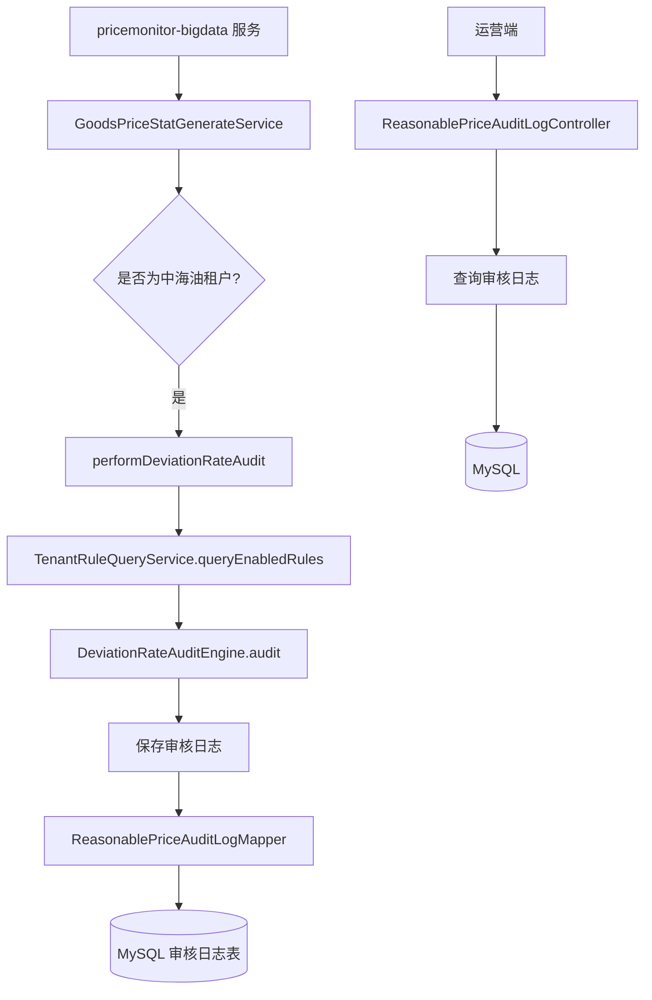
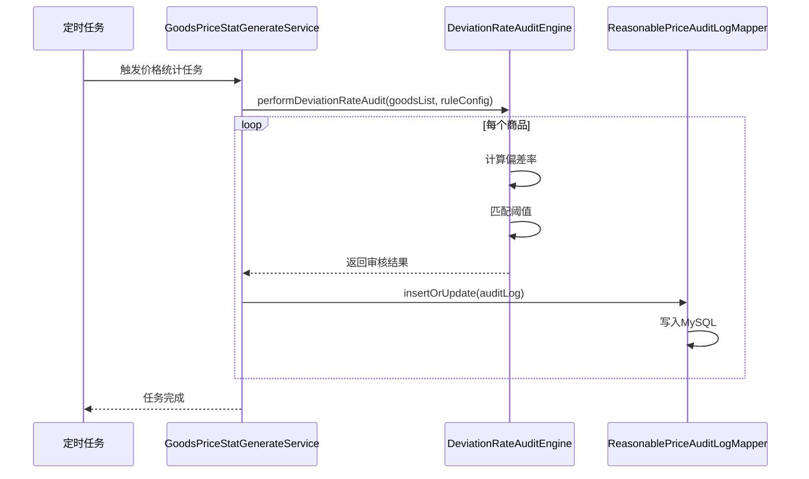

# :material-file-document: 中海油偏差率预警需求设计文档

---

## :material-information-outline: 1. 需求背景

### 1.1 业务背景

中海油租户（`tenantId: 1711947796057149`）需要对其采购商品进行价格偏差率监控，当商品价格偏离合理价超过设定阈值时触发预警。

### 1.2 核心需求#

- 支持动态配置偏差率计算公式
- 支持设置偏高/偏低预警阈值
- 在定时任务计算合理价环节自动执行审核
- 将预警记录保存到 `t_reasonable_price_audit_log` 表
- **提供页面查询接口，支持租户查看偏差率预警数据及处置状态**

---

## :material-wrench: 2. 技术方案#

### 2.1 整体架构#



---

### 2.2 技术选型#

| 技术点 | 选型 | 说明 |
|--------|------|------|
| 规则配置 | JSON 字符串 | 灵活配置字段和运算符 |
| 公式计算 | Java BigDecimal | 精确小数计算，避免浮点误差 |
| 规则缓存 | Caffeine | 本地缓存，5分钟过期 |
| 审核日志保存 | MyBatis | 直接 JDBC 写入 MySQL |
| 页面查询 | Spring MVC + MyBatis | 分页查询，支持按商品ID过滤 |

---

## :material-database-edit: 3. 数据模型设计#

### 3.1 审核日志表结构#

```sql
CREATE TABLE t_reasonable_price_audit_log (
    id BIGINT PRIMARY KEY AUTO_INCREMENT,
    tenant_id VARCHAR(64) NOT NULL COMMENT '租户ID',
    goods_id VARCHAR(64) NOT NULL COMMENT '商品ID',
    goods_name VARCHAR(500) COMMENT '商品名称',
    official_price DECIMAL(20,6) COMMENT '官网价',
    market_reference_price DECIMAL(20,6) COMMENT '市场参考价',
    deviation_rate DECIMAL(10,4) COMMENT '偏差率(%)',
    audit_result VARCHAR(20) COMMENT '审核结果: HIGH/LOW/PASS',
    audit_description VARCHAR(500) COMMENT '审核说明',
    create_time DATETIME DEFAULT CURRENT_TIMESTAMP,
    update_time DATETIME DEFAULT CURRENT_TIMESTAMP ON UPDATE CURRENT_TIMESTAMP,
    INDEX idx_tenant_goods (tenant_id, goods_id),
    INDEX idx_create_time (create_time)
) ENGINE=InnoDB DEFAULT CHARSET=utf8mb4 COMMENT='合理价偏差率审核日志';
```

---

### 3.2 规则配置示例#

```json
{
  "formula": "(official_price - market_reference_price) / market_reference_price * 100",
  "high_threshold": 10.0,
  "low_threshold": -10.0,
  "description": "官网价偏离市场参考价超过±10%触发预警"
}
```

---

## :material-code-braces: 4. 核心代码设计#

### 4.1 偏差率审核引擎#

```java
@Component
public class DeviationRateAuditEngine {
    
    /**
     * 执行偏差率审核
     * @param goodsPriceStat 商品价格统计信息
     * @param ruleConfig 规则配置(JSON)
     * @return 审核结果
     */
    public DeviationRateAuditResult audit(
            GoodsPriceStatDTO goodsPriceStat, 
            String ruleConfig) {
        
        // 1. 解析规则配置
        RuleConfig config = JSON.parseObject(ruleConfig, RuleConfig.class);
        
        // 2. 获取字段值
        BigDecimal officialPrice = goodsPriceStat.getOfficialPrice();
        BigDecimal marketRefPrice = goodsPriceStat.getMarketReferencePrice();
        
        // 3. 计算偏差率
        BigDecimal deviationRate = calculateDeviationRate(
            officialPrice, 
            marketRefPrice, 
            config.getFormula()
        );
        
        // 4. 匹配阈值
        String auditResult = matchThreshold(deviationRate, config);
        
        // 5. 构建结果
        return DeviationRateAuditResult.builder()
                .deviationRate(deviationRate)
                .auditResult(auditResult)
                .auditDescription(buildDescription(auditResult, deviationRate, config))
                .build();
    }
}
```

---

### 4.2 公式计算实现#

```java
private BigDecimal calculateDeviationRate(
        BigDecimal officialPrice, 
        BigDecimal marketRefPrice, 
        String formula) {
    
    // 公式模板: (field1 - field2) / field2 * 100
    // 替换字段占位符
    String parsedFormula = formula
            .replace("official_price", officialPrice.toString())
            .replace("market_reference_price", marketRefPrice.toString());
    
    // 使用 Spring Expression Language 计算
    Expression expression = expressionParser.parseExpression(parsedFormula);
    BigDecimal result = expression.getValue(evaluationContext, BigDecimal.class);
    
    // 保留4位小数
    return result.setScale(4, RoundingMode.HALF_UP);
}
```

---

### 4.3 阈值匹配逻辑#

```java
private String matchThreshold(BigDecimal deviationRate, RuleConfig config) {
    BigDecimal highThreshold = config.getHighThreshold();
    BigDecimal lowThreshold = config.getLowThreshold();
    
    if (deviationRate.compareTo(highThreshold) > 0) {
        return "HIGH";  // 偏高预警
    } else if (deviationRate.compareTo(lowThreshold) < 0) {
        return "LOW";   // 偏低预警
    } else {
        return "PASS";  // 通过
    }
}
```

---

## :material-list-status: 5. 执行流程#

### 5.1 定时任务触发#



---

### 5.2 页面查询接口#

```java
@RestController
@RequestMapping("/api/audit-log")
public class ReasonablePriceAuditLogController {
    
    @PostMapping("/query")
    public ResultBody<PageResult<AuditLogDTO>> queryAuditLogs(
            @RequestBody AuditLogQueryRequest request) {
        
        // 1. 参数校验
        validateQueryRequest(request);
        
        // 2. 分页查询
        PageResult<AuditLogDTO> result = auditLogService.queryByPage(request);
        
        // 3. 补充商品名称(从ES查询)
        enrichGoodsName(result.getRecords());
        
        return ResultBody.ok(result);
    }
}
```

---

## :material-alert: 6. 异常处理#

### 6.1 异常场景#

| 异常场景 | 处理方式 | 说明 |
|---------|---------|------|
| 规则配置为空 | 跳过审核 | 记录INFO日志 |
| 官网价为空 | 跳过审核 | 记录WARN日志 |
| 市场参考价为空 | 跳过审核 | 记录WARN日志 |
| 市场参考价为0 | 跳过审核 | 避免除零异常 |
| 公式计算异常 | 跳过该商品 | 记录ERROR日志，继续处理下一个 |

---

### 6.2 降级策略#

```java
try {
    DeviationRateAuditResult result = auditEngine.audit(goodsPriceStat, ruleConfig);
    saveAuditLog(result);
} catch (Exception e) {
    log.error("偏差率审核失败，goodsId={}", goodsId, e);
    // 不影响主流程，继续处理下一个商品
}
```

---

## :material-clock-fast: 7. 性能优化#

### 7.1 优化点#

1. **批量保存**: 积累100条后批量插入，减少数据库连接次数
2. **规则缓存**: 规则配置缓存5分钟，避免每次查询数据库
3. **异步保存**: 审核日志保存异步执行，不阻塞主流程
4. **分页查询**: 页面查询使用分页，默认每页20条

---

### 7.2 批量保存实现#

```java
// 在 GoodsPriceStatGenerateService 中
private List<ReasonablePriceAuditLog> auditLogBuffer = new ArrayList<>();

private void saveAuditLogAsync(DeviationRateAuditResult result, GoodsPriceStatDTO goods) {
    ReasonablePriceAuditLog log = buildAuditLog(result, goods);
    
    synchronized (auditLogBuffer) {
        auditLogBuffer.add(log);
        
        // 积累100条或距离上次刷新超过30秒，执行批量插入
        if (auditLogBuffer.size() >= 100) {
            batchInsert();
        }
    }
}

@Scheduled(fixedDelay = 30000)
public void flushAuditLogs() {
    batchInsert();
}
```

---

## :material-file-check: 8. 部署检查清单#

### 8.1 数据库变更#

- [ ] 执行 `t_reasonable_price_audit_log` 建表SQL
- [ ] 确认 `t_tenant_rule` 表已添加 `formula_config` 字段
- [ ] 为中海油租户添加规则配置数据

---

### 8.2 配置检查#

- [ ] `application.yml` 中确认定时任务配置正确
- [ ] 确认 `deviation.rate.enabled=true` (启用偏差率审核)
- [ ] 确认规则缓存时间配置合理(默认5分钟)

---

### 8.3 功能验证#

- [ ] 执行定时任务，确认偏差率审核被执行
- [ ] 查询 `t_reasonable_price_audit_log` 表，确认数据已保存
- [ ] 调用页面查询接口，确认数据可正常展示
- [ ] 模拟偏高/偏低场景，确认阈值匹配正确

---

## :material-clipboard-text: 9. 总结

### 9.1 已完成功能#

- [x] 偏差率计算公式动态配置
- [x] 偏高/偏低阈值设置
- [x] 定时任务自动执行审核
- [x] 审核日志保存到数据库
- [x] 页面查询接口开发完成

---

### 9.2 后续优化方向#

1. **规则可视化配置**: 前端提供公式配置界面
2. **审核结果通知**: 命中阈值后发送消息通知
3. **审核日志分析**: 统计各租户的预警次数、偏差率分布
4. **规则版本管理**: 支持规则历史版本回溯

---

> :calendar: **文档版本**: v1.0  
> :hammer: **更新日期**: 2026-04-16  
> :busts-in-silhouette: **编写人**: lilinlin  
> :information_source: **适用范围**: 价格监测平台 - 偏差率预警功能
