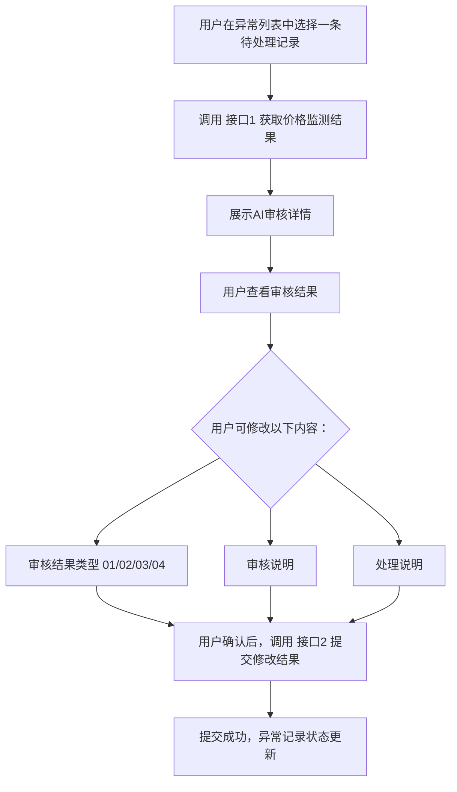

# 人工干预特殊处理 - 前端对接说明

## 一、概述

:material-information-outline: **功能说明**

本文档说明"人工干预特殊处理"功能涉及的两个新增接口，用于前端同事对接开发。

**场景说明**：用户在商品异常列表中，对某条异常记录进行"人工干预特殊处理"操作时，需要先获取该商品的AI价格监测结果，审核后可修改结果并提交。

---

## 二、接口列表

| 序号 | 接口路径 | 方法 | 说明 |
|------|----------|------|------|
| 1 | `/api/goodsException/priceAuditResult/get` | POST | 获取价格监测结果 |
| 2 | `/api/goodsException/priceAuditResult/modify` | POST | 修改价格监测结果并提交 |

**通用说明**：
- Content-Type: `application/json`
- 统一响应格式：`ResultBody<T>`，结构如下：

```json
{
  "code": 0,          // 0-成功，非0-失败
  "msg": "success",   // 响应信息
  "data": {}          // 响应数据
}
```

---

## 三、接口详细说明

### 3.1 获取价格监测结果

:material-poll: **接口描述**

根据商品ID和租户ID获取该商品的AI价格监测结果，包含当前价格、合理价、审核结论等信息。

#### 请求参数

| 参数名 | 类型 | 必填 | 说明 |
|--------|------|------|------|
| goodsId | String | 是 | 商品ID |
| tenantId | String | 是 | 租户ID |
| exceptionId | Long | 否 | 异常上报ID，用于关联异常记录 |

#### 请求示例

```json
{
  "goodsId": "GD20250501001",
  "tenantId": "T001",
  "exceptionId": 12345
}
```

#### 响应参数

| 参数名 | 类型 | 说明 |
|--------|------|------|
| goodsId | String | 商品ID |
| goodsName | String | 商品名称 |
| currentPrice | BigDecimal | 当前价格 |
| reasonablePrice | BigDecimal | 合理价 |
| auditPriceResult | Object | 价格监测结果详情，见下表 |
| exceptionId | Long | 异常上报ID |
| exceptionType | Integer | 异常类型 |

**`auditPriceResult` 对象结构**：

| 参数名 | 类型 | 说明 |
|--------|------|------|
| goodsId | String | 商品ID |
| auditResultType | String | 审核结果类型（参见审核结果枚举） |
| auditResultName | String | 审核结果名称（中文描述） |
| matchedRuleId | Long | 匹配的规则ID |
| matchedRuleName | String | 匹配的规则名称 |
| priceDeviationPercent | Double | 价格偏离百分比 |
| auditDescription | String | 审核说明（AI给出的分析说明） |
| useLastPurchasePrice | Boolean | 是否需要特殊处理（合理价为0时使用上次采购价） |

#### 响应示例

```json
{
  "code": 0,
  "msg": "success",
  "data": {
    "goodsId": "GD20250501001",
    "goodsName": "某型号阀门",
    "currentPrice": 1500.00,
    "reasonablePrice": 1200.00,
    "auditPriceResult": {
      "goodsId": "GD20250501001",
      "auditResultType": "01",
      "auditResultName": "价格异常",
      "matchedRuleId": 1001,
      "matchedRuleName": "价格高于合理价",
      "priceDeviationPercent": 25.0,
      "auditDescription": "当前价格1500元，合理价1200元，偏离25%，远超阈值10%",
      "useLastPurchasePrice": false
    },
    "exceptionId": 12345,
    "exceptionType": 1
  }
}
```

---

### 3.2 修改价格监测结果并提交

:material-pencil: **接口描述**

人工修改审核结果并提交处理，覆盖AI的审核结论。

#### 请求参数

| 参数名 | 类型 | 必填 | 说明 |
|--------|------|------|------|
| exceptionId | Long | 是 | 异常上报ID |
| goodsId | String | 是 | 商品ID |
| tenantId | String | 是 | 租户ID |
| auditResultType | String | 是 | 价格监测结果类型（参见审核结果枚举） |
| auditDescription | String | 否 | 审核说明（人工输入的审核意见） |
| dealMsg | String | 否 | 处理说明（人工填写的处理备注） |

#### 审核结果类型枚举

| 枚举值 | 含义 | 说明 |
|--------|------|------|
| 01 | 价格异常 | 价格偏离合理价，认定异常 |
| 02 | 价格正常 | 价格在合理范围内，认定正常 |
| 03 | 价格预警 | 价格有一定偏离，需关注 |
| 04 | 无法监测 | 缺乏数据，无法做出判断 |

#### 请求示例

```json
{
  "exceptionId": 12345,
  "goodsId": "GD20250501001",
  "tenantId": "T001",
  "auditResultType": "02",
  "auditDescription": "经核实，该商品为定制型号，价格合理",
  "dealMsg": "已与供应商确认价格无误"
}
```

#### 响应参数

无 data 内容，通过 `code` 和 `msg` 判断结果。

#### 响应示例

```json
{
  "code": 0,
  "msg": "success",
  "data": null
}
```

---

## 四、业务流程



---

## 五、注意事项

:material-alert-circle: **重要提示**

1. **调用顺序**：必须先调用接口1获取数据，才能调用接口2提交修改。
2. **exceptionId 传递**：接口1返回的 `exceptionId` 需要在调用接口2时原样传回。
3. **审核结果类型**：`auditResultType` 必须传入 `01/02/03/04` 其中之一，否则接口会报错。
4. **必填校验**：接口2中 `exceptionId`、`goodsId`、`tenantId`、`auditResultType` 均为必填，缺少任何一个都会返回参数检验失败。

---

## 六、常见错误码

| 错误场景 | code | msg |
|----------|------|-----|
| 参数校验失败 | 非0 | 具体的校验信息（如"商品ID不能为空"） |
| 数据不存在 | 非0 | 系统不存在该异常上报信息 |
| 业务处理失败 | 非0 | 具体的失败原因 |
