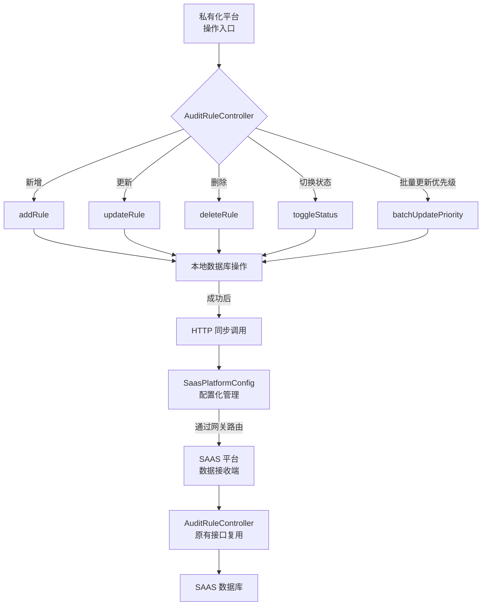

# 审核规则 SAAS 数据同步功能设计文档

:material-file-document: **文档信息**

| 项目 | 内容 |
|------|------|
| **功能名称** | 审核规则 SAAS 数据同步 |
| **作者** | lilinlin |
| **创建日期** | 2026-04-21 |
| **适用平台** | 私有化部署平台 |
| **关联模块** | bssc-biz-operate（运营端服务） |

---

## :material-target: 一、需求背景

### 1.1 业务场景

项目采用双平台部署架构：

- **SAAS 平台**：公有云服务，集中管理所有租户数据
- **私有化平台**：为特定客户独立部署，数据隔离

**核心需求**：

- 审核规则的增删改查操作在**私有化平台**进行
- 规则数据需要**实时同步**到 SAAS 平台数据库
- 两个平台的表结构和代码完全一致

### 1.2 技术方案选型

| 方案 | 优点 | 缺点 | 选择 |
|------|------|------|------|
| HTTP 直连调用 | 实现简单、耦合度低、易于调试 | 需处理网络超时、短暂不一致 | :white_check_mark: 采用 |
| MQ 消息队列 | 解耦好、支持重试、性能高 | 需引入 MQ、架构复杂 | ❌ 数据量小，不必要 |
| 数据库同步（Canal） | 对代码无侵入 | 运维复杂、无法携带业务上下文 | ❌ 不适用 |

**最终决策**：采用 HTTP 直连方式，原因：

1. 审核规则是配置类数据，同步量小
2. 实现简单，维护成本低
3. 两个平台代码结构一致，接口可复用

---

## :material-sitemap: 二、架构设计

### 2.1 整体架构



### 2.2 数据流向

```
用户操作 → 私有化 Controller → 本地数据库操作 
                              ↓ 成功后
                         HTTP 同步调用
                              ↓
                    SAAS 网关（带服务名）
                              ↓
                    SAAS Controller（同接口）
                              ↓
                       SAAS 数据库
```

### 2.3 关键特性

:white_check_mark: **无侵入设计**：原有业务逻辑完全不变  
:white_check_mark: **容错处理**：同步失败不影响本地操作  
:white_check_mark: **配置化管理**：所有参数可通过配置文件调整  
:white_check_mark: **资源安全**：使用 try-with-resources 确保资源释放  
:white_check_mark: **日志追踪**：记录同步成功/失败详情  

---

## :material-code-json: 三、代码实现

### 3.1 新增文件清单

#### 3.1.1 SaasPlatformConfig.java（配置类）

**路径**：`com.bssc.maint.operate.config.SaasPlatformConfig`

**核心功能**：

- 使用 `@ConfigurationProperties` 自动绑定配置
- 提供所有接口路径的默认值
- 智能 URL 拼接逻辑
- 统一的启用控制开关

**主要字段**：

```java
private String baseUrl;                              // SAAS 网关地址
private String auditRuleAddPath;                     // 创建接口路径
private String auditRuleUpdatePath;                  // 更新接口路径
private String auditRuleDeletePath;                  // 删除接口路径
private String auditRuleToggleStatusPath;            // 状态切换路径
private String auditRuleBatchUpdatePriorityPath;     // 批量更新优先级路径
private int timeout = 5000;                          // HTTP 超时时间
private boolean enabled = true;                      // 是否启用同步
```

**便捷方法**：

```java
public String getFullUrl(String path);               // 智能拼接 URL
public String getAuditRuleAddUrl();                  // 获取创建接口完整 URL
public String getAuditRuleUpdateUrl();               // 获取更新接口完整 URL
// ... 其他接口类似
```

#### 3.1.2 修改的文件

**AuditRuleController.java**

**新增导入**：

```java
import cn.hutool.http.HttpResponse;
import com.bssc.maint.operate.config.SaasPlatformConfig;
```

**新增依赖注入**：

```java
@Autowired
private SaasPlatformConfig saasPlatformConfig;
```

**修改的方法**（共 5 个）：

1. `addRule()` - 创建规则后同步
2. `updateRule()` - 更新规则成功后同步
3. `deleteRule()` - 删除规则成功后同步
4. `toggleStatus()` - 切换状态成功后同步
5. `batchUpdatePriority()` - 批量更新优先级成功后同步

**新增的私有方法**（共 2 个）：

```java
private void syncToSaas(String url, Object requestBody);
private void syncToSaasRaw(String url, Map<String, Object> params);
```

### 3.2 核心代码逻辑

#### 3.2.1 同步方法实现

```java
/**
 * 同步数据到 SAAS 平台（对象参数）
 */
private void syncToSaas(String url, Object requestBody) {
    // 1. 检查是否启用同步
    if (!saasPlatformConfig.isEnabled() || StrUtil.isEmpty(url)) {
        log.debug("SAAS 平台同步未启用或地址未配置，跳过同步");
        return;
    }
    
    // 2. 使用 try-with-resources 确保资源释放
    try (HttpResponse response = HttpRequest.post(url)
            .body(JSONUtil.toJsonStr(requestBody))
            .timeout(saasPlatformConfig.getTimeout())
            .execute()) {
        
        // 3. 检查响应状态
        if (response.isOk()) {
            log.info("同步到 SAAS 成功，url: {}", url);
        } else {
            log.warn("同步到 SAAS 返回异常状态，url: {}, status: {}", 
                    url, response.getStatus());
        }
    } catch (Exception e) {
        // 4. 异常隔离：同步失败不影响本地操作
        log.error("同步到 SAAS 失败，url: {}", url, e);
    }
}
```

#### 3.2.2 调用示例

```java
@PostMapping("/addRule")
public ResultBody<String> addRule(@Valid @RequestBody AddRuleRequest request) {
    Long tenantId = getCurrentTenantId();
    
    // ... 原有的防重锁逻辑 ...
    
    try {
        // 1. 本地数据库操作
        TenantRule tenantRule = convertToTenantRule(request);
        tenantRule.setTenantId(tenantId);
        Long ruleId = tenantRuleService.createTenantRule(tenantRule, request.getCategoryList());
        TransmittableThreadContext.set("ruleId", ruleId);
        
        // 2. 同步到 SAAS 平台
        syncToSaas(saasPlatformConfig.getAuditRuleAddUrl(), request);
        
        return ResultBody.ok().data(ruleId);
    } finally {
        releaseLock(lockKey, requestId);
    }
}
```

### 3.3 配置文件

**application.yml**

```yaml
# SAAS 平台地址配置（用于私有化平台数据同步）
# 私有化部署时需要配置此地址，SAAS 平台部署时无需配置
saas:
  platform:
    # SAAS 平台网关地址（建议配置带服务名的网关地址）
    # K8s 环境示例：http://jgjc-bssc-cloud-gateway-svc.jgjc:9090
    # 直接 IP 示例：http://8.130.214.12:port
    base-url: http://jgjc-bssc-cloud-gateway-svc.jgjc:9090
    
    # 是否启用同步功能（默认 true）
    enabled: true
    
    # HTTP 请求超时时间（毫秒，默认 5000）
    timeout: 5000
    
    # 以下接口路径可根据实际情况自定义（使用默认值即可）
    # audit-rule-add-path: /api/audit-rules/addRule
    # audit-rule-update-path: /api/audit-rules/updateRule
    # audit-rule-delete-path: /api/audit-rules/deleteRule
    # audit-rule-toggle-status-path: /api/audit-rules/toggleStatus
    # audit-rule-batch-update-priority-path: /api/audit-rules/batchUpdatePriority
```

---

## :material-wrench: 四、技术要点

### 4.1 为什么使用网关地址？

**优势**：

1. **统一入口**：所有请求通过网关路由，便于统一管理
2. **负载均衡**：网关可做负载均衡和故障转移
3. **认证鉴权**：网关层统一处理 Token 验证
4. **服务发现**：K8s 环境下通过服务名自动发现实例
5. **解耦**：后端服务地址变化不影响调用方

**配置示例**：

```yaml
# K8s 环境（推荐）
base-url: http://jgjc-bssc-cloud-gateway-svc.jgjc:9090

# 直接 IP 方式
base-url: http://8.130.214.12:9090
```

### 4.2 资源管理

使用 **try-with-resources** 确保 HttpResponse 正确关闭：

```java
try (HttpResponse response = HttpRequest.post(url).execute()) {
    // 处理响应
}
// 自动关闭资源，避免内存泄漏
```

### 4.3 异常隔离策略

```
本地操作成功 → 同步调用 → 同步成功/失败
                ↓
           只记录日志，不影响返回结果
```

**设计理念**：

- 同步失败不应影响用户的正常操作
- 通过日志记录问题，后续可人工排查或补偿
- 适合配置类数据的最终一致性场景

### 4.4 URL 拼接逻辑

配置类提供了智能的 URL 拼接：

```java
public String getFullUrl(String path) {
    if (baseUrl == null || baseUrl.isEmpty()) {
        return null;
    }
    // 如果 path 已经包含完整路径，直接返回
    if (path.startsWith("http://") || path.startsWith("https://")) {
        return path;
    }
    // 拼接 baseUrl 和 path，自动处理斜杠
    String cleanBaseUrl = baseUrl.endsWith("/") ? 
        baseUrl.substring(0, baseUrl.length() - 1) : baseUrl;
    String cleanPath = path.startsWith("/") ? path : "/" + path;
    return cleanBaseUrl + cleanPath;
}
```

---

## :material-rocket-launch: 五、上线注意事项

### 5.1 发版策略

#### 私有化平台

:white_check_mark: **使用修改后的版本**

- 包含同步逻辑的代码
- 配置文件中设置 `saas.platform.base-url`
- 确保网络能访问到 SAAS 平台网关

#### SAAS 平台

:white_check_mark: **使用原有版本即可**

- 不需要任何代码改动
- 不需要配置 `saas.platform.base-url`
- 原有的 Controller 接口会自动接收同步请求

### 5.2 配置检查清单

**私有化平台必须配置**：

```yaml
saas:
  platform:
    base-url: http://正确的-SAAS-网关地址:端口  # :warning: 必须修改
    enabled: true                               # 确认启用
    timeout: 5000                               # 根据网络情况调整
```

**SAAS 平台无需配置**：

- 该项配置留空或不配置均可
- 系统会自动跳过同步逻辑

### 5.3 网络连通性验证

上线前务必验证：

```bash
# 1. 测试网关连通性
curl http://jgjc-bssc-cloud-gateway-svc.jgjc:9090/actuator/health

# 2. 测试具体接口可达性
curl -X POST http://jgjc-bssc-cloud-gateway-svc.jgjc:9090/api/audit-rules/testAudit \
  -H "Content-Type: application/json" \
  -d '{"tenantId":"xxx"}'

# 3. 检查防火墙规则
# 确保私有化平台所在网络可以访问 SAAS 网关
```

### 5.4 Token 认证问题 :warning:

**潜在问题**：

SAAS 平台的接口可能有 Token 验证，私有化调用时可能需要处理认证。

**解决方案**（根据实际情况选择）：

**方案 A：网关白名单**（推荐）

- 在 SAAS 网关配置私有化平台 IP 白名单
- 白名单内的请求跳过 Token 验证

**方案 B：服务间调用 Token**

- 创建一个专用的服务账号
- 在同步方法中添加 Token 头：

```java
HttpRequest.post(url)
    .header("Authorization", "Bearer " + getServiceToken())
    .body(JSONUtil.toJsonStr(requestBody))
    .execute();
```

**方案 C：内部接口标识**

- 添加自定义 Header 标识内部调用
- SAAS 端识别该标识后跳过权限校验

### 5.5 幂等性保证

确保 SAAS 平台的接口支持重复调用：

**创建接口**：

- 根据 `ruleName` + `tenantId` 判断是否已存在
- 已存在则返回现有 ID 或提示冲突

**更新/删除接口**：

- 根据 `ruleId` 判断是否存在
- 不存在则返回成功（幂等）

### 5.6 监控与告警

**关键日志**：

```
INFO  - 同步到 SAAS 成功，url: xxx
WARN  - 同步到 SAAS 返回异常状态，url: xxx, status: 500
ERROR - 同步到 SAAS 失败，url: xxx, exception: xxx
```

**建议监控指标**：

1. 同步成功率（应 > 99%）
2. 同步平均耗时（应 < 100ms）
3. 同步失败次数（告警阈值：连续失败 3 次）

### 5.7 回滚方案

如果同步功能出现问题：

**快速关闭同步**：

```yaml
saas:
  platform:
    enabled: false  # 立即关闭同步
```

**回滚代码**：

- 私有化平台回滚到上一版本
- SAAS 平台无需回滚

---

## :material-test-tube: 六、测试建议

### 6.1 单元测试

测试配置类的 URL 拼接逻辑：

```java
@Test
public void testGetFullUrl() {
    config.setBaseUrl("http://gateway:9090");
    
    assertEquals("http://gateway:9090/api/test", 
                 config.getFullUrl("/api/test"));
    assertEquals("http://gateway:9090/api/test", 
                 config.getFullUrl("api/test"));
}
```

### 6.2 集成测试

**测试场景**：

1. 创建规则 → 验证 SAAS 库中是否有数据
2. 更新规则 → 验证 SAAS 库中数据是否更新
3. 删除规则 → 验证 SAAS 库中数据是否删除
4. 网络异常 → 验证本地操作不受影响
5. 关闭同步 → 验证不发起 HTTP 请求

### 6.3 压力测试

模拟并发操作：

- 10 个用户同时创建规则
- 验证不会出现重复数据
- 验证防重锁机制有效

---

## :material-chart-arc: 七、性能评估

### 7.1 性能影响

**本地操作**：无影响（同步在操作完成后异步执行）

**同步耗时**：

- 正常情况：50-100ms
- 超时配置：5000ms
- 对用户体验影响：几乎无感知

### 7.2 并发控制

利用现有的 Redis 防重锁机制：

```java
String lockKey = generateLockKey(tenantId, "ADD");
if (!tryAcquireLock(lockKey, requestId)) {
    return ResultBody.failed().data("操作过于频繁，请稍后再试");
}
```

---

## :material-clipboard-alert: 八、问题排查

### 8.1 常见问题

**问题 1：同步失败，日志显示连接超时**

```
ERROR - 同步到 SAAS 失败，url: http://xxx, exception: ConnectTimeout
```

**解决**：

1. 检查 `base-url` 配置是否正确
2. 验证网络连通性
3. 适当增加 `timeout` 配置

**问题 2：SAAS 端返回 401/403**

```
WARN - 同步到 SAAS 返回异常状态，url: xxx, status: 401
```

**解决**：

1. 检查是否需要 Token 认证
2. 配置网关白名单
3. 添加认证 Header

**问题 3：SAAS 端数据不同步**

**排查步骤**：

1. 检查 `enabled` 是否为 true
2. 查看日志是否有同步记录
3. 验证 SAAS 端接口是否正常
4. 检查 SAAS 端数据库事务是否提交

### 8.2 日志级别调整

临时开启 DEBUG 日志排查问题：

```yaml
logging:
  level:
    com.bssc.maint.operate.controller.AuditRuleController: DEBUG
```

---

## :material-clipboard-text: 九、后续优化方向

### 9.1 短期优化

1. **失败重试机制**
   - 记录失败的同步请求到数据库
   - 定时任务补偿重试

2. **异步化改造**
   - 使用 `@Async` 异步执行同步
   - 进一步降低对用户的影响

### 9.2 长期优化

1. **升级为 MQ 方案**
   - 如果同步量增大，考虑引入 RabbitMQ/Kafka
   - 提供更好的解耦和可靠性

2. **双向同步**
   - 支持 SAAS 端的变更同步回私有化
   - 实现真正的数据一致性

---

## :material-clipboard-check: 十、总结

### 10.1 核心优势

:white_check_mark: **实现简单**：仅需修改一个 Controller，新增一个配置类  
:white_check_mark: **维护方便**：配置化管理，易于调整  
:white_check_mark: **风险可控**：同步失败不影响主流程  
:white_check_mark: **扩展性好**：可轻松添加其他业务的同步  

### 10.2 关键成功因素

1. **正确的网关地址配置**
2. **网络连通性保障**
3. **Token 认证处理**
4. **幂等性保证**
5. **完善的日志监控**

### 10.3 上线检查清单

- [ ] 私有化平台代码已更新
- [ ] SAAS 平台代码保持不变
- [ ] `base-url` 配置为正确的网关地址
- [ ] `enabled` 设置为 true
- [ ] 网络连通性已验证
- [ ] Token 认证方案已确定
- [ ] 日志监控已配置
- [ ] 回滚方案已准备

---

**文档版本**：v1.0  
**最后更新**：2026-04-21  
**维护人员**：lilinlin
