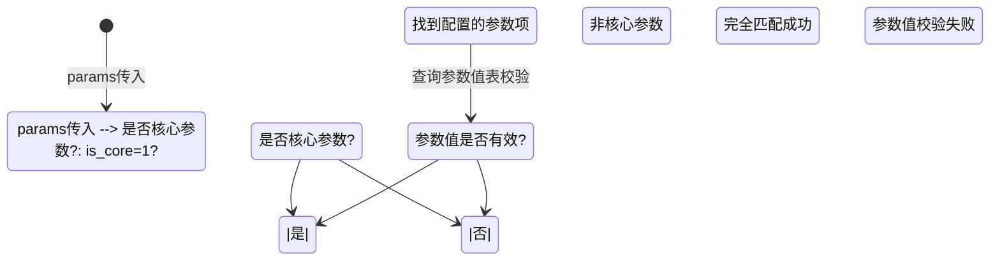

# 研发简要设计卡片 - 标准商品治理匹配服务

:material-file-document-edit: **文档类型**: 功能设计 |
:material-account-clock: **更新时间**: 2026-06-04 |
:material-account: **维护人**: 研发团队 |
:material-tag: **标签**: 标准商品, 治理匹配, bssc-biz-operate, Feign, 枚举类

---

## 一、基础信息

:material-information-outline: **基本信息**

- **需求编号**：标准商品治理匹配服务开发
- **开发类型**：新功能
- **跨模块**：是
- **涉及模块**：商品治理模块、标准商品管理模块、消息通知模块
- **数据结构变动**：是（新增枚举类）
- **相关服务及前端**：`bssc-biz-operate`（后端运营服务）、`bssc-cloud-feignapi`（Feign接口）
- **工时预估**：设计:2小时，开发:4小时，测试:2小时

---

## 二、设计信息

### 2.1 主要设计思路

#### 2.1.1 业务背景

AI抽取商品信息后，需要通过Feign接口回调进行商品治理匹配，将非结构化的商品信息转换为标准商品数据。核心目标是实现商品的品目、品牌、参数的自动匹配核验，并生成唯一特征码用于商品去重。

#### 2.1.2 核心流程

```
请求入口 → 租户校验 → 品目匹配 → 品牌匹配 → 参数核验 → 特征码生成 → 去重判断 → 数据落库 → 消息通知
```

#### 2.1.3 主要改动内容

1. **新增服务实现类**：`StandGoodsGovernMatchServiceImpl`
2. **新增VO对象**：
   - `ParamMatchVO` - 参数匹配结果
   - `CatalogMatchVO` - 品目匹配结果
   - `BrandMatchVO` - 品牌匹配结果
   - `StandGoodsGovernMatchResultVO` - 匹配结果汇总（增强版，支持返回原始抽取参数和品目参数配置）
3. **新增枚举类**：`ParamMatchStatus` - 参数匹配状态枚举
4. **新增请求DTO**：`GoodsGovernMatchReq` - Feign请求参数
5. **优化点**：
   - 品目匹配优先选择末级品目（`is_last=1`），避免匹配到父级品目
   - 失败时返回品目参数配置（`catalogParamConfig`），便于前端引导用户补充参数
   - 成功时返回原始抽取参数（`extractedParams`），包含品目、品牌及所有抽取的参数

#### 2.1.4 设计要点

| 模块 | 设计说明 |
|------|----------|
| 品目匹配 | 支持精确匹配，优先选择末级品目（`is_last=1`），通过参数反推候选品目范围 |
| 品牌匹配 | 按中文名或英文名精确匹配 |
| 参数核验 | 分离核心参数和必填参数，校验参数项和参数值，支持文本、单选、多选类型 |
| 特征码生成 | MD5(租户ID#品目ID#品牌ID#核心参数排序拼接) |
| 消息通知 | 处理完成后统一保存到`t_developer_msg_detail`，失败时携带品目参数配置 |
| 返回增强 | 失败时返回catalogParamConfig，成功时返回extractedParams |

---

### 2.2 时序图/流程图/状态图

#### 2.2.1 整体流程图

```mermaid
flowchart TB
    A[接收Feign请求<br>GoodsGovernMatchReq] --> B[租户信息校验<br>(带Redis缓存)]
    B --> C{参数为空?}
    C -->|是| D[尝试品目匹配]
    D --> E[获取品目参数配置]
    E --> F[返回失败+配置]
    C -->|否| G[品目匹配核验]
    G --> H{品目匹配成功?}
    H -->|否| I[记录失败原因<br>设置失败类型]
    H -->|是| J[品牌匹配核验]
    J --> K{品牌匹配成功?}
    K -->|否| I
    K -->|是| L[参数核验]
    L --> M{核验成功?}
    M -->|否| N[收集所有失败原因<br>确定主要失败类型]
    M -->|是| O[生成特征码<br>MD5生成]
    N --> F
    O --> P[查重判断]
    P --> Q{已存在?}
    Q -->|是| R[handleExistGoods<br>直接返回结果]
    Q -->|否| S[createStandGoods<br>新建标准商品]
    R --> T[保存处理消息<br>saveGovernMsg]
    S --> T
    T --> U[返回匹配结果<br>StandGoodsGovernMatchResultVO]
```

#### 2.2.2 参数匹配状态图



#### 2.2.3 特征码生成逻辑（增强版）

```
特征码 = MD5(租户ID + "#" + 品目ID + "#" + 品牌ID + "#" + 核心参数排序拼接)

示例：
输入：
  - 租户ID: tenant001
  - 品目ID: 100
  - 品牌ID: 50
  - 核心参数: [{tenantParamId:"1", standParamValue:"16GB"}, {tenantParamId:"2", standParamValue:"512GB"}]

拼接字符串: "tenant001#100#50#1:16GB|2:512GB|"

MD5结果: "a1b2c3d4e5f6..." (32位十六进制字符串)

:warning: **注意**：增加租户ID作为前缀，确保不同租户的商品即使其他信息相同也能区分
```

---

### 2.3 数据结构

#### 2.3.1 涉及表结构

**1. 标准商品表 `t_stand_goods`**

```sql
-- 主要字段
id                  BIGINT       -- 主键ID
stand_goods_code    VARCHAR(64)  -- 标准商品编码(特征码)
stand_goods_name    VARCHAR(255) -- 标准商品名称
goods_id            VARCHAR(64)  -- 租户商品ID
tenant_id           VARCHAR(64)  -- 租户ID
tenant_catalog_id   VARCHAR(64)  -- 租户品目ID
brand_id            VARCHAR(64)  -- 品牌ID
catalog_path_name   VARCHAR(500) -- 品目路径名称
goods_param         TEXT         -- 商品参数JSON
is_deleted          TINYINT      -- 删除标记
create_time         DATETIME     -- 创建时间
update_time         DATETIME     -- 更新时间
```

**2. 标准商品参数值表 `t_stand_goods_param_value`**

```sql
-- 主要字段
id                      BIGINT       -- 主键ID
stand_goods_id          VARCHAR(64)  -- 标准商品ID
goods_id                VARCHAR(64)  -- 租户商品ID
tenant_catalog_id       VARCHAR(64)  -- 租户品目ID
tenant_param_id         VARCHAR(64)  -- 租户参数ID
tenant_param_name       VARCHAR(128) -- 租户参数名称
tenant_subassembly_id  VARCHAR(64)  -- 参数项ID
tenant_param_value_id   INT          -- 参数值ID
tenant_param_value      VARCHAR(255) -- 参数值
tenant_param_input_type INT          -- 输入类型
tenant_param_attribute  VARCHAR(10)  -- 参数属性(1必填,2核心)
tenant_id               VARCHAR(64)  -- 租户ID
is_deleted              TINYINT      -- 删除标记
create_time             DATETIME     -- 创建时间
```

**3. 治理表 `t_stand_goods_govern`**

```sql
-- 主要字段
id                    BIGINT       -- 主键ID
extract_status        INT          -- 抽取状态(0待处理,1成功,2失败)
audit_desc            VARCHAR(500) -- 审核描述
transfer_goods_param  TEXT         -- 转换后的商品参数JSON
update_time           DATETIME     -- 更新时间
```

**4. 消息表 `t_developer_msg_detail`**

```sql
-- 主要字段
msg_id         VARCHAR(64)  -- 消息ID
developer_id   VARCHAR(64)  -- 开发者ID(租户ID)
tenant_id      VARCHAR(64)  -- 租户ID
msg_type       VARCHAR(10)  -- 消息类型(11=商品治理)
goods_id       VARCHAR(64)  -- 商品ID
msg_content    TEXT         -- 消息内容JSON
msg_time       DATETIME     -- 消息时间
status         VARCHAR(1)   -- 状态(0未读)
```

#### 2.3.2 新增枚举类

```java
/**
 * 参数匹配状态枚举
 */
public enum ParamMatchStatus {
    NOT_CORE_PARAM(0, "非核心参数"),      // 非核心参数
    VALUE_MISMATCH(1, "参数值校验失败"),   // 参数项匹配成功，值校验失败
    FULLY_MATCHED(2, "匹配成功");         // 参数项和值都匹配成功
}
```

---

### 2.4 输入输出

#### 2.4.1 输入参数 `GoodsGovernMatchReq`

| 字段名 | 类型 | 必填 | 说明 |
|--------|------|------|------|
| governId | String | 是 | 治理表ID |
| tenantId | String | 是 | 租户ID |
| goodsId | String | 是 | 租户商品ID |
| originGoodsId | String | 否 | 原始商品ID |
| goodsName | String | 否 | 商品名称 |
| link | String | 否 | 商品链接 |
| catalogName | String | 是 | 租户品目名称 |
| brandName | String | 否 | 品牌名称 |
| params | Map<String, String> | 是 | 抽取参数(K-V格式) |
| goodsCode | String | 否 | 小博码 |
| similarCode | String | 否 | 相似码 |

#### 2.4.2 输出结果 `StandGoodsGovernMatchResultVO`

| 字段名 | 类型 | 说明 |
|--------|------|------|
| governId | String | 治理表ID |
| matchSuccess | Boolean | 是否匹配成功 |
| resultType | Integer | 结果类型(1=已存在EXIST, 2=新建NEW, 3=失败FAILED) |
| standGoodsId | String | 标准商品ID |
| standGoodsCode | String | 标准商品编码（特征码） |
| catalogMatch | CatalogMatchVO | 品目匹配结果 |
| brandMatch | BrandMatchVO | 品牌匹配结果 |
| paramMatches | List<ParamMatchVO> | 参数匹配结果列表 |
| featureCode | String | 特征码 |
| governStatus | Integer | 治理状态(1=成功SUCCESS, 2=失败FAILED) |
| governDesc | String | 治理描述 |
| transferGoodsParam | String | 转换后的商品参数JSON |
| extractedParams | Map<String, String> | 原始抽取参数（成功时返回，包含catalog、brand、params） |
| catalogParamConfig | Map<String, Object> | 品目参数配置（失败时返回，用于引导用户补充参数） |
| message | String | 匹配消息 |

#### 2.4.3 消息内容格式

**成功消息：**

```json
{
  "auditStatus": "1",        // 1=成功
  "auditOpinion": "新标准商品创建成功",
  "goodsId": "ITEM202605090000005",
  "extractedParams": {       // 原始抽取参数
    "catalog": "碎纸机",
    "brand": "松下",
    "params": "{\"碎纸效果\":\"段状\",\"容量\":\"10L\"}"
  }
}
```

**失败消息：**

```json
{
  "auditStatus": "0",        // 0=失败
  "auditOpinion": "核心参数【碎纸效果】的值【xxx】核验失败；必填参数【入纸宽度】未匹配到值",
  "goodsId": "ITEM202605090000005",
  "catalogParamConfig": {    // 品目参数配置（用于前端展示）
    "碎纸效果": {
      "paramId": 32648,
      "paramName": "碎纸效果",
      "paramCode": "1495750123095105613",
      "isCore": 1,
      "isMust": 1,
      "inputType": 10,
      "paramAttribute": "12",
      "valueOptions": [
        {"paramValueId": 160420, "paramValue": "段状"},
        {"paramValueId": 160421, "paramValue": "粒状"}
      ]
    },
    "入纸宽度": {
      "paramId": 32650,
      "paramName": "入纸宽度",
      "isCore": 0,
      "isMust": 1,
      "inputType": 1,
      "valueOptions": [
        {"paramValueId": 160428, "paramValue": "A4"},
        {"paramValueId": 160429, "paramValue": "A3"}
      ]
    }
  }
}
```

---

### 2.5 接口

#### 2.5.1 Feign接口

| 接口路径 | 请求方式 | 说明 |
|----------|----------|------|
| `/triggerMatch` | POST | 触发商品治理匹配 |

#### 2.5.2 接口示例

**请求示例：**

```json
{
  "governId": "12345",
  "tenantId": "tenant001",
  "goodsId": "goods001",
  "catalogName": "笔记本电脑",
  "brandName": "联想",
  "params": {
    "内存": "16GB",
    "CPU": "i7-12700H",
    "硬盘": "512GB SSD"
  }
}
```

**响应示例(成功)：**

```json
{
  "governId": "12345",
  "matchSuccess": true,
  "resultType": 2,
  "standGoodsId": "1001",
  "standGoodsCode": "a1b2c3d4e5f6...",
  "catalogMatch": {
    "matchSuccess": true,
    "tenantCatalogId": "cat001",
    "tenantCatalogName": "笔记本电脑",
    "standCatalogId": "std_cat001",
    "standCatalogName": "便携式计算机",
    "matchScore": 1.0
  },
  "brandMatch": {
    "matchSuccess": true,
    "brandId": "brand001",
    "brandNameCn": "联想"
  },
  "paramMatches": [
    {
      "matchStatus": "FULLY_MATCHED",
      "tenantParamName": "内存",
      "standParamValue": "16GB"
    }
  ],
  "featureCode": "a1b2c3d4e5f6...",
  "governStatus": 1,
  "governDesc": "新标准商品创建成功，ID：1001",
  "message": "新标准商品创建成功"
}
```

---

### 2.6 提示语

| 场景 | 提示语 | 说明 |
|------|--------|------|
| **租户校验** | | |
| 租户不存在 | 租户不存在! | 抛出异常 |
| **参数校验** | | |
| 参数为空 | 无请求参数 KEY/VALUE 类型，核验失败 | 返回失败+品目参数配置 |
| **品目匹配** | | |
| 品目名称为空 | 品目名称为空 | 品目匹配失败 |
| 未找到匹配品目 | 未找到匹配的品目：xxx | 品目匹配失败 |
| 品目缺少标准ID | 匹配到的品目缺少标准品目ID | 警告日志，但不影响匹配 |
| 品目匹配成功 | 品目精确匹配成功 | 正常流程 |
| **品牌匹配** | | |
| 品牌名称为空 | 品牌名称为空 | 品牌匹配失败 |
| 未找到匹配品牌 | 未找到匹配的品牌：xxx | 品牌匹配失败 |
| 品牌匹配成功 | 品牌匹配成功（中文名） | 正常流程 |
| **参数核验** | | |
| 必填参数缺失 | 未匹配到必填参数项【xxx】 | 收集到失败原因列表 |
| 核心参数值校验失败 | 核心参数【xxx】的值【xxx】核验失败 | 收集到失败原因列表 |
| 核心参数缺失 | 核心参数【xxx】未匹配到值 | 收集到失败原因列表 |
| 参数值不在可选列表中 | 参数值【xxx】不存在 | VALUE_MISMATCH状态 |
| 参数核验异常 | 参数核验异常：xxx | 异常情况 |
| **整体结果** | | |
| 多个失败原因 | 品目核验失败：xxx；品牌核验失败：xxx | 用"；"分隔 |
| 新建成功 | 新标准商品创建成功 | 返回成功+extractedParams |
| 已存在 | 标准商品已存在 | 返回成功+extractedParams |
| 匹配异常 | 匹配失败：xxx | 异常情况 |

**提示语组合示例：**

```
1. 单个失败："核心参数【碎纸效果】的值【xxx】核验失败"
2. 多个失败："品目核验失败：未找到匹配的品目：xxx；品牌核验失败：未找到匹配的品牌：xxx"
3. 参数为空："无请求参数 KEY/VALUE 类型，核验失败"（同时返回catalogParamConfig）
```

---

### 2.7 配置项

| 配置项 | 配置编码 | 默认值 | 说明 |
|--------|----------|--------|------|
| 租户缓存Key前缀 | TENANT_CACHE_KEY_PREFIX | bssc:tenant: | Redis缓存Key前缀 |
| 租户缓存过期时间 | TENANT_CACHE_EXPIRE_DAYS | 1天 | 租户信息缓存有效期 |

---

### 2.8 文书及模板

无

---

### 2.9 在途/历史数据兼容

| 场景 | 兼容方案 |
|------|----------|
| 历史商品无特征码 | 不影响，新商品按新逻辑生成特征码 |
| 历史参数值格式差异 | 支持 trim 处理后匹配 |
| 品目名称变更 | 优先精确匹配，失败后模糊匹配 |

---

### 2.10 测试场景及用例说明

#### 2.10.1 测试重点

1. **品目匹配**：精确匹配、模糊匹配、匹配失败场景
2. **品牌匹配**：中文名、英文名、别名匹配场景
3. **参数核验**：核心参数、必填参数、参数值校验场景
4. **特征码生成**：相同商品生成相同特征码
5. **去重判断**：已存在商品、新建商品场景
6. **消息通知**：成功消息、失败消息保存

#### 2.10.2 典型测试用例

| 用例编号 | 场景 | 预期结果 |
|----------|------|----------|
| TC001 | 正常商品匹配(品目+品牌+参数都匹配) | 新建标准商品成功，返回extractedParams |
| TC002 | 商品已存在(特征码相同) | 返回已存在标准商品，返回extractedParams |
| TC003 | 品目不匹配 | 返回失败，提示品目核验失败 |
| TC004 | 品牌不匹配 | 返回失败，提示品牌核验失败 |
| TC005 | 核心参数值不在可选值中 | 返回失败，提示参数值核验失败 |
| TC006 | 必填参数缺失 | 返回失败，提示必填参数缺失 |
| TC007 | 参数为空但品目存在 | 返回失败，携带catalogParamConfig供前端展示 |
| TC008 | 参数为空且品目不存在 | 返回失败，无catalogParamConfig |
| TC009 | 租户不存在 | 抛出异常，提示租户不存在 |
| TC010 | 多个核验项失败 | 返回失败，用"；"分隔所有失败原因 |
| TC011 | 品目有多个同名记录 | 优先选择is_last=1的末级品目 |
| TC012 | 文本类型参数校验 | 只校验非空，不进行等值验证 |

#### 2.10.3 改动影响范围

| 影响范围 | 说明 |
|----------|------|
| 商品治理流程 | AI抽取后回调匹配逻辑变更 |
| 标准商品数据 | 新增标准商品数据结构 |
| 消息通知 | 新增商品治理消息类型 |

---

## 三、代码结构

```
com.bssc.maint.operate.codematch
├── enums
│   └── ParamMatchStatus.java          # 参数匹配状态枚举
├── service
│   ├── StandGoodsGovernMatchService.java    # 服务接口
│   └── impl
│       └── StandGoodsGovernMatchServiceImpl.java  # 服务实现
└── vo
    ├── BrandMatchVO.java              # 品牌匹配结果
    ├── CatalogMatchVO.java            # 品目匹配结果
    ├── ParamMatchVO.java              # 参数匹配结果
    └── StandGoodsGovernMatchResultVO.java  # 匹配结果汇总

com.bssc.cloud.feignapi.operate.dto
└── GoodsGovernMatchReq.java           # Feign请求DTO
```

---

## 四、核心方法说明

### 4.1 matchByMatchReq (主入口)

```java
@Transactional(rollbackFor = Exception.class)
public StandGoodsGovernMatchResultVO matchByMatchReq(GoodsGovernMatchReq req)
```

**职责**：整体流程编排，事务控制

**流程**：
1. 获取租户信息(带Redis缓存)
2. **参数是否为空判断**：
   - 为空：尝试品目匹配 → 获取品目参数配置 → 返回失败+配置
   - 不为空：继续正常流程
3. 品目匹配核验（优先末级品目）
4. 品牌匹配核验
5. 参数核验(核心+必填)
6. 生成特征码(MD5含租户ID)
7. 去重判断
8. 数据落库/返回已存在
9. 保存消息通知（成功携带extractedParams，失败携带catalogParamConfig）

### 4.2 matchCatalog (品目匹配)

```java
private CatalogMatchVO matchCatalog(String catalogName, String tenantId, Map<String, String> params)
```

**职责**：品目精确匹配，优先选择末级品目

**逻辑**：
1. 根据参数名反推候选品目ID集合（取交集）
2. 查询品目名称匹配的列表（SQL过滤 is_last=1）
3. 如果有候选品目ID，进行范围过滤
4. **优先选择末级品目（`is_last=1`）**
5. 返回匹配结果

**优化点**：
- SQL层面直接过滤 `is_last=1`，性能最优
- 支持通过参数反推缩小匹配范围
- 避免匹配到父级品目导致参数配置缺失

### 4.3 matchAndValidateParams (参数核验)

```java
private List<ParamMatchVO> matchAndValidateParams(
    Map<String, String> params, 
    String tenantCatalogId,
    String tenantId, 
    List<String> failReasons)
```

**职责**：核心参数和必填参数的匹配核验

**逻辑**：
1. 查询品目下配置的核心参数(is_core=1)和必填参数(is_must=1)
2. 核验必填参数是否都有值
3. 遍历传入参数，匹配核心参数项
4. 根据inputType校验参数值：
   - 文本类型(3/7/9)：仅校验非空
   - 单选类型(1/5)：精确匹配参数值
   - 多选类型(2/4)：批量校验多个值
5. 检查是否所有核心参数都有匹配到值
6. 返回匹配结果列表

### 4.4 generateFeatureCode (特征码生成)

```java
private String generateFeatureCode(
    String tenantId,
    String tenantCatalogId, 
    String brandId, 
    List<ParamMatchVO> paramMatches)
```

**职责**：生成商品唯一标识特征码

**算法**：`MD5(租户ID#品目ID#品牌ID#核心参数排序拼接)`

**示例**：`MD5("tenant001#100#50#1:16GB|2:512GB|")`

:warning: **注意**：增加租户ID前缀，确保不同租户的商品即使其他信息相同也能区分

### 4.5 getAllCatalogParamsInfo (获取品目参数配置)

```java
private Map<String, Object> getAllCatalogParamsInfo(String tenantCatalogId, String tenantId)
```

**职责**：获取品目下所有参数的完整配置信息

**返回结构**：

```json
{
  "参数名": {
    "paramId": 32648,
    "paramName": "碎纸效果",
    "paramCode": "xxx",
    "isCore": 1,
    "isMust": 1,
    "inputType": 10,
    "paramAttribute": "12",
    "valueOptions": [...]  // 选项类型参数包含可选值列表
  }
}
```

**使用场景**：
- 参数为空时，返回给前端引导用户补充参数
- 核验失败时，帮助用户了解需要填写哪些参数

### 4.6 validateParamValue (参数值校验)

```java
private CatalogParamValueEntity validateParamValue(
    Integer subassemblyId, 
    String paramValue)
```

**职责**：校验参数值是否在参数值表中存在

**逻辑**：根据参数项ID查询参数值表，精确匹配参数值

---

## 五、注意事项

1. :warning: **事务控制**：主方法添加`@Transactional`注解，确保数据一致性
2. :floppy_disk: **缓存使用**：租户信息使用Redis缓存（1天过期），减少数据库查询
3. :memo: **错误收集**：核验失败原因统一收集后用"；"分隔返回，便于用户定位问题
4. :mag: **日志记录**：关键节点添加详细日志，便于问题排查和性能分析
5. :label: **参数状态**：使用枚举`ParamMatchStatus`替代布尔字段，语义更清晰
6. :priority_high: **末级品目优先**：品目匹配时SQL层面过滤`is_last=1`，避免匹配到父级品目
7. :inbox: **参数为空处理**：参数为空时尝试获取品目参数配置，返回给前端引导用户补充
8. :key: **特征码唯一性**：增加租户ID前缀，确保不同租户的商品即使其他信息相同也能区分
9. :input_text: **参数类型校验**：根据inputType采用不同的校验策略（文本/单选/多选）
10. :outbox: **消息内容增强**：
    - 成功消息携带`extractedParams`（原始抽取参数）
    - 失败消息携带`catalogParamConfig`（品目参数配置）
