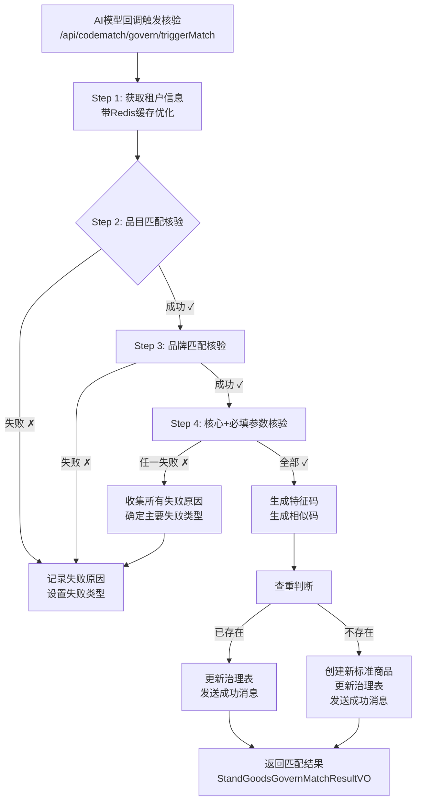

# 标准商品治理核验失败类型分类方案设计文档

:material-file-document-edit: **文档类型**: 功能设计 |
:material-account-clock: **更新时间**: 2026-05-19 |
:material-account: **维护人**: 研发团队 |
:material-tag: **标签**: 标准商品, 核验失败, 分类方案, 商品治理, 审核规则

---

:material-file-document: **文档信息**

| 项目 | 内容 |
|------|--------|
| **文档名称** | 标准商品治理核验失败类型分类方案设计文档 |
| **版本号** | V1.0 |
| **创建日期** | 2026-05-19 |
| **作者** | AI Assistant |
| **审核人** | - |
| **状态** | 待评审 |

---

## 一、需求背景#

### 1.1 业务背景#

:warning: **现状问题**

在标准商品治理流程中，商品需要通过AI模型（大模型/小模型）进行品目识别、品牌识别和参数抽取，然后通过 `/api/codematch/govern/triggerMatch` 接口进行自动化核验。当前系统存在以下问题：

1. :red_circle: **失败原因展示不够结构化**：列表页只能看到详细的文本描述，无法快速识别失败类型
2. :red_circle: **缺乏统计分析能力**：无法按失败类型统计各类问题的分布情况
3. :red_circle: **筛选效率低**：运营人员无法快速筛选出某一类失败的商品进行批量处理

### 1.2 需求目标#

:target: **改进方向**

1. :white_check_mark: **列表页新增"失败类型"列**：在 `/api/standgoodsgovern/standGoodsGovernList` 接口返回中增加失败类型字段
2. :white_check_mark: **核验失败提示规范化**：对各类失败场景进行明确分类，细化问题原因描述
3. :white_check_mark: **支持统计分析**：通过结构化的失败类型字段，支持后续的统计分析和数据洞察

### 1.3 涉及接口#

| 接口路径 | 服务 | 说明 |
|----------|------|------|
| `/api/standgoodsgovern/standGoodsGovernList` | operate-service | 标准商品治理列表查询（需新增返回字段） |
| `/api/codematch/govern/triggerMatch` | operate-service | 触发商品核验匹配（需记录失败类型） |

---

## 二、现有核验流程分析#

### 2.1 核验流程图#



### 2.2 关键校验点梳理#

#### 2.2.1 品目匹配核验（Catalog Match）#

| 校验项 | 校验逻辑 | 失败场景 | 原提示信息示例 |
|--------|---------|---------|--------------|
| 品目名称非空 | `StrUtil.isBlank(catalogName)` | 品目名称为空 | "品目名称为空" |
| 参数反推候选品目 | 根据传入参数名反推共同品目ID集合 | 无候选品目（不影响后续） | - |
| 品目精确匹配 | 查询 `zc_tenant_catalog` 表，条件：tenantId + catalogName + isLast=1 + isEnabled=1 | 未找到匹配的品目 | "未找到匹配的品目：碎纸机" |
| 同名品目去重 | 多个同名品目时取第一个 | 匹配到多个同名品目 | "品目【碎纸机】匹配到多个结果（3个），取第一个" |
| 标准品目ID检查 | 检查 `standCatalogId` 是否为空 | 缺少标准品目ID | "匹配到的品目缺少标准品目ID" |
| **原商品品目比对** | 解析原商品 catalogs JSON，比对抽取品目是否在品目路径中 | 抽取品目与原商品不一致 | "抽取结果与原商品挂载品目不一致：抽取到的品目:碎纸机, 原商品挂载品目:办公设备-打印机-碎纸机" |

#### 2.2.2 品牌匹配核验（Brand Match）#

| 校验项 | 校验逻辑 | 失败场景 | 原提示信息示例 |
|--------|---------|---------|--------------|
| 品牌名称非空 | `StrUtil.isBlank(brandName)` | 品牌名称为空 | "品牌名称为空" |
| 品牌精确匹配 | 查询 `t_stand_brands` 表，条件：nameCn=品牌名 OR name=品牌名 + isDeleted=0 | 未找到匹配的品牌 | "未找到匹配的品牌：华为" |

#### 2.2.3 参数核验（Parameter Validation）#

**参数配置查询：**
- 查询 `zc_tenant_catalog_param` 表
- 条件：`tenantId + catalogId + (isCore=1 OR isMust=1) + isDeleted=0 + isEnabled=1`

**逐个参数校验流程：**

```
对于每个核心/必填参数：
  ├─ 1. 检查参数key是否存在于传入params中
  │    └─ 不存在 → 记录"参数未提供"
  │
  ├─ 2. 检查参数值是否为空
  │    └─ 为空 → 记录"参数值为空"
  │
  └─ 3. 根据 inputType 校验参数值
       ├─ inputType = 1或5（单选/下拉）
       │    └─ 查询 t_catalog_param_value 表精确匹配
       │         └─ 未匹配 → 记录"参数值不存在"
       │
       ├─ inputType = 2或4（复选/多选）
       │    └─ 批量校验多个值，至少一个匹配即可
       │         └─ 全部不匹配 → 记录"多选值中存在无效值"
       │
       ├─ inputType = 3/7/9（文本/数值/日期）
       │    └─ 仅校验非空，不进行等值验证
       │         └─ 已通过第2步校验
       │
       └─ inputType = null或其他未知类型
            └─ 使用默认校验方式（精确匹配）
```

**参数属性标识：**
- `isCore=1` → 核心参数（用于生成特征码）
- `isMust=1` → 必填参数（必须提供且有值）
- `tenantParamAttribute` = "1"（核心）/ "2"（必填）/ "12"（核心且必填）

#### 2.2.4 特殊场景处理#

| 场景 | 处理逻辑 | 消息体内容 |
|------|---------|-----------|
| **参数为空** | 直接返回失败，但仍获取品目参数配置供前端展示 | `catalogParamConfig`: 完整参数结构 |
| **品目成功但参数失败** | 收集所有参数失败原因，用"；"分隔，返回品目参数配置 | `catalogParamConfig`: 完整参数结构 |
| **品目失败** | 跳过参数核验，直接返回失败 | 无 `catalogParamConfig` |
| **核验成功** | 生成特征码、相似码，查重后创建/更新标准商品 | `extractedParams`: {品目名称, 品牌, 所有参数} |

---

## 三、失败类型分类设计#

### 3.1 失败类型枚举定义#

```java
package com.bssc.maint.operate.enums;

import lombok.AllArgsConstructor;
import lombok.Getter;

/**
 * 商品核验失败类型枚举
 * 
 * @author system
 * @since 2026-05-19
 */
@Getter
@AllArgsConstructor
public enum FailureTypeEnum {
    
    // =================== 品目相关失败 ===================
    
    /**
     * 品目名称为空
     */
    CATALOG_NAME_EMPTY("CATALOG_NAME_EMPTY", "品目失败", "品目名称为空"),
    
    /**
     * 未找到匹配的品目
     */
    CATALOG_NOT_FOUND("CATALOG_NOT_FOUND", "品目失败", "未找到匹配的品目"),
    
    /**
     * 抽取品目与原商品挂载品目不匹配
     */
    CATALOG_MISMATCH("CATALOG_MISMATCH", "品目失败", "抽取品目与原商品挂载品目不匹配"),
    
    /**
     * 品目缺少标准品目ID
     */
    CATALOG_NO_STAND_ID("CATALOG_NO_STAND_ID", "品目失败", "品目缺少标准品目ID"),
    
    // =================== 品牌相关失败 ===================
    
    /**
     * 品牌名称为空
     */
    BRAND_NAME_EMPTY("BRAND_NAME_EMPTY", "品牌失败", "品牌名称为空"),
    
    /**
     * 未找到匹配的品牌
     */
    BRAND_NOT_FOUND("BRAND_NOT_FOUND", "品牌失败", "未找到匹配的品牌"),
    
    // =================== 参数相关失败 ===================
    
    /**
     * 商品参数完全为空（整个params Map为空）
     */
    PARAMS_EMPTY("PARAMS_EMPTY", "参数失败", "商品参数为空"),
    
    /**
     * 必填参数未提供（参数key不存在）
     */
    PARAM_MISSING("PARAM_MISSING", "参数失败", "必填参数未提供"),
    
    /**
     * 参数值为空（参数key存在但值为空字符串）
     */
    PARAM_VALUE_EMPTY("PARAM_VALUE_EMPTY", "参数失败", "参数值为空"),
    
    /**
     * 参数值不在可选值列表中（单选/下拉类型）
     */
    PARAM_VALUE_INVALID("PARAM_VALUE_INVALID", "参数失败", "参数值不在可选值列表中"),
    
    /**
     * 多选参数存在无效值（复选/多选类型）
     */
    PARAM_BATCH_INVALID("PARAM_BATCH_INVALID", "参数失败", "多选参数存在无效值"),
    
    // =================== 系统异常 ===================
    
    /**
     * 租户不存在
     */
    TENANT_NOT_FOUND("TENANT_NOT_FOUND", "系统失败", "租户不存在"),
    
    /**
     * 系统异常
     */
    SYSTEM_ERROR("SYSTEM_ERROR", "系统失败", "系统异常");
    
    /**
     * 失败类型编码（用于数据库存储和API传输）
     */
    private final String code;
    
    /**
     * 失败大类（用于前端分组展示）
     */
    private final String category;
    
    /**
     * 失败类型描述（用于前端友好提示）
     */
    private final String description;
    
    /**
     * 根据code获取枚举
     */
    public static FailureTypeEnum fromCode(String code) {
        if (code == null) {
            return null;
        }
        for (FailureTypeEnum type : values()) {
            if (type.getCode().equals(code)) {
                return type;
            }
        }
        return null;
    }
}
```

### 3.2 失败类型映射关系表#

| 校验阶段 | 具体场景 | 失败类型code | 失败大类 | auditDesc示例 |
|---------|---------|-------------|---------|--------------|
| **品目核验** | 品目名称为空 | `CATALOG_NAME_EMPTY` | 品目失败 | 品目名称为空 |
| **品目核验** | 未找到匹配的品目 | `CATALOG_NOT_FOUND` | 品目失败 | 未找到匹配的品目：办公文具 |
| **品目核验** | 抽取品目与原商品不一致 | `CATALOG_MISMATCH` | 品目失败 | 抽取结果与原商品挂载品目不一致：抽取到的品目:碎纸机, 原商品挂载品目:办公设备-打印机-碎纸机 |
| **品目核验** | 品目缺少标准品目ID | `CATALOG_NO_STAND_ID` | 品目失败 | 匹配到的品目缺少标准品目ID，租户品目ID：12345 |
| **品牌核验** | 品牌名称为空 | `BRAND_NAME_EMPTY` | 品牌失败 | 品牌名称为空 |
| **品牌核验** | 未找到匹配的品牌 | `BRAND_NOT_FOUND` | 品牌失败 | 未找到匹配的品牌：华为 |
| **参数核验** | 整个params为空 | `PARAMS_EMPTY` | 参数失败 | 商品参数为空，核验失败 |
| **参数核验** | 核心必填参数缺失 | `PARAM_MISSING` | 参数失败 | 核心必填参数【分辨率】未提供 |
| **参数核验** | 核心参数缺失 | `PARAM_MISSING` | 参数失败 | 核心参数【颜色】未提供 |
| **参数核验** | 必填参数缺失 | `PARAM_MISSING` | 参数失败 | 必填参数【尺寸】未提供 |
| **参数核验** | 核心必填参数值为空 | `PARAM_VALUE_EMPTY` | 参数失败 | 核心必填参数【分辨率】的值为空 |
| **参数核验** | 核心参数值为空 | `PARAM_VALUE_EMPTY` | 参数失败 | 核心参数【颜色】的值为空 |
| **参数核验** | 必填参数值为空 | `PARAM_VALUE_EMPTY` | 参数失败 | 必填参数【尺寸】的值为空 |
| **参数核验** | 单选参数值无效 | `PARAM_VALUE_INVALID` | 参数失败 | 核心必填参数【分辨率】的值【超大】核验失败 |
| **参数核验** | 多选参数存在无效值 | `PARAM_BATCH_INVALID` | 参数失败 | 核心必填参数【配件】的多选值【鼠标,键盘,未知配件】中存在无效值 |
| **系统异常** | 租户不存在 | `TENANT_NOT_FOUND` | 系统失败 | 租户不存在! |
| **系统异常** | 其他异常 | `SYSTEM_ERROR` | 系统失败 | 匹配失败：xxx异常 |

### 3.3 多失败场景处理策略#

当多个校验项都失败时，采用以下策略：

1. **收集所有失败原因**：将所有失败原因用"；"分隔拼接
2. **确定主要失败类型**：按优先级选择第一个失败的类型
   - 优先级：品目失败 > 品牌失败 > 参数失败 > 系统失败
3. **示例**：
   ```
   失败原因：品目核验失败：抽取结果与原商品挂载品目不一致；品牌核验失败：未找到匹配的品牌
   主要失败类型：CATALOG_MISMATCH（品目失败优先级更高）
   ```

---

## 四、技术方案设计#

### 4.1 数据库变更#

#### 4.1.1 表结构修改#

**表名：** `t_stand_goods_govern`

```sql
-- 新增失败类型字段
ALTER TABLE t_stand_goods_govern 
ADD COLUMN failure_type VARCHAR(50) COMMENT '失败类型编码，参考FailureTypeEnum' AFTER audit_desc;

-- 可选：添加索引以支持按失败类型查询
CREATE INDEX idx_failure_type ON t_stand_goods_govern(failure_type);
```

**字段说明：**
- `failure_type`: VARCHAR(50)，允许NULL
- 存储 `FailureTypeEnum` 的 `code` 值
- 历史数据为 NULL，表示未分类或核验成功

#### 4.1.2 MyBatis映射文件更新#

**文件：** `StandGoodsGovernMapper.xml`

在 `<resultMap>` 中新增映射：

```xml
<resultMap type="com.bssc.maint.operate.db.model.StandGoodsGovernEntity" id="standGoodsGovernMap">
    <!-- 原有字段... -->
    <result property="auditDesc" column="audit_desc"/>
    <result property="failureType" column="failure_type"/>  <!-- 新增 -->
    <!-- 其他字段... -->
</resultMap>
```

在 `<insert>` 和 `<update>` 语句中同步新增字段。

---

### 4.2 实体类改造#

#### 4.2.1 StandGoodsGovernEntity.java#

**文件路径：** `entpur-backend/bssc-biz-operate/src/main/java/com/bssc/maint/operate/db/model/StandGoodsGovernEntity.java`

```java
/**
 * 核验结果描述
 */
private String auditDesc;

/**
 * 失败类型编码
 * 参考 FailureTypeEnum 枚举
 */
private String failureType;

/**
 * 租户id
 */
private String tenantId;
```

#### 4.2.2 StandGoodsGovernDetailVO.java#

**文件路径：** `entpur-backend/bssc-biz-operate/src/main/java/com/bssc/maint/operate/controller/resp/standGoodsGovern/StandGoodsGovernDetailVO.java`

```java
@ApiModelProperty(value = "核验结果描述")
private String auditDesc;

@ApiModelProperty(value = "失败类型编码")
private String failureType;

@ApiModelProperty(value = "失败类型描述（格式：大类-描述）")
private String failureTypeDesc;

@ApiModelProperty(value = "租户id")
private String tenantId;
```

#### 4.2.3 StandGoodsGovernMatchResultVO.java#

**文件路径：** `entpur-backend/bssc-biz-operate/src/main/java/com/bssc/maint/operate/codematch/vo/StandGoodsGovernMatchResultVO.java`

```java
@ApiModelProperty(value = "匹配是否成功")
private Boolean matchSuccess;

@ApiModelProperty(value = "结果类型：NEW-新建, EXIST-已存在, FAILED-失败")
private ResultType resultType;

@ApiModelProperty(value = "失败类型编码")
private String failureType;

@ApiModelProperty(value = "失败类型描述")
private String failureTypeDesc;

@ApiModelProperty(value = "治理表状态")
private Integer governStatus;
```

---

### 4.3 核心业务逻辑改造#

#### 4.3.1 StandGoodsGovernMatchServiceImpl.java#

**文件路径：** `entpur-backend/bssc-biz-operate/src/main/java/com/bssc/maint/operate/codematch/service/impl/StandGoodsGovernMatchServiceImpl.java`

##### 改造点1：品目匹配失败时设置失败类型#

**位置：** 第124-130行

```java
// 原代码
if (!catalogMatch.getMatchSuccess()) {
    log.warn("【步骤3失败】品目核验失败：{}", catalogMatch.getMessage());
    failReasons.add("品目核验失败：" + catalogMatch.getMessage());
} else {
    log.info("【步骤3成功】品目匹配成功，租户品目ID：{}，标准品目ID：{}",
            catalogMatch.getTenantCatalogId(), catalogMatch.getStandCatalogId());
}

// 改造后
if (!catalogMatch.getMatchSuccess()) {
    log.warn("【步骤3失败】品目核验失败：{}", catalogMatch.getMessage());
    failReasons.add("品目核验失败：" + catalogMatch.getMessage());
    
    // 【新增】设置失败类型
    String failureType = determineCatalogFailureType(catalogMatch);
    result.setFailureType(failureType);
    log.info("【步骤3失败】设置失败类型：{}", failureType);
} else {
    log.info("【步骤3成功】品目匹配成功，租户品目ID：{}，标准品目ID：{}",
            catalogMatch.getTenantCatalogId(), catalogMatch.getStandCatalogId());
}
```

##### 改造点2：品牌匹配失败时设置失败类型#

**位置：** 第136-142行

```java
// 原代码
if (!brandMatch.getMatchSuccess()) {
    log.warn("【步骤4失败】品牌核验失败：{}", brandMatch.getMessage());
    failReasons.add("品牌核验失败：" + brandMatch.getMessage());
} else {
    log.info("【步骤4成功】品牌匹配成功，品牌ID：{}，品牌名称：{}",
            brandMatch.getBrandId(), brandMatch.getBrandNameCn());
}

// 改造后
if (!brandMatch.getMatchSuccess()) {
    log.warn("【步骤4失败】品牌核验失败：{}", brandMatch.getMessage());
    failReasons.add("品牌核验失败：" + brandMatch.getMessage());
    
    // 【新增】如果尚未设置失败类型，则设置为品牌失败
    if (result.getFailureType() == null) {
        String failureType = determineBrandFailureType(brandMatch);
        result.setFailureType(failureType);
        log.info("【步骤4失败】设置失败类型：{}", failureType);
    }
} else {
    log.info("【步骤4成功】品牌匹配成功，品牌ID：{}，品牌名称：{}",
            brandMatch.getBrandId(), brandMatch.getBrandNameCn());
}
```

##### 改造点3：参数为空场景#

**位置：** 第152-163行

```java
// 原代码
if (CollectionUtil.isEmpty(params)) {
    String errorMsg = "商品参数为空，核验失败";
    log.warn("商品参数为空，商品id:{}", req.getGoodsId());
    Map<String, Object> catalogParamConfig = getAllCatalogParamsInfo(req.getTenantId(), req.getGoodsId());
    saveVerificationFailMsg(req.getTenantId(), req.getGoodsId(), errorMsg, catalogParamConfig);
    return handleMatchFail(result, req.getGovernId(), errorMsg, catalogParamConfig);
}

// 改造后
if (CollectionUtil.isEmpty(params)) {
    String errorMsg = "商品参数为空，核验失败";
    log.warn("商品参数为空，商品id:{}", req.getGoodsId());
    
    // 获取品目参数配置（用于返回给前端展示完整参数结构）
    Map<String, Object> catalogParamConfig = getAllCatalogParamsInfo(req.getTenantId(), req.getGoodsId());
    
    // 【新增】设置失败类型
    String failureType = FailureTypeEnum.PARAMS_EMPTY.getCode();
    result.setFailureType(failureType);
    
    // 【改造】传递 failureType，但不影响 catalogParamConfig 的传递
    saveVerificationFailMsg(req.getTenantId(), req.getGoodsId(), errorMsg, catalogParamConfig, failureType);
    return handleMatchFail(result, req.getGovernId(), errorMsg, catalogParamConfig, failureType);
}
```

##### 改造点4：参数缺失场景#

**位置：** 第790-807行

```java
// 原代码
if (!params.containsKey(paramName)) {
    String failMsg;
    if (isCore && isMust) {
        failMsg = "核心必填参数【" + paramName + "】未提供";
    } else if (isCore) {
        failMsg = "核心参数【" + paramName + "】未提供";
    } else if (isMust) {
        failMsg = "必填参数【" + paramName + "】未提供";
    } else {
        failMsg = "参数【" + paramName + "】未提供";
    }
    failReasons.add(failMsg);
    log.warn("【参数匹配核验-参数缺失】{}", failMsg);
    matchVO.setMatchStatus(ParamMatchStatus.VALUE_MISMATCH);
    matchVO.setMessage("参数未提供");
    results.add(matchVO);
    continue;
}

// 改造后
if (!params.containsKey(paramName)) {
    String failMsg;
    if (isCore && isMust) {
        failMsg = "核心必填参数【" + paramName + "】未提供";
    } else if (isCore) {
        failMsg = "核心参数【" + paramName + "】未提供";
    } else if (isMust) {
        failMsg = "必填参数【" + paramName + "】未提供";
    } else {
        failMsg = "参数【" + paramName + "】未提供";
    }
    failReasons.add(failMsg);
    log.warn("【参数匹配核验-参数缺失】{}", failMsg);
    
    // 【新增】设置参数级别的失败类型
    matchVO.setFailureType(FailureTypeEnum.PARAM_MISSING.getCode());
    matchVO.setMatchStatus(ParamMatchStatus.VALUE_MISMATCH);
    matchVO.setMessage("参数未提供");
    results.add(matchVO);
    continue;
}
```

##### 改造点5：参数值为空场景#

**位置：** 第810-829行

```java
// 原代码
if (StrUtil.isBlank(paramValue)) {
    String failMsg;
    if (isCore && isMust) {
        failMsg = "核心必填参数【" + paramName + "】的值为空";
    } else if (isCore) {
        failMsg = "核心参数【" + paramName + "】的值为空";
    } else if (isMust) {
        failMsg = "必填参数【" + paramName + "】的值为空";
    } else {
        failMsg = "参数【" + paramName + "】的值为空";
    }
    failReasons.add(failMsg);
    log.warn("【参数匹配核验-参数值为空】{}", failMsg);
    matchVO.setMatchStatus(ParamMatchStatus.VALUE_MISMATCH);
    matchVO.setStandParamValue(paramValue);
    matchVO.setMessage("参数值为空");
    results.add(matchVO);
    continue;
}

// 改造后
if (StrUtil.isBlank(paramValue)) {
    String failMsg;
    if (isCore && isMust) {
        failMsg = "核心必填参数【" + paramName + "】的值为空";
    } else if (isCore) {
        failMsg = "核心参数【" + paramName + "】的值为空";
    } else if (isMust) {
        failMsg = "必填参数【" + paramName + "】的值为空";
    } else {
        failMsg = "参数【" + paramName + "】的值为空";
    }
    failReasons.add(failMsg);
    log.warn("【参数匹配核验-参数值为空】{}", failMsg);
    
    // 【新增】设置参数级别的失败类型
    matchVO.setFailureType(FailureTypeEnum.PARAM_VALUE_EMPTY.getCode());
    matchVO.setMatchStatus(ParamMatchStatus.VALUE_MISMATCH);
    matchVO.setStandParamValue(paramValue);
    matchVO.setMessage("参数值为空");
    results.add(matchVO);
    continue;
}
```

##### 改造点6：参数值校验失败场景#

**位置：** 第865-899行

```java
// 原代码（部分）
if (matchedValue != null) {
    // 成功逻辑...
} else {
    String failMsg;
    if (isBatchParam) {
        if (isCore && isMust) {
            failMsg = "核心必填参数【" + paramName + "】的多选值【" + paramValue + "】中存在无效值";
        } else if (isCore) {
            failMsg = "核心参数【" + paramName + "】的多选值【" + paramValue + "】中存在无效值";
        } else if (isMust) {
            failMsg = "必填参数【" + paramName + "】的多选值【" + paramValue + "】中存在无效值";
        } else {
            failMsg = "参数【" + paramName + "】的多选值【" + paramValue + "】中存在无效值";
        }
        log.warn("【参数匹配核验】多选参数校验失败：{}", failMsg);
    } else {
        if (isCore && isMust) {
            failMsg = "核心必填参数【" + paramName + "】的值【" + paramValue + "】核验失败";
        } else if (isCore) {
            failMsg = "核心参数【" + paramName + "】的值【" + paramValue + "】核验失败";
        } else if (isMust) {
            failMsg = "必填参数【" + paramName + "】的值【" + paramValue + "】核验失败";
        } else {
            failMsg = "参数【" + paramName + "】的值【" + paramValue + "】核验失败";
        }
        log.warn("【参数匹配核验】添加失败原因：{}", failMsg);
    }
    matchVO.setMessage(isBatchParam ? "多选值中存在无效值" : "参数值【" + paramValue + "】不存在");
    failReasons.add(failMsg);
}

// 改造后
if (matchedValue != null) {
    // 成功逻辑...
} else {
    String failMsg;
    String failureType;
    
    if (isBatchParam) {
        failureType = FailureTypeEnum.PARAM_BATCH_INVALID.getCode();
        if (isCore && isMust) {
            failMsg = "核心必填参数【" + paramName + "】的多选值【" + paramValue + "】中存在无效值";
        } else if (isCore) {
            failMsg = "核心参数【" + paramName + "】的多选值【" + paramValue + "】中存在无效值";
        } else if (isMust) {
            failMsg = "必填参数【" + paramName + "】的多选值【" + paramValue + "】中存在无效值";
        } else {
            failMsg = "参数【" + paramName + "】的多选值【" + paramValue + "】中存在无效值";
        }
        log.warn("【参数匹配核验】多选参数校验失败：{}", failMsg);
    } else {
        failureType = FailureTypeEnum.PARAM_VALUE_INVALID.getCode();
        if (isCore && isMust) {
            failMsg = "核心必填参数【" + paramName + "】的值【" + paramValue + "】核验失败";
        } else if (isCore) {
            failMsg = "核心参数【" + paramName + "】的值【" + paramValue + "】核验失败";
        } else if (isMust) {
            failMsg = "必填参数【" + paramName + "】的值【" + paramValue + "】核验失败";
        } else {
            failMsg = "参数【" + paramName + "】的值【" + paramValue + "】核验失败";
        }
        log.warn("【参数匹配核验】添加失败原因：{}", failMsg);
    }
    
    // 【新增】设置参数级别的失败类型
    matchVO.setFailureType(failureType);
    matchVO.setMessage(isBatchParam ? "多选值中存在无效值" : "参数值【" + paramValue + "】不存在");
    failReasons.add(failMsg);
}
```

##### 改造点7：整体失败处理#

**位置：** 第182-195行

```java
// 原代码
if (CollectionUtil.isNotEmpty(failReasons)) {
    String allFailReasons = String.join("；", failReasons);
    log.error("【整体核验失败】失败原因：{}", allFailReasons);
    
    Map<String, Object> catalogParamConfig = null;
    if (catalogMatch.getMatchSuccess() && catalogMatch.getTenantCatalogId() != null && !isCoreParamMatchSuccess) {
        catalogParamConfig = getAllCatalogParamsInfo(req.getTenantId(), req.getGoodsId());
    }
    
    saveVerificationFailMsg(req.getTenantId(), req.getGoodsId(), allFailReasons, catalogParamConfig);
    return handleMatchFail(result, req.getGovernId(), allFailReasons, catalogParamConfig);
}

// 改造后
if (CollectionUtil.isNotEmpty(failReasons)) {
    String allFailReasons = String.join("；", failReasons);
    log.error("【整体核验失败】失败原因：{}", allFailReasons);
    
    // 获取品目参数配置（用于返回给前端展示完整参数结构）
    Map<String, Object> catalogParamConfig = null;
    if (catalogMatch.getMatchSuccess() && catalogMatch.getTenantCatalogId() != null && !isCoreParamMatchSuccess) {
        catalogParamConfig = getAllCatalogParamsInfo(req.getTenantId(), req.getGoodsId());
    }
    
    // 【新增】确定主要失败类型（如果前面未设置）
    if (result.getFailureType() == null) {
        String failureType = determinePrimaryFailureType(failReasons);
        result.setFailureType(failureType);
        log.info("【整体核验失败】确定主要失败类型：{}", failureType);
    }
    
    // 【改造】传递 failureType
    saveVerificationFailMsg(req.getTenantId(), req.getGoodsId(), allFailReasons, catalogParamConfig, result.getFailureType());
    return handleMatchFail(result, req.getGovernId(), allFailReasons, catalogParamConfig, result.getFailureType());
}
```

##### 改造点8：辅助方法实现#

**新增方法1：确定品目失败类型**

```java
/**
 * 根据品目匹配结果确定失败类型
 */
private String determineCatalogFailureType(CatalogMatchVO catalogMatch) {
    String message = catalogMatch.getMessage();
    
    if (message.contains("品目名称为空")) {
        return FailureTypeEnum.CATALOG_NAME_EMPTY.getCode();
    } else if (message.contains("与原商品挂载品目不一致")) {
        return FailureTypeEnum.CATALOG_MISMATCH.getCode();
    } else if (message.contains("缺少标准品目ID")) {
        return FailureTypeEnum.CATALOG_NO_STAND_ID.getCode();
    } else if (message.contains("未找到匹配的品目")) {
        return FailureTypeEnum.CATALOG_NOT_FOUND.getCode();
    }
    
    return FailureTypeEnum.CATALOG_NOT_FOUND.getCode();
}
```

**新增方法2：确定品牌失败类型**

```java
/**
 * 根据品牌匹配结果确定失败类型
 */
private String determineBrandFailureType(BrandMatchVO brandMatch) {
    String message = brandMatch.getMessage();
    
    if (message.contains("品牌名称为空")) {
        return FailureTypeEnum.BRAND_NAME_EMPTY.getCode();
    } else if (message.contains("未找到匹配的品牌")) {
        return FailureTypeEnum.BRAND_NOT_FOUND.getCode();
    }
    
    return FailureTypeEnum.BRAND_NOT_FOUND.getCode();
}
```

**新增方法3：确定主要失败类型**

```java
/**
 * 根据失败原因列表确定主要失败类型
 * 优先级：品目失败 > 品牌失败 > 参数失败 > 系统失败
 */
private String determinePrimaryFailureType(List<String> failReasons) {
    if (CollectionUtil.isEmpty(failReasons)) {
        return FailureTypeEnum.SYSTEM_ERROR.getCode();
    }
    
    // 按优先级判断
    for (String reason : failReasons) {
        if (reason.contains("品目")) {
            if (reason.contains("与原商品挂载品目不一致")) {
                return FailureTypeEnum.CATALOG_MISMATCH.getCode();
            } else if (reason.contains("品目名称为空")) {
                return FailureTypeEnum.CATALOG_NAME_EMPTY.getCode();
            } else if (reason.contains("缺少标准品目ID")) {
                return FailureTypeEnum.CATALOG_NO_STAND_ID.getCode();
            }
            return FailureTypeEnum.CATALOG_NOT_FOUND.getCode();
        }
        
        if (reason.contains("品牌")) {
            if (reason.contains("品牌名称为空")) {
                return FailureTypeEnum.BRAND_NAME_EMPTY.getCode();
            }
            return FailureTypeEnum.BRAND_NOT_FOUND.getCode();
        }
        
        if (reason.contains("参数")) {
            if (reason.contains("参数为空")) {
                return FailureTypeEnum.PARAMS_EMPTY.getCode();
            } else if (reason.contains("未提供")) {
                return FailureTypeEnum.PARAM_MISSING.getCode();
            } else if (reason.contains("值为空")) {
                return FailureTypeEnum.PARAM_VALUE_EMPTY.getCode();
            } else if (reason.contains("多选值") || reason.contains("无效值")) {
                return FailureTypeEnum.PARAM_BATCH_INVALID.getCode();
            } else {
                return FailureTypeEnum.PARAM_VALUE_INVALID.getCode();
            }
        }
    }
    
    return FailureTypeEnum.SYSTEM_ERROR.getCode();
}
```

##### 改造点9：更新治理表方法签名调整#

**位置：** 第395-429行

```java
// 原方法签名
private void updateGovernStatus(String governId, Integer status, String desc, 
                                String transferGoodsParam, String similarCode, 
                                StandGoodsEntity standGoods)

// 改造后方法签名
private void updateGovernStatus(String governId, Integer status, String desc, 
                                String transferGoodsParam, String similarCode, 
                                StandGoodsEntity standGoods, String failureType) {
    try {
        log.debug("【更新治理表详情】governId：{}，status：{}，desc：{}，failureType：{}",
                governId, status, desc, failureType);
        
        StandGoodsGovernEntity governEntity = new StandGoodsGovernEntity();
        governEntity.setId(Integer.valueOf(governId));
        governEntity.setAuditStatus(status);
        governEntity.setAuditDesc(desc);
        
        // 【新增】设置失败类型
        if (StrUtil.isNotBlank(failureType)) {
            governEntity.setFailureType(failureType);
            log.debug("【更新治理表】设置失败类型：{}", failureType);
        }
        
        // 设置当前商品的相似码
        if (StrUtil.isNotBlank(similarCode)) {
            governEntity.setSimilarCode(similarCode);
            log.debug("【更新治理表】设置相似码：{}", similarCode);
        }
        
        if (ObjectUtil.isNotEmpty(standGoods)) {
            governEntity.setStandGoodsCode(standGoods.getStandGoodsCode());
            governEntity.setStandGoodsName(standGoods.getStandGoodsName());
            log.debug("【更新治理表】设置标准商品编码：{}，名称：{}",
                    standGoods.getStandGoodsCode(), standGoods.getStandGoodsName());
        }
        
        if (StrUtil.isNotBlank(transferGoodsParam)) {
            governEntity.setTransferGoodsParam(transferGoodsParam);
        }
        
        governEntity.setUpdateTime(new Date());
        standGoodsGovernMapper.updateById(governEntity);
        log.info("【更新治理表成功】governId：{}", governId);
    } catch (Exception e) {
        log.error("【更新治理表失败】governId：{}，error：{}", governId, e.getMessage(), e);
        throw e;
    }
}
```

##### 改造点10：handleMatchFail方法调整#

**位置：** 第289-307行

```java
// 原方法签名
private StandGoodsGovernMatchResultVO handleMatchFail(StandGoodsGovernMatchResultVO result,
                                                      String governId, String message, 
                                                      Map<String, Object> catalogParamConfig)

// 改造后方法签名
private StandGoodsGovernMatchResultVO handleMatchFail(StandGoodsGovernMatchResultVO result,
                                                      String governId, String message, 
                                                      Map<String, Object> catalogParamConfig,
                                                      String failureType) {
    log.info("【处理匹配失败】governId：{}，失败原因：{}，失败类型：{}", governId, message, failureType);
    
    result.setMatchSuccess(false);
    result.setResultType(StandGoodsGovernMatchResultVO.ResultType.FAILED);
    result.setGovernStatus(StandGoodsGovernMatchResultVO.GovernStatus.FAILED);
    result.setMessage(message);
    result.setGovernDesc(message);
    result.setFailureType(failureType);  // 【新增】
    
    // 设置品目参数配置（用于返回给调用方）
    if (catalogParamConfig != null && !catalogParamConfig.isEmpty()) {
        result.setCatalogParamConfig(catalogParamConfig);
        log.info("【处理匹配失败】携带品目参数配置，参数数量：{}", catalogParamConfig.size());
    }
    
    // 设置失败类型描述
    if (StrUtil.isNotBlank(failureType)) {
        FailureTypeEnum failureTypeEnum = FailureTypeEnum.fromCode(failureType);
        if (failureTypeEnum != null) {
            result.setFailureTypeDesc(failureTypeEnum.getCategory() + "-" + failureTypeEnum.getDescription());
        }
    }
    
    log.info("【更新治理表状态】governId：{}，status：FAILED，failureType：{}", governId, failureType);
    updateGovernStatus(governId, StandGoodsGovernMatchResultVO.GovernStatus.FAILED, message, null, null, null, failureType);
    return result;
}
```

##### 改造点11：消息保存方法调整#

**位置：** 第1516-1531行

```java
// 原方法签名
private void saveVerificationFailMsg(String tenantId, String goodsId, 
                                     String errorMsg, Map<String, Object> catalogParamConfig)

// 改造后方法签名
private void saveVerificationFailMsg(String tenantId, String goodsId, 
                                     String errorMsg, Map<String, Object> catalogParamConfig,
                                     String failureType) {
    log.info("【保存核验失败消息】tenantId={}，goodsId={}，errorMsg={}，failureType={}", 
             tenantId, goodsId, errorMsg, failureType);
    
    Map<String, Object> msgData = new HashMap<>();
    msgData.put("auditStatus", "0");
    msgData.put("auditOpinion", errorMsg);
    msgData.put("goodsId", goodsId);
    
    // ✅ 保持原有逻辑：参数失败时携带完整参数候选项
    if (catalogParamConfig != null && !catalogParamConfig.isEmpty()) {
        msgData.put("catalogParamConfig", catalogParamConfig);
        log.info("【保存核验失败消息】携带品目参数配置，参数数量：{}", catalogParamConfig.size());
    }
    
    // ✅ 新增：失败类型字段（可选，不影响原有逻辑）
    if (StrUtil.isNotBlank(failureType)) {
        msgData.put("failureType", failureType);
        log.info("【保存核验失败消息】携带失败类型：{}", failureType);
    }
    
    saveGovernMsgRaw(tenantId, goodsId, msgData);
}
```

**注意：** ✅ 成功消息方法 `saveGovernSuccessMsgWithParams` **无需修改**，因为成功场景不涉及 `failureType`。

---

### 4.4 列表查询接口改造#

#### 4.4.1 StandGoodsGovernServiceImpl.java#

**文件路径：** `entpur-backend/bssc-biz-operate/src/main/java/com/bssc/maint/operate/service/impl/StandGoodsGovernServiceImpl.java`

**改造点：convertToDetailVO方法**

```java
/**
 * 将实体转换为详情VO
 */
private StandGoodsGovernDetailVO convertToDetailVO(StandGoodsGovernEntity entity) {
    StandGoodsGovernDetailVO vo = new StandGoodsGovernDetailVO();
    
    // 原有字段拷贝
    vo.setId(entity.getId());
    vo.setOriginId(entity.getOriginId());
    vo.setGoodsId(entity.getGoodsId());
    vo.setCode(entity.getCode());
    vo.setGoodsName(entity.getGoodsName());
    vo.setGoodsCode(entity.getGoodsCode());
    vo.setSimilarCode(entity.getSimilarCode());
    vo.setSourceType(entity.getSourceType());
    vo.setGoodsParam(entity.getGoodsParam());
    vo.setTransferGoodsParam(entity.getTransferGoodsParam());
    vo.setExtractGoodsParam(entity.getExtractGoodsParam());
    vo.setAuditStatus(entity.getAuditStatus());
    vo.setAuditDesc(entity.getAuditDesc());
    vo.setTenantId(entity.getTenantId());
    vo.setTenantName(entity.getTenantName());
    vo.setExtractStatus(entity.getExtractStatus());
    vo.setCreateTime(entity.getCreateTime());
    vo.setUpdateTime(entity.getUpdateTime());
    vo.setAiType(entity.getAiType());
    vo.setStandGoodsName(entity.getStandGoodsName());
    vo.setStandGoodsCode(entity.getStandGoodsCode());
    vo.setPrice(entity.getPrice());
    vo.setBrandName(entity.getBrandName());
    vo.setSku(entity.getSku());
    vo.setSupplierName(entity.getSupplierName());
    vo.setGoodsDesc(entity.getGoodsDesc());
    vo.setCatalogs(entity.getCatalogs());
    vo.setMeasureUnit(entity.getMeasureUnit());
    
    // 【新增】失败类型相关字段
    vo.setFailureType(entity.getFailureType());
    
    // 根据失败类型code获取描述
    if (StrUtil.isNotBlank(entity.getFailureType())) {
        FailureTypeEnum failureType = FailureTypeEnum.fromCode(entity.getFailureType());
        if (failureType != null) {
            vo.setFailureTypeDesc(failureType.getCategory() + "-" + failureType.getDescription());
        } else {
            vo.setFailureTypeDesc("未知失败类型");
        }
    } else {
        // 历史数据或成功场景显示为空
        vo.setFailureTypeDesc("");
    }
    
    return vo;
}
```

---

### 4.5 向后兼容性保障#

#### 4.5.1 数据库层面#

- :white_check_mark: `failure_type` 字段允许 NULL
- :white_check_mark: 不设默认值，避免误导
- :white_check_mark: 历史数据保持 NULL

#### 4.5.2 代码层面#

- :white_check_mark: 所有读取 `failureType` 的地方都做空值判断
- :white_check_mark: 消息体中的 `failureType` 字段仅在非空时才添加
- :white_check_mark: 成功场景不设置 `failureType`

#### 4.5.3 消息消费方兼容#

下游消费 `t_dev_msg_detail` 的服务无需改造：

```java
JSONObject msgContent = JSON.parseObject(msgDetail.getMsgContent());

// 原有字段继续使用
String auditStatus = msgContent.getString("auditStatus");
String auditOpinion = msgContent.getString("auditOpinion");
JSONObject catalogParamConfig = msgContent.getJSONObject("catalogParamConfig");
JSONObject extractedParams = msgContent.getJSONObject("extractedParams");

// 新增字段按需使用（可能为null）
String failureType = msgContent.getString("failureType");
if (StrUtil.isNotBlank(failureType)) {
    // 使用 failureType 进行统计分析
}
```

---

## 五、测试方案#

### 5.1 单元测试用例#

| 用例编号 | 测试场景 | 输入条件 | 预期失败类型 | 预期auditDesc | 验证点 |
|---------|---------|---------|------------|--------------|--------|
| TC001 | 品目名称为空 | catalogName="" | CATALOG_NAME_EMPTY | 品目名称为空 | failureType正确设置 |
| TC002 | 未找到匹配品目 | catalogName="不存在" | CATALOG_NOT_FOUND | 未找到匹配的品目：xxx | failureType正确设置 |
| TC003 | 品目不匹配 | 抽取品目≠原商品品目 | CATALOG_MISMATCH | 抽取结果与原商品挂载品目不一致 | failureType正确设置，catalogParamConfig存在 |
| TC004 | 品牌名称为空 | brandName="" | BRAND_NAME_EMPTY | 品牌名称为空 | failureType正确设置 |
| TC005 | 未找到匹配品牌 | brandName="不存在" | BRAND_NOT_FOUND | 未找到匹配的品牌：xxx | failureType正确设置 |
| TC006 | 参数完全为空 | params={} | PARAMS_EMPTY | 商品参数为空，核验失败 | failureType正确设置，catalogParamConfig存在 |
| TC007 | 核心必填参数缺失 | 缺少核心必填参数 | PARAM_MISSING | 核心必填参数【xxx】未提供 | failureType正确设置，catalogParamConfig存在 |
| TC008 | 参数值为空 | 参数key存在但值为"" | PARAM_VALUE_EMPTY | 核心必填参数【xxx】的值为空 | failureType正确设置，catalogParamConfig存在 |
| TC009 | 单选参数值无效 | 参数值不在可选列表中 | PARAM_VALUE_INVALID | 核心必填参数【xxx】的值【yyy】核验失败 | failureType正确设置，catalogParamConfig存在 |
| TC010 | 多选参数存在无效值 | 多选值中有无效值 | PARAM_BATCH_INVALID | 核心必填参数【xxx】的多选值【yyy】中存在无效值 | failureType正确设置，catalogParamConfig存在 |
| TC011 | 多失败场景 | 品目+品牌都失败 | CATALOG_MISMATCH | 品目核验失败：xxx；品牌核验失败：yyy | 取优先级高的失败类型 |
| TC012 | 核验成功-新建商品 | 所有校验通过，商品不存在 | null | 新标准商品创建成功 | failureType为null，extractedParams存在 |
| TC013 | 核验成功-商品已存在 | 所有校验通过，商品已存在 | null | 标准商品已存在 | failureType为null，extractedParams存在 |
| TC014 | 历史数据查询 | failureType=NULL | - | - | failureTypeDesc显示为空字符串 |

### 5.2 集成测试场景#

1. :mag: **完整核验流程测试**
   - 模拟AI回调，触发完整核验流程
   - 验证各环节失败类型的正确设置
   - 验证治理表 `failure_type` 字段的更新
   - 验证消息体内容的完整性

2. :mag: **列表查询测试**
   - 查询包含各种失败类型的商品列表
   - 验证 `failureType` 和 `failureTypeDesc` 的正确返回
   - 验证历史数据（failureType=NULL）的正常展示

3. :mag: **消息消费测试**
   - 验证下游服务能正常消费包含 `failureType` 的消息
   - 验证下游服务能兼容不包含 `failureType` 的历史消息

### 5.3 回归测试要点#

- :white_check_mark: 原有的 `auditDesc` 文案保持不变
- :white_check_mark: 原有的 `catalogParamConfig` 逻辑不受影响
- :white_check_mark: 原有的 `extractedParams` 逻辑不受影响
- :white_check_mark: 原有的核验成功/失败流程不受影响
- :white_check_mark: 原有的治理表更新逻辑不受影响

---

## 六、实施计划#

### 6.1 开发阶段#

| 任务 | 负责人 | 预计工时 | 依赖 |
|-----|-------|---------|------|
| 1. 数据库变更脚本编写 | DBA | 0.5天 | - |
| 2. 创建 FailureTypeEnum 枚举类 | 后端开发 | 0.5天 | - |
| 3. 实体类和VO类改造 | 后端开发 | 0.5天 | 任务2 |
| 4. 核验逻辑改造（StandGoodsGovernMatchServiceImpl） | 后端开发 | 2天 | 任务2、3 |
| 5. 列表查询逻辑改造（StandGoodsGovernServiceImpl） | 后端开发 | 0.5天 | 任务2、3 |
| 6. MyBatis映射文件更新 | 后端开发 | 0.5天 | 任务1、3 |
| 7. 单元测试编写 | 后端开发 | 1天 | 任务4、5 |

**合计工时：** 5.5天

### 6.2 测试阶段#

| 任务 | 负责人 | 预计工时 | 依赖 |
|-----|-------|---------|------|
| 1. 单元测试执行 | 测试工程师 | 1天 | 开发完成 |
| 2. 集成测试执行 | 测试工程师 | 1天 | 单元测试通过 |
| 3. 回归测试执行 | 测试工程师 | 1天 | 集成测试通过 |
| 4. 性能测试（可选） | 测试工程师 | 0.5天 | 回归测试通过 |

**合计工时：** 3.5天

### 6.3 上线阶段#

| 任务 | 负责人 | 预计工时 | 依赖 |
|-----|-------|---------|------|
| 1. 生产环境数据库变更 | DBA | 0.5天 | 测试通过 |
| 2. 应用部署 | 运维工程师 | 0.5天 | 数据库变更完成 |
| 3. 上线验证 | 测试工程师 | 0.5天 | 应用部署完成 |

**合计工时：** 1.5天

**总计：** 10.5天（约2周）

---

## 七、风险评估与应对#

### 7.1 技术风险#

| 风险项 | 影响程度 | 发生概率 | 应对措施 |
|-------|---------|---------|---------|
| 数据库字段新增导致锁表 | 高 | 低 | 选择在业务低峰期执行，使用 ONLINE DDL |
| 历史数据量大导致迁移慢 | 中 | 中 | 不强制迁移历史数据，允许为NULL |
| 枚举类维护不及时 | 低 | 低 | 建立枚举类维护规范，新增失败类型时需同步更新文档 |

### 7.2 业务风险#

| 风险项 | 影响程度 | 发生概率 | 应对措施 |
|-------|---------|---------|---------|
| 失败类型分类不准确 | 中 | 中 | 预留"未知失败类型"兜底，后续可根据实际情况调整 |
| 前端展示不友好 | 低 | 低 | 提供 failureTypeDesc 字段，前端直接展示 |
| 下游服务兼容性问题 | 中 | 低 | 充分测试消息消费方的兼容性 |

### 7.3 回滚方案#

如果上线后发现问题，可快速回滚：

1. **代码回滚**：回退到上一版本，不使用 `failureType` 字段
2. **数据库保留**：`failure_type` 字段保留但不使用，不影响现有功能
3. **数据清理**：如需清理，执行 `UPDATE t_stand_goods_govern SET failure_type = NULL`

---

## 八、后续优化方向#

### 8.1 短期优化（1-3个月）#

1. :chart_increase: **前端展示优化**
   - 列表页新增"失败类型"列
   - 支持按失败类型筛选
   - 失败类型标签化展示（不同颜色区分）

2. :chart_bar: **统计分析功能**
   - 失败类型分布统计报表
   - 按时间段、租户维度统计
   - Top N 失败原因排行

3. :warning: **数据质量监控**
   - 失败率监控告警
   - 异常失败类型监控

### 8.2 中期优化（3-6个月）#

1. :mag: **失败子类型细化**
   - 启用 `failure_sub_type` 字段
   - 更细粒度的失败原因分类

2. :bulb: **智能推荐修复方案**
   - 根据失败类型推荐修复建议
   - 自动填充建议参数值

3. :wrench: **批量处理功能**
   - 按失败类型批量重新核验
   - 批量修正参数值

### 8.3 长期优化（6-12个月）#

1. :robot: **AI模型优化反馈**
   - 将失败类型数据反馈给AI训练
   - 提升AI抽取准确率

2. :repeat: **自动化修复**
   - 常见失败场景自动修复
   - 减少人工干预

3. :school: **知识图谱构建**
   - 基于失败数据构建商品知识图谱
   - 辅助商品标准化

---

## 九、附录#

### 9.1 相关文档#

- [标准商品治理匹配服务设计文档.md](./标准商品治理匹配服务设计文档.md)
- [阳煤租户标准商品治理数据同步功能设计文档.md](./阳煤租户标准商品治理数据同步功能设计文档.md)

### 9.2 参考代码#

- 枚举类：`com.bssc.maint.operate.enums.FailureTypeEnum`
- 实体类：`com.bssc.maint.operate.db.model.StandGoodsGovernEntity`
- 服务实现：`com.bssc.maint.operate.codematch.service.impl.StandGoodsGovernMatchServiceImpl`
- 列表服务：`com.bssc.maint.operate.service.impl.StandGoodsGovernServiceImpl`

### 9.3 变更记录#

| 版本 | 日期 | 变更内容 | 变更人 |
|-----|------|---------|-------|
| V1.0 | 2026-05-19 | 初始版本 | AI Assistant |

---

**文档结束**
