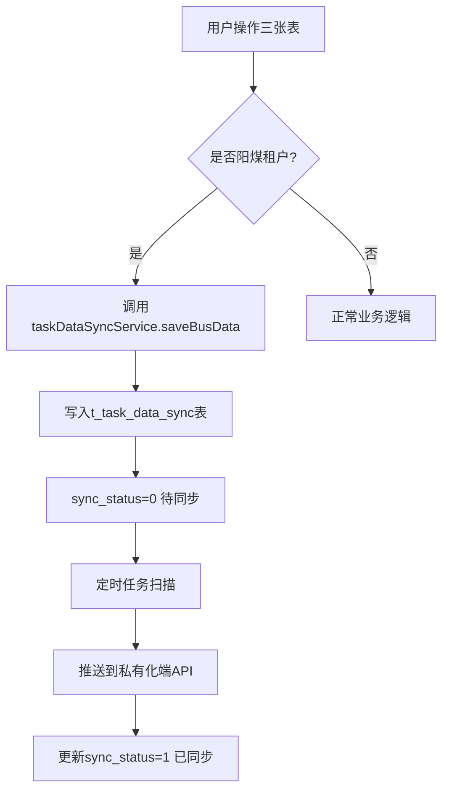

# 阳煤租户标准商品治理数据同步功能设计文档

:material-file-document-edit: **文档类型**: 数据同步设计 |
:material-account-clock: **更新时间**: 2026-05-09 |
:material-account: **维护人**: 研发团队 |
:material-alert-circle: **重要**: 包含严重Bug修复记录

---

## 1. 文档概述

### 1.1 背景

:material-information: **需求背景**

为满足阳煤租户(租户ID: `1810228209924907010`)的私有化部署需求，需要实现SAAS端与私有化端之间标准商品治理相关三张表的数据同步功能。

### 1.2 涉及数据表

:material-database: **数据表清单**

- **t_stand_goods_govern** - 标准商品治理表
- **t_stand_goods** - 标准商品表
- **t_stand_goods_param_value** - 标准商品参数表
- **t_developer_goods_exception** - 开发者商品异常表（补充）

### 1.3 同步架构

```
┌─────────────┐     定时任务推送      ┌──────────────┐
│  SAAS端     │ ──────────────────→  │  私有化端     │
│ (operate)   │                       │ (interchange)│
└─────────────┘                       └──────────────┘
     ↑                                       ↓
     │ 触发同步                          解析并存储
     │                                    到本地数据库
```

---

## 2. 技术方案

### 2.1 SAAS端实现(operate模块)

#### 2.1.1 核心思路

:material-lightbulb-on: **实现方案**

在三张表的Service层添加租户判断逻辑，当操作阳煤租户数据时，自动调用 `TaskDataSyncService.saveBusData()` 方法将数据写入同步任务表，由定时任务推送到私有化端。

#### 2.1.2 修改文件清单

| 文件路径 | 修改内容 |
|---------|---------|
| `StandGoodsGovernServiceImpl.java` | 添加阳煤租户同步逻辑 |
| `StandGoodsServiceImpl.java` | 添加阳煤租户同步逻辑 |
| `StandGoodsParamValueServiceImpl.java` | 添加阳煤租户同步逻辑 |

#### 2.1.3 关键代码实现

??? example "2.1.3.1 公共配置"
    ```java
    @Autowired
    private TaskDataSyncService taskDataSyncService;

    /**
     * 阳煤租户ID
     */
    private static final String YANGMEI_TENANT_ID = "1810228209924907010";
    ```

??? example "2.1.3.2 辅助方法"
    ```java
    /**
     * 判断是否为阳煤租户
     */
    private boolean isYangmeiTenant(String tenantId) {
        return YANGMEI_TENANT_ID.equals(tenantId);
    }

    /**
     * 触发阳煤租户数据同步
     */
    private void triggerYangmeiSync(Entity entity, SyncOperateTypeEnum operType) {
        if (entity == null || !isYangmeiTenant(entity.getTenantId())) {
            return;
        }
        
        try {
            taskDataSyncService.saveBusData(
                Entity.class,
                entity,
                operType,
                TaskSyncDataType.entpur,  // 租户端库（私有化数据）
                "-1",                      // 同步目标：SAAS平台
                entity.getTenantId()       // 数据来源租户ID
            );
            log.info("阳煤租户{}数据同步成功, id={}, operType={}", 
                getTableName(), entity.getId(), operType);
        } catch (Exception e) {
            log.error("阳煤租户{}数据同步失败, id={}, error={}", 
                getTableName(), entity.getId(), e.getMessage(), e);
        }
    }
    ```

??? example "2.1.3.3 各表同步触发点"
    **StandGoodsGovernServiceImpl:**
    - `changeAuditStatus()` - 变更核验状态时触发UPDATE同步

    **StandGoodsServiceImpl:**
    - `updateStandGoods()` - 更新标准商品时触发UPDATE同步
    - `batchSaveStandGoods()` - 批量保存时遍历触发ADD同步

    **StandGoodsParamValueServiceImpl:**
    - `batchSaveStandGoodsParamValue()` - 批量保存时遍历触发ADD同步
    - `updateStandGoodsParamValues()` - 更新参数时分别触发ADD/UPDATE/DELETE同步

#### 2.1.4 枚举映射

:warning: **注意**: `SyncOperateTypeEnum` 枚举使用以下常量:

| 枚举值 | 对应值 | 说明 |
|--------|--------|------|
| `ADD` | "1" | 新增 |
| `UPDATE` | "2" | 更新 |
| `DELETE` | "3" | 删除 |

---

### 2.2 私有化端实现(interchange模块)

#### 2.2.1 核心思路

:material-lightbulb-on: **实现方案**

在 `HandleTaskDataServiceImpl.handleBusinessData()` 方法中，针对三张表添加特殊处理逻辑，调用 `baseMysqlDaoServiceForOperate.saveOrUpdate()` 将数据存储到私有化端数据库。

#### 2.2.2 修改文件清单

| 文件路径 | 修改内容 |
|---------|---------|
| `HandleTaskDataServiceImpl.java` | 添加三张表的处理方法 |

#### 2.2.3 关键代码实现

??? example "2.2.3.1 在handleBusinessData中添加分支处理"
    位置: 第245行附近，INSERT/UPDATE分支中
    
    ```java
    // 阳煤租户标准商品治理相关表特殊处理
    if ("t_stand_goods_govern".equals(tableName)) {
        handleStandGoodsGovern(colValues);
    } else if ("t_stand_goods".equals(tableName)) {
        handleStandGoods(colValues);
    } else if ("t_stand_goods_param_value".equals(tableName)) {
        handleStandGoodsParamValue(colValues);
    } else {
        flag = baseMysqlDaoServiceForOperate.saveOrUpdate(tableName, colValues);
    }
    ```

??? example "2.2.3.2 三个处理方法实现"
    ```java
    /**
     * 处理标准商品治理表数据
     */
    private void handleStandGoodsGovern(Map<String, Object> colValues) {
        try {
            String tableName = "t_stand_goods_govern";
            int flag = baseMysqlDaoServiceForOperate.saveOrUpdate(tableName, colValues);
            log.info("阳煤租户标准商品治理表数据处理成功，flag={}", flag);
        } catch (Exception e) {
            log.error("阳煤租户标准商品治理表数据处理失败，error={}", 
                ExceptionUtil.stacktraceToString(e));
            throw e;
        }
    }

    /**
     * 处理标准商品表数据
     */
    private void handleStandGoods(Map<String, Object> colValues) {
        try {
            String tableName = "t_stand_goods";
            int flag = baseMysqlDaoServiceForOperate.saveOrUpdate(tableName, colValues);
            log.info("阳煤租户标准商品表数据处理成功，flag={}", flag);
        } catch (Exception e) {
            log.error("阳煤租户标准商品表数据处理失败，error={}", 
                ExceptionUtil.stacktraceToString(e));
            throw e;
        }
    }

    /**
     * 处理标准商品参数表数据
     */
    private void handleStandGoodsParamValue(Map<String, Object> colValues) {
        try {
            String tableName = "t_stand_goods_param_value";
            int flag = baseMysqlDaoServiceForOperate.saveOrUpdate(tableName, colValues);
            log.info("阳煤租户标准商品参数表数据处理成功，flag={}", flag);
        } catch (Exception e) {
            log.error("阳煤租户标准商品参数表数据处理失败，error={}", 
                ExceptionUtil.stacktraceToString(e));
            throw e;
        }
    }
    ```

---

## 3. 数据流转过程

### 3.1 SAAS端操作流程



### 3.2 私有化端处理流程

```mermaid
graph TD
    A[定时任务拉取同步数据] --> B[调用handleSaaSBusinessData]
    B --> C[查询未处理数据 sourceTenantId=阳煤租户ID]
    C --> D{判断表名}
    D -->|t_stand_goods_govern| E[handleStandGoodsGovern]
    D -->|t_stand_goods| F[handleStandGoods]
    D -->|t_stand_goods_param_value| G[handleStandGoodsParamValue]
    D -->|其他表| H[通用处理逻辑]
    E --> I[baseMysqlDaoServiceForOperate.saveOrUpdate]
    F --> I
    G --> I
    I --> J[更新处理状态]
    J --> K[记录日志]
```



---

## 4. 关键技术点

### 4.1 租户隔离

:material-check-circle: **隔离策略**

- SAAS端通过 `entity.getTenantId()` 判断是否为阳煤租户
- 只有阳煤租户的数据才会触发同步
- 其他租户不受影响，保持原有逻辑

### 4.2 异常处理

:material-alert-circle: **异常处理机制**

- SAAS端同步失败只记录日志，不影响主业务流程
- 私有化端处理失败会抛出异常，触发重试机制
- 详细的错误日志便于问题排查

### 4.3 数据一致性

:material-check-all: **一致性保证**

- SAAS端先完成本地事务，再触发同步
- 私有化端使用 `saveOrUpdate` 保证幂等性
- 定时任务支持失败重试

### 4.4 性能考虑

:material-speedometer: **性能优化**

- 批量操作时逐条触发同步，避免大数据量冲击
- 异步定时任务推送，不阻塞用户操作
- 私有化端每次处理100条数据，平衡效率与稳定性

---

## 5. 测试验证

### 5.1 功能测试场景

| 场景 | 操作步骤 | 预期结果 |
|------|---------|---------|
| 阳煤租户新增治理记录 | 在SAAS端为阳煤租户新增t_stand_goods_govern记录 | 1. 本地保存成功<br>2. t_task_data_sync生成待同步记录<br>3. 定时任务推送到私有化端<br>4. 私有化端数据库有对应记录 |
| 阳煤租户更新标准商品 | 在SAAS端更新阳煤租户的t_stand_goods记录 | 1. 本地更新成功<br>2. 生成UPDATE类型同步任务<br>3. 私有化端对应记录被更新 |
| 阳煤租户删除参数 | 在SAAS端软删除阳煤租户的t_stand_goods_param_value记录 | 1. 本地软删除成功<br>2. 生成DELETE类型同步任务<br>3. 私有化端对应记录被软删除 |
| 非阳煤租户操作 | 对其他租户进行相同操作 | 1. 本地操作正常<br>2. 不生成同步任务<br>3. 私有化端无变化 |

### 5.2 验证SQL

??? example "SAAS端检查同步任务"
    ```sql
    -- 查看阳煤租户的同步任务
    SELECT * FROM t_task_data_sync 
    WHERE source_tenant_id = '1810228209924907010'
      AND bus_name IN ('t_stand_goods_govern', 't_stand_goods', 't_stand_goods_param_value')
    ORDER BY create_time DESC 
    LIMIT 10;
    ```

??? example "私有化端检查数据"
    ```sql
    -- 检查治理表数据
    SELECT * FROM t_stand_goods_govern 
    WHERE tenant_id = '1810228209924907010'
    ORDER BY create_time DESC 
    LIMIT 10;

    -- 检查标准商品表数据
    SELECT * FROM t_stand_goods 
    WHERE tenant_id = '1810228209924907010'
    ORDER BY create_time DESC 
    LIMIT 10;

    -- 检查参数表数据
    SELECT * FROM t_stand_goods_param_value 
    WHERE tenant_id = '1810228209924907010'
    ORDER BY create_time DESC 
    LIMIT 10;
    ```

---

## 6. 运维监控

### 6.1 关键日志

:material-file-document-outline: **日志关键字**

**SAAS端日志关键字:**
- `阳煤租户标准商品治理数据同步成功`
- `阳煤租户标准商品数据同步成功`
- `阳煤租户标准商品参数数据同步成功`
- `阳煤租户.*数据同步失败`

**私有化端日志关键字:**
- `阳煤租户标准商品治理表数据处理成功`
- `阳煤租户标准商品表数据处理成功`
- `阳煤租户标准商品参数表数据处理成功`
- `阳煤租户.*数据处理失败`

### 6.2 监控指标

:material-chart-line: **监控指标**

- 同步任务积压数量
- 同步成功率
- 平均同步延迟
- 失败重试次数

---

## 7. 注意事项

### 7.1 开发注意事项

:warning: **开发规范**

1. **枚举常量**: 使用 `SyncOperateTypeEnum.ADD` 而非 `INSERT`
2. **导入顺序**: Service导入要在Enum之前，避免编译错误
3. **事务控制**: 同步触发点在事务提交后执行，确保数据一致性
4. **空值判断**: 所有同步方法都要做空值和租户ID校验

### 7.2 部署注意事项

:warning: **部署检查清单**

1. **配置检查**: 确认阳煤租户ID配置正确
2. **定时任务**: 确保私有化端的同步定时任务已启用
3. **网络连通**: SAAS端与私有化端API接口需网络可达
4. **权限验证**: 私有化端API需要正确的认证token

### 7.3 扩展性考虑

:material-lightbulb-on: **扩展建议**

如需支持更多租户同步:
1. 将 `YANGMEI_TENANT_ID` 改为配置项或数据库配置
2. 支持租户列表或多个租户ID
3. 可考虑增加租户级别的同步开关

---

## 8. 重大Bug修复记录

### 8.1 Bug 1: t_developer_goods_exception 表同步数据类型错误

:red_circle: **问题等级**: 🔴 严重  
:calendar: **发现日期**: 2026-05-09  
:warning: **影响范围**: 所有私有化租户的商品异常数据同步

#### 8.1.1 问题现象

私有化租户（如阳煤）的商品异常数据同步到SAAS时失败，日志报错：
```
Table 'entpur.t_developer_goods_exception' doesn't exist
```

同步任务状态：
- `sync_status = '1'` （已同步到SAAS的同步表）
- `operate_status = '2'` （处理失败）

#### 8.1.2 根本原因

:material-alert-circle: **架构理解偏差**

项目采用**双环境独立部署架构**：
- **SAAS平台**: 有 `operate` 库和 `entpur` 库
- **私有化部署**: 也有 `operate` 库和 `entpur` 库

`t_developer_goods_exception` 表的特点：
- ✅ 存在于 SAAS平台的 `operate` 库
- ✅ 存在于 私有化环境的 `operate` 库
- ❌ **不存在于** 任何环境的 `entpur` 库

**错误的同步逻辑**：

在 `DeveloperGoodsExceptionServiceImpl.java` 中，所有触发同步的地方都使用了：
```java
TaskSyncDataType.entpur  // ❌ 错误
```

这导致 interchange 模块处理时：
1. 判断 `dataType='entpur'`
2. 调用 `baseMysqlDaoServiceForEntpur.saveOrUpdate()`
3. 尝试在 `entpur` 库操作 `t_developer_goods_exception` 表
4. ❌ 表不存在，抛出异常

#### 8.1.3 修复方案

将所有 `t_developer_goods_exception` 表的同步数据类型从 `entpur` 改为 `operate`：

**修改文件**: `DeveloperGoodsExceptionServiceImpl.java`

**修改位置**（共6处）:

1. **第129行** - `modifyGoodsException()` 方法
2. **第195行** - `saveOrUpdateForTenant()` 方法（新增）
3. **第212行** - `saveOrUpdateForTenant()` 方法（更新）
4. **第264行** - `saveOrUpdateBatchForTenant()` 方法
5. **第285行** - `deleteForTenant()` 方法
6. **第444行** - `changeStatus()` 方法

**修改前**:
```java
taskDataSyncService.saveBusData(TDevGoodsException.class, entity, 
    SyncOperateTypeEnum.UPDATE, TaskSyncDataType.entpur, "-1", tenantId);
```

**修改后**:
```java
taskDataSyncService.saveBusData(TDevGoodsException.class, entity, 
    SyncOperateTypeEnum.UPDATE, TaskSyncDataType.operate, "-1", tenantId);
```

#### 8.1.4 修复原理

```
修改前流程（错误）:
私有化 entpur库 → 写入同步表(dataType='entpur') 
→ interchange判断 dataType='entpur' 
→ 调用 baseMysqlDaoServiceForEntpur 
→ 操作 entpur库 ❌ 表不存在

修改后流程（正确）:
私有化 operate库 → 写入同步表(dataType='operate') 
→ interchange判断 dataType='operate' 
→ 调用 baseMysqlDaoServiceForOperate 
→ 操作 operate库 ✅ 表存在
```

#### 8.1.5 经验总结

:star: **关键原则**：

- `dataType` 表示**数据来源的数据库类型**，不是同步方向
- 对于只在 `operate` 库存在的表，必须使用 `TaskSyncDataType.operate`
- 对于只在 `entpur` 库存在的表，必须使用 `TaskSyncDataType.entpur`
- 不能一概而论地认为私有化租户的数据都用 `entpur`

:clipboard-check: **排查方法**：
1. 确认表在哪个库存在（operate 还是 entpur）
2. 检查同步记录的 `dataType` 字段
3. 查看 interchange 模块的处理逻辑分支
4. 确认调用的 DAO 服务是否匹配

---

### 8.2 Bug 2: 标准商品创建时同步操作类型错误

:orange_circle: **问题等级**: 🟠 重要  
:calendar: **发现日期**: 2026-05-09  
:warning: **影响范围**: 阳煤租户标准商品及参数值的同步

#### 8.2.1 问题现象

在 `StandGoodsGovernMatchServiceImpl.createStandGoodsFromReq()` 方法中，创建标准商品后触发同步时使用了错误的操作类型。

#### 8.2.2 错误代码

:warning: **位置**: 第964-965行

```java
// ❌ 错误代码
yangmeiDataSyncService.triggerSync(StandGoodsEntity.class, goods, SyncOperateTypeEnum.UPDATE);
yangmeiDataSyncService.triggerBatchSync(StandGoodsParamValueEntity.class, paramValueEntityList, SyncOperateTypeEnum.DELETE);
```

**问题分析**:
1. 第955行执行了 `standGoodsMapper.insert(goods)` - **新增操作**
2. 第1065行执行了 `standGoodsParamValueService.save(paramValue)` - **新增操作**
3. 但同步时却使用了 `UPDATE` 和 `DELETE` ❌

#### 8.2.3 修复方案

**修改文件**: `StandGoodsGovernMatchServiceImpl.java`

**修改位置**: 第964-965行

**修改前**:
```java
yangmeiDataSyncService.triggerSync(StandGoodsEntity.class, goods, SyncOperateTypeEnum.UPDATE);
yangmeiDataSyncService.triggerBatchSync(StandGoodsParamValueEntity.class, paramValueEntityList, SyncOperateTypeEnum.DELETE);
```

**修改后**:
```java
yangmeiDataSyncService.triggerSync(StandGoodsEntity.class, goods, SyncOperateTypeEnum.ADD);
yangmeiDataSyncService.triggerBatchSync(StandGoodsParamValueEntity.class, paramValueEntityList, SyncOperateTypeEnum.ADD);
```

#### 8.2.4 潜在影响

:warning: **风险警告**

如果使用错误的操作类型可能导致：
- **UPDATE**: 私有化端找不到对应记录，更新失败
- **DELETE**: 可能误删私有化端的数据，造成数据丢失 ⚠️

#### 8.2.5 经验总结

:star: **开发规范**：

1. 同步操作类型必须与数据库操作严格对应：
   - `insert()` → `SyncOperateTypeEnum.ADD`
   - `update()` → `SyncOperateTypeEnum.UPDATE`
   - `delete()` → `SyncOperateTypeEnum.DELETE`

2. 在编写同步代码时，要仔细检查：
   - 上方执行的数据库操作是什么？
   - 下方触发的同步操作类型是否匹配？

3. 建议增加代码审查清单：
   - [ ] 检查同步操作类型是否正确
   - [ ] 检查 dataType 是否正确
   - [ ] 检查 target 是否正确
   - [ ] 检查 sourceTenantId 是否正确

---

## 9. 版本历史

| 版本 | 日期 | 作者 | 说明 |
|------|------|------|------|
| v1.0 | 2026-04-21 | AI Assistant | 初始版本,完成阳煤租户三张表同步功能 |
| v1.1 | 2026-04-21 | AI Assistant | 重构:抽取YangmeiDataSyncService统一服务,消除代码重复 |
| v1.2 | 2026-04-21 | AI Assistant | 补充:interchange模块实现,支持t_stand_goods_govern新增场景 |
| v1.3 | 2026-04-30 | AI Assistant | 修正:data_type和target参数设置错误，统一使用entpur和"-1" |
| v1.4 | 2026-04-30 | AI Assistant | 完善:添加代码修正记录章节，详细说明参数错误及修正方案 |
| v1.5 | 2026-05-09 | AI Assistant | :red_circle: 修复:t_developer_goods_exception表同步dataType错误(entpur→operate) |
| v1.6 | 2026-05-09 | AI Assistant | :orange_circle: 修复:标准商品创建时同步操作类型错误(UPDATE/DELETE→ADD) |

---

## 10. 附录

### 10.1 相关文件清单

**SAAS端(operate模块):**
- `bssc-biz-operate/src/main/java/com/bssc/maint/operate/service/YangmeiDataSyncService.java` - 阳煤租户同步服务接口
- `bssc-biz-operate/src/main/java/com/bssc/maint/operate/service/impl/YangmeiDataSyncServiceImpl.java` - 阳煤租户同步服务实现
- `bssc-biz-operate/src/main/java/com/bssc/maint/operate/service/impl/StandGoodsGovernServiceImpl.java` - 使用统一同步服务
- `bssc-biz-operate/src/main/java/com/bssc/maint/operate/service/impl/StandGoodsServiceImpl.java` - 使用统一同步服务
- `bssc-biz-operate/src/main/java/com/bssc/maint/operate/service/impl/StandGoodsParamValueServiceImpl.java` - 使用统一同步服务

**私有化端(interchange模块):**
- `bssc-biz-interchange/src/main/java/com/bssc/biz/interchange/service/YangmeiDataSyncService.java` - interchange模块的阳煤租户同步服务
- `bssc-biz-interchange/src/main/java/com/bssc/biz/interchange/service/impl/YangmeiDataSyncServiceImpl.java` - interchange模块的同步服务实现
- `bssc-biz-interchange/src/main/java/com/bssc/biz/interchange/service/impl/MonitorTaskServiceImpl.java` - 在syncHandleGoodsAiTask中触发同步
- `bssc-biz-interchange/src/main/java/com/bssc/biz/interchange/service/impl/HandleTaskDataServiceImpl.java` - 处理SAAS推送的数据

### 10.2 架构优化说明

#### 10.2.1 代码重构

:material-lightbulb-on: **优化方案**

为避免代码重复，将阳煤租户同步逻辑抽取为统一的 `YangmeiDataSyncService` 服务:

**优势:**
1. **消除重复代码**: 三个ServiceImpl不再各自实现相同的同步逻辑
2. **统一管理**: 租户ID、判断逻辑、异常处理集中在一处
3. **易于扩展**: 如需支持更多租户，只需修改YangmeiDataSyncService
4. **反射获取tenantId**: 通过反射自动获取实体的tenantId字段，无需硬编码
5. **双模块支持**: operate和interchange模块都有独立的YangmeiDataSyncService，适应不同场景
6. **正确的参数配置**: 
   - operate模块使用 `TaskSyncDataType.entpur` 和 `target="-1"`
   - interchange模块使用 `TaskSyncDataType.entpur` 和 `target="-1"`

??? example "使用方式"
    ```java
    // operate模块
    @Autowired
    private com.bssc.maint.operate.service.YangmeiDataSyncService yangmeiDataSyncService;

    yangmeiDataSyncService.triggerSync(EntityClass.class, entity, SyncOperateTypeEnum.ADD);

    // interchange模块
    @Autowired
    private com.bssc.biz.interchange.service.YangmeiDataSyncService yangmeiDataSyncService;

    yangmeiDataSyncService.triggerSync(EntityClass.class, entity, TaskSyncOperType.INSERT);
    ```

#### 10.2.2 interchange模块特殊处理

:material-information: **背景说明**

`t_stand_goods_govern` 表的新增操作在interchange模块的 `MonitorTaskServiceImpl.syncHandleGoodsAiTask()` 方法中执行，该方法调用AI核验接口前会先初始化治理表数据。

**实现方案:**
1. 在interchange模块也创建 `YangmeiDataSyncService`，与operate模块保持一致的架构
2. 关键参数配置:
   - 两个模块都使用 `TaskSyncDataType.entpur`（租户端库）
   - 两个模块都使用 `target="-1"`（同步给SAAS平台）
3. 在批量插入后逐条触发同步:
```java
for (int i = 0; i < totalSize; i += batchSize) {
    List<StandGoodsGovernEntity> subList = standGoodsGovernEntities.subList(i, endIndex);
    standGoodsGovernService.batchInsertOrUpdate(subList);
    
    // 阳煤租户数据同步（新增）
    for (StandGoodsGovernEntity entity : subList) {
        yangmeiDataSyncService.triggerSync(
            StandGoodsGovernEntity.class, 
            entity, 
            TaskSyncOperType.INSERT
        );
    }
}
```

:question: **为什么不需要Feign调用?**
- interchange模块的 `StandGoodsGovernServiceImpl` 已配置 `@DS("operate")`，直接访问operate数据库
- 两个模块共享同一个operate数据库，可以直接调用本地Service
- 避免了不必要的网络开销和复杂性

### 10.3 参考文档

:material-link: **相关文档**
- [消息生成链路说明文档](../../03_项目技术架构文档/消息生成链路说明文档.md)

---

**:material-check-all: 文档结束**
