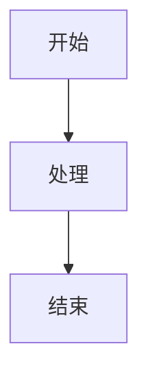

# AI 文档生成规则

:material-file-document-edit: **文档类型**: 规则配置 |
:material-account-clock: **更新时间**: 2026-06-05 |
:material-account: **维护人**: 研发团队 |
:material-tag: **标签**: AI, 文档生成, 规则配置, MkDocs Material, 标签化元数据, 模板

> **用途**: 指导AI在生成知识库文档时，自动归类到正确文件夹、添加标准化标签头部、并美化输出
> **适用项目**: 价格监测平台 (pricemonitor)
> **规则源文件**: `D:\Program Files (x86)\pricemonitor\.codebuddy\rules\AI文档生成规则.mdc`（CodeBuddy Rules 引擎读取）

---

## 一、知识库目录结构

生成文档时，必须根据文档内容归类到以下目录：

```
部门研发运维知识库/
├── 00_说明/                    # 知识库使用说明、部署文档
├── 01_常用工具文档/             # ES、HBase、Spark、K8s等工具使用手册
├── 02_问题处理文档/             # 故障排查报告、问题处理记录
├── 03_项目技术架构文档/          # 项目流程、架构设计、接口说明
├── 04_研发内部设计/             # 功能设计文档、需求追踪
│   ├── 阳煤商品治理/
│   ├── 华能消费帮扶/
│   └── 中海油报表及异常商品监测记录/
├── 05_附件资源/                # 附件、资源文件
└── 99_文档模板/                # 文档模板（本文档所在位置）
```

### 目录归类规则

| 文档类型 | 归类目录 | 示例 |
|:--------|:---------|:------|
| 知识库使用说明 | `00_说明/` | 部署文档、使用指南 |
| 工具/命令手册 | `01_常用工具文档/` | ES语句、Spark机制、K8s命令 |
| 故障排查报告 | `02_问题处理文档/` | ES集群问题、HBase故障、RabbitMQ宕机 |
| 项目架构文档 | `03_项目技术架构文档/` | 项目流程、消息链路、接口架构 |
| 功能设计文档 | `04_研发内部设计/` | 标准商品治理、租户改造、需求设计 |
| 附件资源 | `05_附件资源/` | 截图、SQL脚本、配置文件 |
| 文档模板 | `99_文档模板/` | 各类文档模板 |

---

## 二、文档美化规范 (MkDocs Material)

所有生成的Markdown文档必须遵循以下美化规范：

### 2.1 文档头部信息（标签化元数据 — 必选）

每个文档 `# 标题` 之后必须紧跟标准化标签头部，所有字段用 `|` 分隔。**标签字段在所有文档类型中均为必选**。

#### 通用格式

```markdown
# 文档标题

:material-file-document-edit: **文档类型**: 类型说明 |
:material-account-clock: **更新时间**: YYYY-MM-DD |
:material-account: **维护人**: 姓名 |
:material-tag: **标签**: 关键词1, 关键词2, 关键词3
```

#### 各类型专属格式

**故障排查类**（02_问题处理文档/）— 需增加优先级和发生时间：

```markdown
# 问题名称 排查报告

:material-file-document-edit: **文档类型**: 故障排查 |
:material-alert-circle: **优先级**: 🔴 高 |
:material-account-clock: **发生时间**: YYYY-MM-DD |
:material-account: **处理人**: 研发团队 |
:material-tag: **标签**: 关键词1, 关键词2
```

**工具手册类**（01_常用工具文档/）：

```markdown
# 工具名称 使用手册

:material-file-document-edit: **文档类型**: 工具手册 |
:material-account-clock: **更新时间**: YYYY-MM-DD |
:material-account: **维护人**: 研发团队 |
:material-tag: **标签**: 关键词1, 关键词2
```

**项目架构类**（03_项目技术架构文档/）：

```markdown
# 架构名称 说明文档

:material-file-document-edit: **文档类型**: 项目架构 |
:material-account-clock: **更新时间**: YYYY-MM-DD |
:material-account: **维护人**: 研发团队 |
:material-tag: **标签**: 关键词1, 关键词2
```

**功能设计类**（04_研发内部设计/）— 可选增加涉及模块：

```markdown
# 功能名称 设计文档

:material-file-document-edit: **文档类型**: 功能设计 |
:material-api: **涉及模块**: 模块名 |        ← 可选字段
:material-account-clock: **更新时间**: YYYY-MM-DD |
:material-account: **维护人**: 研发团队 |
:material-tag: **标签**: 关键词1, 关键词2
```

**部署/使用指南类**（00_说明/）：

```markdown
# 指南名称

:material-file-document-edit: **文档类型**: 部署指南 |
:material-account-clock: **更新时间**: YYYY-MM-DD |
:material-account: **维护人**: 研发团队 |
:material-tag: **标签**: 关键词1, 关键词2
```

### 2.2 标签命名规范（:material-tag: 标签字段编写规则）

标签是文档检索的核心手段，必须精心选取：

#### 标签选取原则

| 原则 | 说明 | 示例 |
|:------|:------|:------|
| **技术关键字优先** | 组件名、中间件名、技术栈 | `Elasticsearch`, `HBase`, `Spark`, `K8s`, `Kafka` |
| **项目/租户名** | 涉及的租户或客户 | `阳煤`, `华能`, `中海油` |
| **功能/模块名** | 核心功能或服务模块 | `数据同步`, `价格监测`, `bssc-biz-operate` |
| **问题/场景标识** | 故障现象、操作类型 | `OOM`, `写入拒绝`, `任务卡死`, `磁盘满` |
| **关键表/字段名** | 核心数据库对象 | `t_tenant_goods_type_mapping`, `goods_source` |

#### 标签数量与格式

- 每个文档 **3~6 个标签**，按重要性/粒度从大到小排列
- 标签之间用英文逗号 + 空格分隔：`标签A, 标签B, 标签C`
- 英文标签保持技术原名（如 `Elasticsearch`），中文标签使用简洁短语

### 2.3 图标使用规范

使用Material Design图标增强可读性，**全部使用英文冒号 `:`**：

| 场景 | 图标语法 | 说明 |
|:------|:---------|:------|
| 文档类型 | `:material-file-document-edit:` | 文档元数据标识 |
| 警告/优先级 | `:material-alert-circle:` | 注意事项、优先级、重要警告 |
| 时间信息 | `:material-account-clock:` | 发生时间、更新时间 |
| 人员信息 | `:material-account:` | 处理人、维护人 |
| 标签 | `:material-tag:` | 标签、关键词 |
| 信息提示 | `:material-information:` | 背景说明、基本信息 |
| 成功提示 | `:material-check-circle:` | 完成状态、验证通过 |
| 错误提示 | `:material-close-circle:` | 错误、失败 |
| API/模块 | `:material-api:` | 接口文档、涉及模块 |
| 数据库 | `:material-database:` | 数据库相关 |
| 代码 | `:material-code-json:` | 代码示例 |
| 服务器 | `:material-server:` | 服务器、节点 |
| 网络 | `:material-server-network:` | 集群、网络 |
| 磁盘 | `:material-harddisk:` | 磁盘、存储 |
| 搜索 | `:material-magnify:` | 搜索、查询 |
| 容器 | `:material-kubernetes:` | K8s、容器 |
| 消息 | `:material-message-alert:` | 消息队列、通知 |
| 工具 | `:material-hammer-wrench:` | 工具、改造 |
| 排查/Bug | `:material-bug:` | Bug、问题排查 |
| 宕机 | `:material-server-off:` | 服务宕机 |
| 时效/时钟 | `:material-clock-alert:` | 时效性、超时 |
| 目标/适用 | `:material-target:` | 适用场景、目标 |
| 安全 | `:material-shield-alert:` | 安全红线、密码警告 |

### 2.4 Admonition 提示框

使用提示框突出重要信息：

```markdown
!!! info "信息标题"
    信息内容

!!! note "注意"
    注意内容

!!! warning "警告"
    警告内容

!!! danger "严重"
    严重问题

!!! tip "提示"
    提示内容

!!! check "检查清单"
    - [x] 已完成项
    - [ ] 待完成项
```

### 2.5 可折叠内容

使用可折叠块隐藏长内容：

```markdown
??? example "示例标题"
    折叠的内容

??? tip "提示标题"
    折叠的提示内容

???+ abstract "默认展开"
    默认展开的内容
```

### 2.6 标签页

使用标签页展示多个方案：

````markdown
=== "方案1"
    ```bash
    # 方案1的代码
    ```

=== "方案2"
    ```bash
    # 方案2的代码
    ```
````

### 2.7 代码块

所有代码块必须指定语言：

````markdown
```java
// Java代码
```

```sql
-- SQL语句
```

```bash
# Shell命令
```

```http
# HTTP请求
```

```yaml
# YAML配置
```
````

### 2.8 表格优化

使用对齐的表格增强可读性：

```markdown
| 列1 | 列2 | 列3 |
|:------|:------|:------|
| 内容 | 内容 | 内容 |
```

### 2.9 Mermaid 图表

使用Mermaid绘制流程图、架构图：

````markdown

````

---

## 三、文档生成流程

### 3.1 接收文档需求

当用户请求生成文档时：

1. **识别文档类型** - 判断应该归类到哪个目录
2. **确定文档结构** - 根据内容设计章节
3. **提取标签关键词** - 从内容中提取 3~6 个核心标签
4. **应用美化规范** - 使用上述美化规则

### 3.2 生成文档

1. **创建文件** - 在正确目录下创建 `.md` 文件
2. **编写标签头部** - 按照 2.1 节对应类型的格式添加完整元数据
3. **编写内容** - 遵循美化规范，善用图标和提示框
4. **不手动编写目录** - 使用 MkDocs 右侧自动生成目录

### 3.3 验证检查

生成后逐项检查：

- [ ] 文件是否在正确目录
- [ ] 是否包含完整的标签化元数据头部（文档类型 + 时间 + 维护人 + **标签**）
- [ ] 图标语法是否使用英文冒号 `:`（非中文冒号 `：`）
- [ ] 是否使用了适当的提示框（info/tip/warning/danger）
- [ ] 代码块是否指定语言
- [ ] 表格是否对齐
- [ ] 是否包含真实密码/密钥（绝对禁止）
- [ ] 标签数量是否在 3~6 个之间

---

## 四、示例模板

### 4.1 工具文档模板

````markdown
# 工具名称 使用手册

:material-file-document-edit: **文档类型**: 工具手册 |
:material-account-clock: **更新时间**: 2026-06-05 |
:material-account: **维护人**: 研发团队 |
:material-tag: **标签**: 组件名, 功能分类, 环境

---

## 一、概述

:material-information: **简介**

工具的功能说明...

## 二、常用命令

### 2.1 基础操作

??? example "示例1"
    ```bash
    # 命令示例
    ```

## 三、常见问题

### 3.1 问题1

:material-alert-circle: **问题描述**

解决方案...

---

**:material-check-all: 文档结束**
````

### 4.2 故障排查报告模板

````markdown
# 问题名称 排查报告

:material-file-document-edit: **文档类型**: 故障排查 |
:material-alert-circle: **优先级**: 🔴 高 |
:material-account-clock: **发生时间**: 2026-06-05 |
:material-account: **处理人**: 研发团队 |
:material-tag: **标签**: 故障组件, 故障现象, 涉及服务

---

## 一、问题现象

:red_circle: **问题描述**

## 二、排查过程

### 2.1 初步分析

## 三、根本原因

## 四、解决方案

## 五、预防措施

---

**:material-check-all: 报告结束**
````

### 4.3 功能设计文档模板

````markdown
# 功能名称 设计文档

:material-file-document-edit: **文档类型**: 功能设计 |
:material-api: **涉及模块**: 模块名 |
:material-account-clock: **更新时间**: 2026-06-05 |
:material-account: **维护人**: 研发团队 |
:material-tag: **标签**: 租户名, 功能分类, 技术方案

---

## 一、需求概述

### 1.1 需求背景

## 二、技术方案

### 2.1 数据库设计

| 字段名 | 类型 | 说明 |
|:--------|:------|:------|

### 2.2 接口设计

??? example "接口示例"
    ```java
    // 接口代码
    ```

## 三、实施计划

## 四、测试验证

---

**:material-check-all: 文档结束**
````

### 4.4 部署/使用指南模板

````markdown
# 指南名称

:material-file-document-edit: **文档类型**: 部署指南 |
:material-account-clock: **更新时间**: 2026-06-05 |
:material-account: **维护人**: 研发团队 |
:material-tag: **标签**: 工具名, 部署, 配置

---

## 一、概述

:material-information: **适用场景**

## 二、环境准备

## 三、部署步骤

## 四、验证

---

**:material-check-all: 文档结束**
````

---

## 五、注意事项

### 5.1 安全规范：禁止输出真实密码（最高优先级）

> :material-shield-alert: **安全红线**：生成任何文档时，**绝对禁止**输出真实密码、密钥、Token、证书等敏感凭证信息。

**必须遵守的规则：**

1. **密码/密钥占位**：所有密码、密钥、Token、AccessKey、SecretKey 等一律使用占位符替代，格式如：
   - `your_password_here` / `your_redis_password`
   - `your_api_token` / `sk-xxxxxxxxxxxxxxxx`
   - `your_access_key` / `your_secret_key`
2. **连接字符串脱敏**：JDBC URL、Redis连接串等中的密码部分必须用占位符：
   - ❌ `jdbc:mysql://host:3306/db?user=root&password=real123`
   - ✅ `jdbc:mysql://host:3306/db?user=root&password=your_password`
3. **配置文件示例**：任何配置文件、properties、yml 示例中的敏感值均用占位符：
   - ❌ `spring.redis.password=MyRedis@2024`
   - ✅ `spring.redis.password=your_redis_password`
4. **排查日志脱敏**：引用生产日志、命令行输出时，先检查并替换其中的密码/IP等敏感信息

!!! danger "违反后果"
    文档一旦提交到 Git 仓库（尤其是公开仓库），密码将永久记录在版本历史中，即使后续删除也**无法彻底清除**，存在严重安全风险。

### 5.2 避免常见错误

1. **不要使用中文冒号** - 图标语法使用英文冒号 `:`
2. **不要手动编写目录** - 使用MkDocs自动生成目录
3. **不要使用HTML标签** - 使用Markdown原生语法
4. **代码块要指定语言** - 确保语法高亮正常
5. **标签字段不可省略** - 所有文档类型都必须包含 `:material-tag: **标签**:`

### 5.3 图标语法检查

生成文档后，检查是否有乱码：

- 错误：`:material-chart-flow：` （中文冒号）
- 正确：`:material-chart-flow:` （英文冒号）

### 5.4 文件命名规范

- 使用中文命名，清晰表达文档内容
- 避免使用特殊字符（`/ \ : * ? " < > |`）
- 文件扩展名必须为 `.md`

### 5.5 存量文档规范调整

对已存在的知识库文档进行批量规范化时：

1. 逐文件读取现有头部，识别已有元数据（日期、作者等）
2. 按 2.1 节对应类型格式补充/重写标签头部
3. 保留原有正文内容不变，仅在标题后插入标准化元数据块
4. 从文档正文中提取核心关键词，按 2.2 节规范生成标签
5. 如文档已有元数据行（如 `:calendar:` 时间、基本信息表格），保留在头部下方作为补充信息

---

## 六、规则更新记录

| 版本 | 日期 | 更新内容 |
|:------|:------|:---------|
| v1.1 | 2026-06-05 | 所有模板强制增加标签字段；新增标签命名规范(2.2)；新增部署指南模板(4.4)；完善图标速查表；新增存量文档规范调整说明(5.5)；统一图标命名 |
| v1.0 | 2026-06-05 | 初始版本，定义文档生成规则 |

---

**:material-check-all: 规则文件结束**
